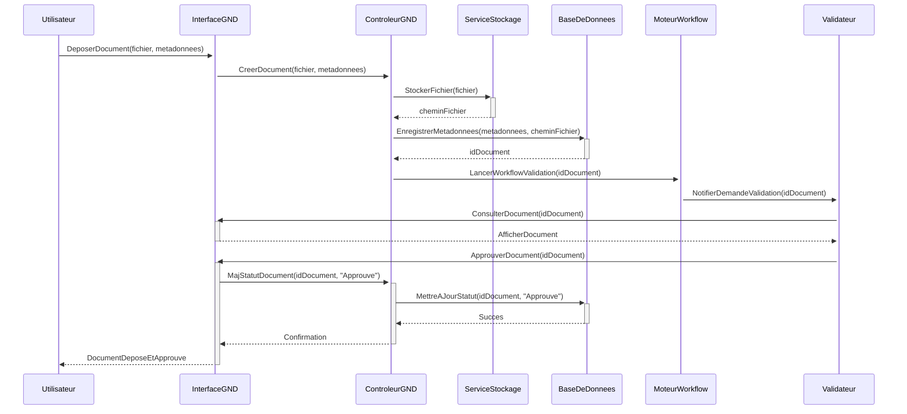
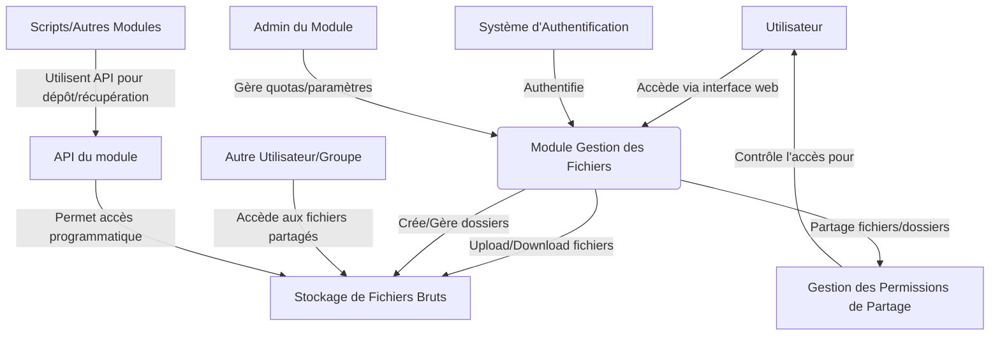
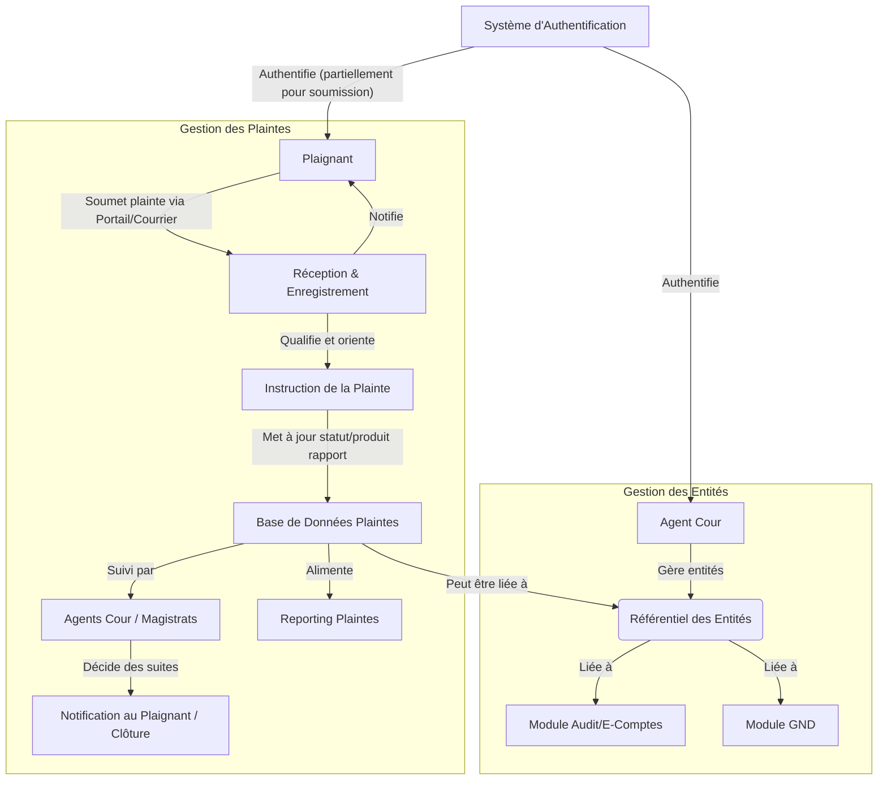

# Projet SIGEF-TC – Documentation consolidée – Primex Software

## Sommaire

1.  [Introduction générale (README)](#introduction)
2.  [Spécifications Générales du Projet SIGEF-TC](#specifications-generales)
    *   [2.1. Présentation Générale du Projet](#spec-pres-generale)
        *   [2.1.1. Contexte](#spec-contexte)
        *   [2.1.2. Objectifs du système SIGEF-TC](#spec-objectifs)
        *   [2.1.3. Public cible](#spec-public)
        *   [2.1.4. Portée fonctionnelle et technique](#spec-portee)
    *   [2.2. Architecture du Système](#spec-architecture)
        *   [2.2.1. Architecture logicielle recommandée](#spec-archi-logicielle)
        *   [2.2.2. Technologies proposées](#spec-technologies)
        *   [2.2.3. Sécurité et interopérabilité (Résumé)](#spec-secu-interop-resume)
3.  [Roadmap et Planification Agile](#roadmap)
4.  [Fiches Modules Synthétiques](#fiches-modules)
    *   [4.1. Gestion des Ressources Humaines (RH)](#fiche-rh)
    *   [4.2. Gestion Financière](#fiche-finance)
    *   [4.3. Gestion du Patrimoine](#fiche-patrimoine)
    *   [4.4. Gestion Numérique des Documents (GND)](#fiche-gnd)
    *   [4.5. Gestion des Fichiers](#fiche-fichiers)
    *   [4.6. Gestion des Entités et Plaintes](#fiche-entites-plaintes)
    *   [4.7. Bibliothèque Numérique](#fiche-bibliotheque)
    *   [4.8. E-Comptes / Traitement procédural](#fiche-ecomptes)
    *   [4.9. Application Mobile](#fiche-mobile)
    *   [4.10. Portail Intranet](#fiche-intranet)
    *   [4.11. Suivi Budgétaire (Comptes de l’État)](#fiche-suivi-budget)
    *   [4.12. Plateforme d’Authentification et Gestion des Entités](#fiche-auth)
    *   [4.13. Interopérabilité](#fiche-interop)
    *   [4.14. Business Intelligence (BI)](#fiche-bi)
5.  [Documentations Fonctionnelles & Techniques des Modules](#doc-fonc-tech)
    *   [5.1. Module Gestion des Ressources Humaines (RH)](#doc-rh)
        *   [Documentation Fonctionnelle & Technique](#doc-rh-fonc-tech)
        *   [Diagrammes UML](#doc-rh-diagrammes)
    *   [5.2. Module Gestion Financière](#doc-finance)
        *   [Documentation Fonctionnelle & Technique](#doc-finance-fonc-tech)
        *   [Diagrammes UML](#doc-finance-diagrammes)
    *   [5.3. Module Gestion du Patrimoine](#doc-patrimoine)
        *   [Documentation Fonctionnelle & Technique](#doc-patrimoine-fonc-tech)
        *   [Diagrammes UML](#doc-patrimoine-diagrammes)
    *   [5.4. Module Gestion Numérique des Documents (GND)](#doc-gnd)
        *   [Documentation Fonctionnelle & Technique](#doc-gnd-fonc-tech)
        *   [Diagrammes UML](#doc-gnd-diagrammes)
    *   [5.5. Module Gestion des Fichiers](#doc-fichiers)
        *   [Documentation Fonctionnelle & Technique](#doc-fichiers-fonc-tech)
        *   [Diagrammes UML](#doc-fichiers-diagrammes)
    *   [5.6. Module Gestion des Entités et Plaintes](#doc-entites-plaintes)
        *   [Documentation Fonctionnelle & Technique](#doc-entites-plaintes-fonc-tech)
        *   [Diagrammes UML](#doc-entites-plaintes-diagrammes)
    *   [5.7. Module Bibliothèque Numérique](#doc-bibliotheque)
        *   [Documentation Fonctionnelle & Technique](#doc-bibliotheque-fonc-tech)
        *   [Diagrammes UML](#doc-bibliotheque-diagrammes)
    *   [5.8. Module E-Comptes / Traitement procédural](#doc-ecomptes)
        *   [Documentation Fonctionnelle & Technique](#doc-ecomptes-fonc-tech)
        *   [Diagrammes UML](#doc-ecomptes-diagrammes)
    *   [5.9. Module Application Mobile](#doc-mobile)
        *   [Documentation Fonctionnelle & Technique](#doc-mobile-fonc-tech)
        *   [Diagrammes UML](#doc-mobile-diagrammes)
    *   [5.10. Module Portail Intranet](#doc-intranet)
        *   [Documentation Fonctionnelle & Technique](#doc-intranet-fonc-tech)
        *   [Diagrammes UML](#doc-intranet-diagrammes)
    *   [5.11. Module Suivi Budgétaire (Comptes de l’État)](#doc-suivi-budget)
        *   [Documentation Fonctionnelle & Technique](#doc-suivi-budget-fonc-tech)
        *   [Diagrammes UML](#doc-suivi-budget-diagrammes)
    *   [5.12. Module Plateforme d’Authentification et Gestion des Entités](#doc-auth)
        *   [Documentation Fonctionnelle & Technique](#doc-auth-fonc-tech)
        *   [Diagrammes UML](#doc-auth-diagrammes)
    *   [5.13. Module Interopérabilité](#doc-interop)
        *   [Documentation Fonctionnelle & Technique](#doc-interop-fonc-tech)
        *   [Diagrammes UML](#doc-interop-diagrammes)
    *   [5.14. Module Business Intelligence (BI)](#doc-bi)
        *   [Documentation Fonctionnelle & Technique](#doc-bi-fonc-tech)
        *   [Diagrammes UML](#doc-bi-diagrammes)
6.  [Annexes Transverses](#annexes-transverses)
    *   [6.1. Plan de Sécurité & Interopérabilité](#plan-securite)
    *   [6.2. Plan Business Intelligence](#plan-bi)
7.  [Devis & Honoraires](#devis-honoraires)
8.  [Arborescence du Dépôt de Documentation](#arborescence)

---

<a name="introduction"></a>

## 1. Introduction générale (README)

*(Source: README.md)*

# Projet SIGEF-TC

## Présentation du projet SIGEF-TC

Le Système Intégré de Gestion et de Contrôle de la Cour des Comptes (SIGEF-TC) est une initiative majeure visant à moderniser et optimiser les processus de la Cour des Comptes. Ce système permettra une gestion plus efficiente des ressources, une meilleure traçabilité des dossiers et une collaboration accrue entre les différentes entités.

## Objectifs du système

Les principaux objectifs du SIGEF-TC sont :

*   **Modernisation** : Remplacer les systèmes existants par une solution intégrée et moderne.
*   **Efficacité** : Automatiser les tâches répétitives et optimiser les flux de travail.
*   **Transparence** : Assurer une meilleure traçabilité des informations et des décisions.
*   **Collaboration** : Faciliter la communication et le partage d'informations entre les utilisateurs.
*   **Contrôle** : Renforcer les mécanismes de contrôle et d'audit.
*   **Accessibilité** : Permettre un accès sécurisé aux informations pour les acteurs concernés.

## Technologies recommandées

*   **Frontend** : React.js ou Vue.js
*   **Backend** : Node.js (Express) ou Laravel
*   **Base de données** : PostgreSQL ou MongoDB
*   **API** : RESTful ou GraphQL
*   **Authentification** : OAuth2 / SSO
*   **Mobile** : PWA ou application native
*   **Interopérabilité** : Middleware + services JSON/XML
*   **Documentation** : Markdown, DOCX, PDF

## Liste des 14 modules

1.  Gestion des Ressources Humaines (RH)
2.  Gestion Financière
3.  Gestion du Patrimoine
4.  Gestion Numérique des Documents
5.  Gestion des Fichiers
6.  Gestion des Entités et Plaintes
7.  Bibliothèque Numérique
8.  E-Comptes / Traitement procédural
9.  Application Mobile
10. Portail Intranet
11. Suivi Budgétaire (Comptes de l’État)
12. Plateforme d’Authentification et Gestion des Entités
13. Interopérabilité
14. Business Intelligence (BI)

## Structure générale du dépôt Git

```
.
├── README.md
├── documentation/
│   ├── 01_gestion_rh/
│   │   └── documentation_fonctionnelle_technique_rh.md
│   ├── 02_gestion_financiere/
│   │   └── documentation_fonctionnelle_technique_financiere.md
│   ├── ... (autres modules)
│   └── 14_business_intelligence/
│       └── documentation_fonctionnelle_technique_bi.md
├── fiches_modules/
│   ├── 01_fiche_module_rh.md
│   ├── 02_fiche_module_financiere.md
│   ├── ... (autres modules)
│   └── 14_fiche_module_bi.md
├── planification_agile_roadmap.md
├── plan_securite_interoperabilite.md
└── plan_business_intelligence.md
```

---
Document préparé par : Primex Software
Rédigé par : Team Primex Software
URL : https://primex-software.com
Date : 2024-07-26

---

<a name="devis-honoraires"></a>

## 7. Devis & Honoraires

*(Source: DEVIS_HONORAIRES_SIGEF_TC.md)*

# Section 6 – Devis & Honoraires – Projet SIGEF-TC

---

## 6.1. Méthodologie de chiffrage (Révisée pour Contrainte Budgétaire)

L'estimation des charges pour la réalisation du projet SIGEF-TC a été révisée pour s'aligner sur la contrainte budgétaire de 450 000 USD. Cette révision maintient une approche modulaire et itérative, en cohérence avec la méthodologie Agile, mais met un accent accru sur l'optimisation des efforts et la livraison d'un Produit Minimum Viable (MVP) robuste pour chaque module dans les premières phases.

Notre méthodologie de chiffrage révisée se décompose comme suit :

1.  **Priorisation Stratégique des Fonctionnalités (MVP) :** Pour chaque module, les fonctionnalités ont été rigoureusement priorisées pour se concentrer sur le noyau essentiel (MVP) qui apporte le maximum de valeur ajoutée et répond aux besoins critiques de la Cour des Comptes. Les fonctionnalités secondaires ou "nice-to-have" sont envisagées pour des itérations ultérieures, potentiellement hors de cette enveloppe budgétaire initiale ou via des optimisations de gains de productivité.
2.  **Estimation par Module Optimisée :** L'estimation de la charge de travail par module en jours-homme (j.h) a été revue à la baisse. Cette optimisation repose sur :
    *   Un périmètre fonctionnel MVP plus strict pour la phase initiale.
    *   La capitalisation sur des composants réutilisables et des "patterns" de développement éprouvés.
    *   Une rationalisation des phases de conception et de documentation pour se concentrer sur l'essentiel requis pour le développement et la maintenance.
    *   Le développement (frontend et backend), les tests unitaires et d'intégration, ainsi que la documentation technique spécifique au module restent inclus.
3.  **Rationalisation des Charges Transverses :** Les charges pour les activités transverses ont été réévaluées pour optimiser les coûts tout en préservant les fonctions essentielles de pilotage, de qualité et de support :
    *   Gestion de projet Agile efficiente, avec des cérémonies optimisées.
    *   Expertise architecturale ciblée sur les points critiques.
    *   Stratégie de tests d'intégration et de performance focalisée sur les flux majeurs.
    *   Mutualisation des efforts de documentation et de formation.
4.  **Approche Agile Maintenue :** Le chiffrage reste basé sur l'effort pour compléter les "user stories" du MVP. La flexibilité Agile est conservée pour permettre des ajustements, mais dans le respect strict de l'enveloppe budgétaire globale. La roadmap sera adaptée pour refléter cette priorisation.
5.  **Unité de Mesure :** L'unité de mesure principale demeure le **jour-homme (j.h)**.

Cette méthodologie révisée vise à fournir une solution fonctionnelle et de qualité répondant aux besoins fondamentaux de la Cour des Comptes, tout en respectant la contrainte budgétaire fixée. Elle implique une collaboration étroite avec la Cour pour valider les priorités MVP et pour envisager des évolutions futures de manière phasée.

## 6.2. Estimation des charges (par module et global) (Révisée)

Les charges estimées ci-dessous sont exprimées en jours-homme (j.h) et ont été révisées pour s'inscrire dans l'enveloppe budgétaire globale de 450 000 USD. Cette révision implique un focus sur un Produit Minimum Viable (MVP) pour chaque module lors des phases initiales, avec une optimisation des efforts de développement.

*   **Module 01 – Gestion des Ressources Humaines (RH) :** 70 j.h
    *   *MVP : Gestion administrative de base, portail employé pour consultation, gestion simplifiée des absences.*
*   **Module 02 – Gestion Financière :** 80 j.h
    *   *MVP : Comptabilité générale essentielle, suivi budgétaire interne simplifié, gestion basique des dépenses.*
*   **Module 03 – Gestion du Patrimoine :** 50 j.h
    *   *MVP : Inventaire de base, suivi des affectations principales.*
*   **Module 04 – Gestion Numérique des Documents (GND) :** 90 j.h
    *   *MVP : Référentiel central, dépôt/consultation, versioning simple, recherche basique.*
*   **Module 05 – Gestion des Fichiers :** 30 j.h
    *   *MVP : Stockage et partage de fichiers de travail essentiels.*
*   **Module 06 – Gestion des Entités et Plaintes :** 60 j.h
    *   *MVP : Référentiel entités minimal, processus de base pour enregistrement et suivi des plaintes.*
*   **Module 07 – Bibliothèque Numérique :** 40 j.h
    *   *MVP : Catalogue en ligne avec recherche simple sur un fonds documentaire initial.*
*   **Module 08 – E-Comptes / Traitement procédural :** 120 j.h
    *   *MVP : Dématérialisation d'une procédure type principale, gestion des pièces via GND, workflow de base.*
*   **Module 09 – Application Mobile :** 60 j.h
    *   *MVP : Notifications clés, consultation de tâches urgentes (approche PWA privilégiée pour optimiser).*
*   **Module 10 – Portail Intranet :** 50 j.h
    *   *MVP : Accès aux modules, annuaire de base, diffusion d'actualités essentielles.*
*   **Module 11 – Suivi Budgétaire (Comptes de l’État) :** 70 j.h
    *   *MVP : Import manuel/semi-automatisé des données clés, tableaux de bord de suivi principaux.*
*   **Module 12 – Plateforme d’Authentification et Gestion des Entités (Utilisateurs) :** 70 j.h
    *   *MVP : SSO fonctionnel, gestion utilisateurs/rôles de base (sécurité non compromise).*
*   **Module 13 – Interopérabilité :** 70 j.h
    *   *MVP : Mise en place des 1 ou 2 connecteurs les plus critiques (ex: pour Suivi Budgétaire État).*
*   **Module 14 – Business Intelligence (BI) :** 75 j.h
    *   *MVP : ETL pour 1-2 modules sources, développement de quelques dashboards de direction essentiels.*

**Sous-Total Charges Modules Fonctionnels (Révisé) :** 935 j.h

---
**Charges Transverses (Révisées et Optimisées) :**

*   **Gestion de Projet et Coordination Agile :** 150 j.h
    *   *Pilotage resserré, focus sur la livraison MVP, communication optimisée.*
*   **Architecture Logicielle et Expertise Technique :** 60 j.h
    *   *Interventions ciblées sur les choix structurants et les points de blocage.*
*   **Tests d'Intégration Globaux & Assurance Qualité :** 80 j.h
    *   *Focus sur les flux critiques inter-modules et la validation du MVP.*
*   **Déploiement, Infra & DevOps (mutualisé) :** 50 j.h
    *   *Processus CI/CD optimisés, gestion d'environnements rationalisée.*
*   **Documentation Projet Globale (essentielle) :** 30 j.h
    *   *Concentration sur les manuels utilisateurs et d'administration du MVP.*
*   **Formation des Utilisateurs Clés (MVP) :** 40 j.h
    *   *Formation ciblée sur les fonctionnalités du MVP livré.*

**Sous-Total Charges Transverses (Révisé) :** 410 j.h

---
**Estimation Globale des Charges (Révisée) :**

*   Charge Modules Fonctionnels (MVP) : 935 j.h
*   Charge Transverses (Optimisées) : 410 j.h
*   **TOTAL ESTIMÉ DU PROJET (Révisé) : 1345 j.h**

Cette estimation révisée reflète un effort concentré sur la livraison d'un Produit Minimum Viable (MVP) robuste et fonctionnel pour chaque module, dans le respect de la nouvelle enveloppe budgétaire. Les fonctionnalités plus avancées ou les enrichissements pourront faire l'objet de phases ultérieures, après évaluation de la valeur apportée par ce premier périmètre.

## 6.3. Coût horaire ou forfaitaire (Révisé)

### Taux Journalier Moyen (TJM)
Pour s'aligner sur la contrainte budgétaire globale tout en maintenant une équipe qualifiée, le Taux Journalier Moyen (TJM) consolidé a été révisé. Ce taux continue de prendre en compte un mix de profils d'experts (architectes, développeurs, testeurs, chefs de projet). L'optimisation des coûts est également recherchée par une allocation judicieuse des ressources seniors sur les tâches critiques et l'encadrement efficace des profils plus juniors.

*   **Taux Journalier Moyen (TJM) Révisé : $334 USD / jour-homme**

Ce TJM révisé permet d'atteindre l'objectif budgétaire avec la charge de travail optimisée. Il reflète un engagement de Primex Software à fournir la meilleure valeur possible dans le cadre de l'enveloppe allouée, en s'appuyant sur des processus de développement efficients et une gestion de projet rigoureuse.

### Mode de Facturation
Le projet SIGEF-TC sera facturé en **régie contrôlée**, sur la base des jours-homme consommés et validés à la fin de chaque sprint ou période convenue.

**Justification du choix de la régie contrôlée (maintenue) :**
1.  **Adaptabilité Agile :** Essentielle pour un projet MVP qui évoluera avec les retours utilisateurs. La régie permet d'ajuster le périmètre des sprints sans renégociations lourdes, en se concentrant sur la livraison de valeur dans le respect de l'enveloppe globale.
2.  **Transparence et Suivi Budgétaire :** La facturation basée sur l'effort réel, avec des rapports d'activité clairs, permet à la Cour des Comptes un suivi précis de la consommation budgétaire par rapport aux estimations.
3.  **Collaboration Étroite :** Ce mode favorise l'implication continue de la Cour dans la priorisation et la validation, ce qui est crucial pour s'assurer que le MVP développé correspond aux attentes.
4.  **Maîtrise des Coûts dans un Cadre Contraint :** La "régie contrôlée" signifie que Primex Software s'engage à gérer le projet pour respecter le budget global de 450 000 USD pour le périmètre MVP défini. Un suivi conjoint et des alertes proactives seront mis en place pour toute déviation par rapport aux charges estimées par sprint/module, permettant des décisions rapides pour rester dans l'enveloppe.

L'objectif est de livrer un maximum de valeur fonctionnelle dans le cadre budgétaire défini, en utilisant la flexibilité de la régie pour optimiser les choix et les efforts tout au long du projet.

## 6.4. Tableau récapitulatif des coûts (Révisé)

Le tableau ci-dessous présente une synthèse des charges estimées révisées par module et pour les activités transverses, ainsi que les coûts correspondants calculés sur la base du Taux Journalier Moyen (TJM) révisé de **$334 USD**.

| Module / Activité                                         | Charge estimée (j.h) | Coût estimé (USD) |
|-----------------------------------------------------------|----------------------|-------------------|
| Module 01 – Gestion des Ressources Humaines (RH)          | 70                   | $23,380           |
| Module 02 – Gestion Financière                            | 80                   | $26,720           |
| Module 03 – Gestion du Patrimoine                         | 50                   | $16,700           |
| Module 04 – Gestion Numérique des Documents (GND)         | 90                   | $30,060           |
| Module 05 – Gestion des Fichiers                          | 30                   | $10,020           |
| Module 06 – Gestion des Entités et Plaintes               | 60                   | $20,040           |
| Module 07 – Bibliothèque Numérique                        | 40                   | $13,360           |
| Module 08 – E-Comptes / Traitement procédural             | 120                  | $40,080           |
| Module 09 – Application Mobile                            | 60                   | $20,040           |
| Module 10 – Portail Intranet                              | 50                   | $16,700           |
| Module 11 – Suivi Budgétaire (Comptes de l’État)          | 70                   | $23,380           |
| Module 12 – Plateforme d’Authentification & Gestion Entités | 70                   | $23,380           |
| Module 13 – Interopérabilité                              | 70                   | $23,380           |
| Module 14 – Business Intelligence (BI)                    | 75                   | $25,050           |
| **Sous-Total Modules Fonctionnels (MVP)**                 | **935**              | **$312,290**      |
|                                                           |                      |                   |
| Gestion de Projet et Coordination Agile (Optimisée)       | 150                  | $50,100           |
| Architecture Logicielle et Expertise Technique (Ciblée)   | 60                   | $20,040           |
| Tests d'Intégration Globaux & QA (Focus MVP)              | 80                   | $26,720           |
| Déploiement, Infra & DevOps (Mutualisé)                   | 50                   | $16,700           |
| Documentation Projet Globale (Essentielle)                | 30                   | $10,020           |
| Formation des Utilisateurs Clés (MVP)                     | 40                   | $13,360           |
| **Sous-Total Charges Transverses (Optimisées)**           | **410**              | **$136,940**      |
|                                                           |                      |                   |
| **TOTAL GLOBAL ESTIMÉ (Révisé)**                          | **1345**             | **$449,230**      |

**Remarques importantes (actualisées) :**
*   Les coûts estimés ci-dessus sont calculés pour atteindre un Produit Minimum Viable (MVP) robuste pour chaque module et pour les fonctions transverses essentielles, dans le respect de l'enveloppe budgétaire de 450 000 USD.
*   Ces coûts n'incluent pas les éventuels coûts de licences logicielles tierces (SGBD propriétaires, outils BI spécifiques si non open-source, etc.), les coûts d'infrastructure d'hébergement à long terme, ni les éventuels frais de déplacement ou de mission spécifiques qui seraient à convenir séparément.
*   Cette estimation est fournie à titre indicatif. Le mode de facturation en régie contrôlée impliquera un suivi des consommations réelles par rapport à ces estimations, avec des revues périodiques conjointes pour assurer l'alignement avec les objectifs budgétaires et fonctionnels du MVP.
*   Toute fonctionnalité additionnelle ou extension de périmètre au-delà du MVP défini devra faire l'objet d'une évaluation et d'un chiffrage complémentaires.

---
Rédigé par : Team Primex Software

---

<a name="arborescence"></a>

## 8. Arborescence du Dépôt de Documentation

*(Cette section représente la structure des fichiers de documentation tels que générés et organisés pour le projet SIGEF-TC.)*

```
.
├── DEVIS_HONORAIRES_SIGEF_TC.md
├── README.md
├── SIGEF_TC_DOCUMENTATION_CONSOLIDEE.md
├── SPECIFICATIONS_SIGEF_TC.md
├── documentation/
│   ├── 01_gestion_rh/
│   │   ├── diagrammes_rh.md
│   │   └── documentation_fonctionnelle_technique_rh.md
│   ├── 02_gestion_financiere/
│   │   ├── diagrammes_financiere.md
│   │   └── documentation_fonctionnelle_technique_financiere.md
│   ├── 03_gestion_patrimoine/
│   │   ├── diagrammes_patrimoine.md
│   │   └── documentation_fonctionnelle_technique_patrimoine.md
│   ├── 04_gestion_numerique_documents/
│   │   ├── diagrammes_gnd.md
│   │   └── documentation_fonctionnelle_technique_gnd.md
│   ├── 05_gestion_fichiers/
│   │   ├── diagrammes_fichiers.md
│   │   └── documentation_fonctionnelle_technique_fichiers.md
│   ├── 06_gestion_entites_plaintes/
│   │   ├── diagrammes_entites_plaintes.md
│   │   └── documentation_fonctionnelle_technique_entites_plaintes.md
│   ├── 07_bibliotheque_numerique/
│   │   ├── diagrammes_bibliotheque.md
│   │   └── documentation_fonctionnelle_technique_bibliotheque.md
│   ├── 08_ecomptes_traitement_procedural/
│   │   ├── diagrammes_ecomptes.md
│   │   └── documentation_fonctionnelle_technique_ecomptes.md
│   ├── 09_application_mobile/
│   │   ├── diagrammes_mobile.md
│   │   └── documentation_fonctionnelle_technique_mobile.md
│   ├── 10_portail_intranet/
│   │   ├── diagrammes_intranet.md
│   │   └── documentation_fonctionnelle_technique_intranet.md
│   ├── 11_suivi_budgetaire_comptes_etat/
│   │   ├── diagrammes_suivi_budgetaire.md
│   │   └── documentation_fonctionnelle_technique_suivi_budgetaire.md
│   ├── 12_plateforme_authentification_gestion_entites/
│   │   ├── diagrammes_auth.md
│   │   └── documentation_fonctionnelle_technique_auth.md
│   ├── 13_interoperabilite/
│   │   ├── diagrammes_interop.md
│   │   └── documentation_fonctionnelle_technique_interop.md
│   └── 14_business_intelligence/
│       ├── diagrammes_bi.md
│       └── documentation_fonctionnelle_technique_bi.md
├── fiches_modules/
│   ├── 01_fiche_module_rh.md
│   ├── 02_fiche_module_financiere.md
│   ├── 03_fiche_module_patrimoine.md
│   ├── 04_fiche_module_gnd.md
│   ├── 05_fiche_module_fichiers.md
│   ├── 06_fiche_module_entites_plaintes.md
│   ├── 07_fiche_module_bibliotheque.md
│   ├── 08_fiche_module_ecomptes.md
│   ├── 09_fiche_module_mobile.md
│   ├── 10_fiche_module_intranet.md
│   ├── 11_fiche_module_suivi_budgetaire.md
│   ├── 12_fiche_module_auth.md
│   ├── 13_fiche_module_interoperabilite.md
│   └── 14_fiche_module_bi.md
├── plan_business_intelligence.md
├── plan_securite_interoperabilite.md
└── planification_agile_roadmap.md
```

---

<a name="annexes-transverses"></a>

## 6. Annexes Transverses

<a name="plan-securite"></a>

### 6.1. Plan de Sécurité & Interopérabilité

*(Source: plan_securite_interoperabilite.md)*

# Plan de Sécurité & Interopérabilité - Projet SIGEF-TC

## Introduction
Ce document décrit les stratégies et mesures de sécurité ainsi que les principes d'interopérabilité pour le Système Intégré de Gestion et de Contrôle de la Cour des Comptes (SIGEF-TC). La sécurité et l'interopérabilité sont des piliers fondamentaux pour garantir la confidentialité, l'intégrité, la disponibilité des données et la communication efficace avec les systèmes externes.

## 1. Sécurité

### 1.1. Authentification et Gestion des Rôles
*   **Module Centralisé :** La "Plateforme d’Authentification et Gestion des Entités" sera le seul service responsable de l'authentification et de la gestion des habilitations pour l'ensemble du SIGEF-TC.
*   **Authentification Unique (SSO) :** Les agents de la Cour utiliseront un seul jeu d'identifiants pour accéder à tous les modules auxquels ils ont droit (basé sur OpenID Connect/OAuth 2.0).
*   **Politique de Mots de Passe Robuste :**
    *   Complexité minimale (longueur, types de caractères).
    *   Historique des mots de passe pour éviter la réutilisation.
    *   Expiration régulière et mécanisme de réinitialisation sécurisé.
    *   Stockage sécurisé des mots de passe (hachage fort avec sel, ex: Argon2, bcrypt).
*   **Authentification Multi-Facteurs (MFA/2FA) :**
    *   Obligatoire pour les administrateurs et les rôles à privilèges élevés.
    *   Fortement recommandée et configurable pour tous les utilisateurs.
    *   Méthodes supportées : TOTP (Google Authenticator, Authy), SMS, Email (moins sécurisé, pour récupération).
*   **Gestion des Rôles et Permissions (RBAC) :**
    *   Principe du moindre privilège : les utilisateurs n'ont accès qu'aux fonctionnalités et données strictement nécessaires à leur mission.
    *   Permissions granulaires définies par module et par type d'action (Créer, Lire, Mettre à jour, Supprimer, Valider, etc.).
    *   Les rôles seront définis en collaboration avec la Cour des Comptes pour refléter l'organisation et les responsabilités.
    *   Audit régulier des rôles et permissions attribués.
*   **Verrouillage de Compte :** Après un nombre défini de tentatives de connexion échouées.
*   **Gestion des Sessions :** Expiration automatique des sessions inactives, déconnexion unique (SLO).

### 1.2. Sécurité des Accès aux Modules Sensibles
*   **Modules prioritaires :** E-Comptes / Traitement procédural, Gestion Financière, Gestion des RH (surtout paie), Suivi Budgétaire (Comptes de l’État), Plateforme d'Authentification elle-même.
*   **Contrôles d'accès renforcés :**
    *   MFA obligatoire pour l'accès à ces modules ou à leurs fonctionnalités les plus critiques.
    *   Filtrage IP (optionnel, si applicable) pour restreindre l'accès depuis des réseaux non autorisés.
    *   Surveillance accrue des logs d'accès à ces modules.
*   **Chiffrement des Données Sensibles :**
    *   **En transit :** HTTPS/TLS systématique pour toutes les communications entre le client et le serveur, et entre les modules. Utilisation de certificats SSL/TLS valides et robustes.
    *   **Au repos :** Chiffrement des bases de données (TDE) ou de champs spécifiques contenant des informations hautement confidentielles (ex: données personnelles sensibles, informations financières critiques) en utilisant des algorithmes de chiffrement forts (AES-256). La gestion des clés de chiffrement sera centralisée et sécurisée.

### 1.3. Journalisation et Traçabilité (Audit Logs)
*   **Journalisation Complète :**
    *   Tentatives d'authentification (réussies, échouées) avec adresse IP, timestamp.
    *   Accès aux modules et aux fonctionnalités clés.
    *   Opérations de création, modification, suppression de données importantes (ex: écritures comptables, dossiers de procédure, droits utilisateurs).
    *   Actions d'administration du système.
    *   Erreurs système et applicatives.
*   **Contenu des Logs :** Timestamp, ID utilisateur, action effectuée, ressource affectée, résultat de l'action, adresse IP source.
*   **Protection des Logs :**
    *   Inaltérabilité : les logs seront stockés de manière à empêcher leur modification ou suppression non autorisée (ex: écriture seule, envoi vers un système de centralisation des logs).
    *   Conservation : Durée de conservation définie selon les exigences légales et les besoins d'audit.
    *   Accès restreint : Seuls les administrateurs habilités pourront consulter les logs.
*   **Revue des Logs :** Processus de revue régulière des logs pour détecter les activités suspectes ou les anomalies. Alertes automatiques pour les événements critiques.

### 1.4. Sécurité Applicative
*   **Prévention des failles OWASP Top 10 :**
    *   Validation systématique des entrées utilisateurs (côté client et serveur) pour prévenir les injections (SQL, XSS, etc.).
    *   Utilisation de requêtes paramétrées / ORM pour l'accès aux bases de données.
    *   Protection contre CSRF (jetons anti-CSRF).
    *   Configuration correcte des en-têtes de sécurité HTTP (CSP, HSTS, X-Frame-Options, etc.).
*   **Mises à jour régulières :** Application des correctifs de sécurité pour le système d'exploitation, les serveurs web, les bases de données, les frameworks et les bibliothèques utilisées.
*   **Tests de Sécurité :**
    *   Scans de vulnérabilités automatisés réguliers.
    *   Tests d'intrusion (pentests) réalisés par des experts externes avant la mise en production majeure et périodiquement ensuite.
*   **Sécurité des API :** Toutes les API exposées (internes ou externes) seront sécurisées via la Plateforme d'Authentification (OAuth 2.0).

### 1.5. Sécurité de l'Infrastructure
*   **Hébergement Sécurisé :** Choix d'un hébergeur respectant les normes de sécurité reconnues (ex: ISO 27001, HDS si données de santé, etc.).
*   **Segmentation Réseau :** Isolation des différents environnements (développement, test, production) et des composants critiques (ex: base de données).
*   **Pare-feu :** Configuration stricte des pare-feu pour ne autoriser que les flux nécessaires.
*   **Protection Anti-DDoS.**
*   **Systèmes de Détection et de Prévention d'Intrusion (IDS/IPS).**

## 2. Interopérabilité

### 2.1. Principes Généraux
*   **Module Centralisé :** Le module "Interopérabilité" servira de hub pour la majorité des échanges de données avec les systèmes externes.
*   **Standardisation :** Utilisation de standards ouverts et reconnus chaque fois que possible (RESTful APIs avec JSON, XML, SFTP).
*   **Sécurité des Échanges :**
    *   Authentification mutuelle lorsque possible (ex: mTLS pour les API).
    *   Chiffrement des données en transit (TLS/HTTPS, SFTP).
    *   Signature des messages pour garantir l'intégrité et la non-répudiation (si nécessaire).
    *   Gestion sécurisée des clés API et des credentials pour l'accès aux systèmes externes (via un coffre-fort de secrets).
*   **Traçabilité :** Journalisation de tous les échanges de données (succès, échecs, volumes).
*   **Gouvernance des Données :** Définition claire des propriétaires de données, des formats, des fréquences d'échange et des responsabilités en cas d'incident pour chaque flux d'interopérabilité.

### 2.2. Interopérabilité avec Systèmes Externes Spécifiques
*   **DGCI (Direction Générale des Impôts et des Domaines) :**
    *   **Flux :** Récupération de données fiscales pour audit/contrôle.
    *   **Méthode :** API REST sécurisée (si disponible) ou transfert de fichiers SFTP chiffrés. Des formats structurés (XML, JSON) seront privilégiés.
*   **SIGRH (Système Intégré de Gestion des Ressources Humaines de l'État) :**
    *   **Flux :** Synchronisation des données des agents de la Cour (état civil, position administrative). Potentiellement, export des données de paie agrégées si la paie est gérée en externe.
    *   **Méthode :** API REST ou SOAP si disponible, sinon SFTP.
*   **SIDONIA (Système Douanier) / GAINDE (Plateforme de dématérialisation des formalités du commerce extérieur) :**
    *   **Flux :** Récupération de données sur les opérations douanières pour contrôle.
    *   **Méthode :** API ou SFTP, selon les capacités des systèmes sources.
*   **Systèmes Bancaires :**
    *   **Flux :** Confirmation de transactions, récupération de relevés pour la Gestion Financière interne de la Cour.
    *   **Méthode :** Protocoles spécifiques bancaires (Ebics si applicable en local) ou API sécurisées si les banques les proposent. SFTP pour les relevés.
*   **Autres Administrations :** Définition au cas par cas en fonction des besoins et des capacités des systèmes partenaires, en privilégiant toujours les API sécurisées.

### 2.3. Exposition de Services par SIGEF-TC (si applicable)
*   Si SIGEF-TC doit exposer des données à des tiers autorisés (ex: portail de données ouvertes pour des statistiques anonymisées), cela se fera via une API Gateway.
*   Les API exposées seront conformes aux principes RESTful, utiliseront JSON et seront sécurisées par la Plateforme d'Authentification (OAuth 2.0, clés API).
*   Une documentation claire (Swagger/OpenAPI) sera fournie pour chaque API exposée.

## 3. Conformité RGPD (et autres réglementations locales)
*   **Cartographie des Données Personnelles :** Identifier toutes les données personnelles traitées par SIGEF-TC, leur finalité, leur durée de conservation.
*   **Minimisation des Données :** Ne collecter et traiter que les données strictement nécessaires.
*   **Droits des Personnes :** Mettre en place des mécanismes pour permettre aux individus d'exercer leurs droits (accès, rectification, suppression, portabilité) si applicable.
*   **Privacy by Design & by Default :** Intégrer les principes de protection de la vie privée dès la conception des modules.
*   **Analyse d'Impact sur la Protection des Données (AIPD/PIA) :** Réaliser une AIPD pour les traitements susceptibles d'engendrer un risque élevé pour les droits et libertés des personnes.
*   **Sécurité des Données Personnelles :** Toutes les mesures de sécurité décrites dans ce plan contribuent à la conformité RGPD.
*   **Registre des Traitements :** Maintenir un registre des activités de traitement des données personnelles.
*   **Notification des Violations de Données :** Mettre en place une procédure pour détecter et notifier les violations de données à l'autorité de contrôle et aux personnes concernées, conformément à la réglementation.

## 4. Stratégies de Sauvegarde et de Continuité de Service (PCA/PRA)

### 4.1. Sauvegardes
*   **Périmètre :** Sauvegarde complète des bases de données, des fichiers de configuration, des logs importants, et des données stockées dans le module Gestion des Fichiers et la GND.
*   **Fréquence :**
    *   Sauvegardes complètes hebdomadaires.
    *   Sauvegardes incrémentielles ou différentielles quotidiennes.
    *   Sauvegarde des logs de transaction des bases de données en continu ou très fréquemment.
*   **Rétention :** Politiques de rétention adaptées aux besoins (ex: 30 jours pour les sauvegardes quotidiennes, plusieurs mois pour les hebdomadaires, archivage annuel).
*   **Stockage des Sauvegardes :**
    *   Sur un site distant géographiquement du site de production.
    *   Chiffrement des sauvegardes.
*   **Tests de Restauration :** Réaliser des tests de restauration réguliers pour s'assurer de la validité des sauvegardes et de la maîtrise du processus.

### 4.2. Plan de Continuité d'Activité (PCA) / Plan de Reprise d'Activité (PRA)
*   **Analyse des Besoins de Continuité (BIA) :** Identifier les processus critiques du SIGEF-TC et les RTO (Recovery Time Objective) / RPO (Recovery Point Objective) associés.
*   **Infrastructure de Secours :**
    *   Mise en place d'une infrastructure de secours (physique ou cloud) capable de prendre le relais en cas d'incident majeur sur le site principal.
    *   Réplication des données critiques vers le site de secours (synchrone ou asynchrone selon RPO).
*   **Procédures de Basculement et de Retour :** Documenter et tester les procédures de basculement vers le site de secours et de retour à la normale.
*   **Tests Réguliers :** Effectuer des exercices de PRA périodiques pour s'assurer de son efficacité et former les équipes.
*   **Communication de Crise :** Plan de communication en cas d'activation du PRA.

## Conclusion
La sécurité et l'interopérabilité sont des chantiers continus. Ce plan fournit une base solide qui devra être régulièrement revue, mise à jour et testée en fonction de l'évolution des menaces, des technologies et des besoins du SIGEF-TC. Une culture de la sécurité doit être promue au sein de toutes les équipes impliquées dans le projet.

---
Document préparé par : Primex Software
Rédigé par : Team Primex Software
URL : https://primex-software.com
Date : 2024-07-26

---

<a name="plan-bi"></a>

### 6.2. Plan Business Intelligence

*(Source: plan_business_intelligence.md)*

# Plan Business Intelligence (BI) - Projet SIGEF-TC

## Introduction
Le module Business Intelligence (BI) du SIGEF-TC est conçu pour transformer les données opérationnelles des différents modules en informations exploitables, facilitant ainsi la prise de décision éclairée, le pilotage de la performance, et l'identification de tendances et d'opportunités d'amélioration au sein de la Cour des Comptes. Ce plan décrit l'approche, les composants et les recommandations technologiques pour la mise en œuvre de la solution BI.

## 1. Objectifs de la BI pour SIGEF-TC
*   **Pilotage Stratégique :** Fournir à la direction de la Cour des Comptes une vue d'ensemble consolidée des activités et des performances.
*   **Suivi Opérationnel :** Permettre aux responsables de services de suivre l'efficacité de leurs processus et l'utilisation des ressources.
*   **Aide à l'Audit et au Contrôle :** Doter les magistrats et auditeurs d'outils d'analyse pour approfondir leurs investigations et identifier des anomalies ou des zones de risque.
*   **Amélioration Continue :** Identifier les goulots d'étranglement, les inefficacités et les opportunités d'optimisation des processus.
*   **Transparence (optionnelle) :** Communiquer certains indicateurs de performance agrégés et anonymisés au public ou à d'autres institutions.

## 2. Architecture de la Solution BI

L'architecture BI sera basée sur les composants classiques suivants :

### 2.1. Sources de Données
Les données proviendront des modules transactionnels du SIGEF-TC. Les principaux modules contributeurs seront :
*   Gestion des Ressources Humaines (RH)
*   Gestion Financière (interne à la Cour)
*   Gestion du Patrimoine
*   Gestion Numérique des Documents (métadonnées et statistiques d'usage)
*   Gestion des Entités et Plaintes
*   E-Comptes / Traitement procédural
*   Suivi Budgétaire (Comptes de l’État)
*   Plateforme d’Authentification (logs d'accès pour statistiques d'usage)

### 2.2. Processus ETL (Extract, Transform, Load)
*   **Extraction :** Collecte des données depuis les bases de données opérationnelles des modules sources. L'extraction se fera de manière à minimiser l'impact sur les performances des systèmes transactionnels (ex: la nuit, via des réplicas en lecture si possible).
*   **Transformation :**
    *   Nettoyage des données (gestion des erreurs, valeurs manquantes, doublons).
    *   Harmonisation et standardisation des données (ex: formats de dates, codifications).
    *   Agrégation des données à des niveaux pertinents pour l'analyse.
    *   Calcul de nouveaux indicateurs dérivés (KPIs).
    *   Création de dimensions et de faits pour alimenter le Data Warehouse.
*   **Chargement :** Insertion des données transformées dans le Data Warehouse.

### 2.3. Data Warehouse (DW) / Data Marts
*   **Data Warehouse Central :** Un entrepôt de données centralisé, modélisé de manière dimensionnelle (schémas en étoile ou en flocon) pour optimiser les requêtes analytiques.
*   **Data Marts (optionnel) :** Des sous-ensembles du Data Warehouse, spécialisés par domaine métier (ex: Data Mart RH, Data Mart Financier, Data Mart E-Comptes), peuvent être créés pour simplifier l'accès et améliorer les performances pour des groupes d'utilisateurs spécifiques.

### 2.4. Outils d'Analyse et de Visualisation
*   **Reporting Paginé :** Pour la génération de rapports standards et formels (ex: rapports financiers périodiques, bilans d'activité).
*   **Tableaux de Bord Interactifs :** Pour la visualisation dynamique des KPIs, l'exploration des données via des filtres et des fonctionnalités de drill-down.
*   **Analyse OLAP (Online Analytical Processing) :** Permettre la navigation multi-dimensionnelle dans les données (cubes OLAP) pour des analyses complexes.
*   **Self-Service BI :** Offrir aux utilisateurs avancés la possibilité de créer leurs propres requêtes, rapports et visualisations à partir des données préparées dans le DW ou les Data Marts.

### 2.5. Couche de Présentation
*   **Portail BI :** Une interface web centralisée où les utilisateurs peuvent accéder aux tableaux de bord, rapports et outils d'analyse auxquels ils ont droit.
*   **Export de Données :** Possibilité d'exporter les rapports et les données sous différents formats (Excel, PDF, CSV, images).
*   **Alerting :** Mécanismes de notification lorsque certains KPIs dépassent des seuils prédéfinis.

## 3. Tableaux de Bord Dynamiques et KPIs par Module (Exemples)

Une liste non exhaustive de KPIs et de tableaux de bord potentiels est présentée ci-dessous. Ces éléments devront être affinés et priorisés avec la Cour des Comptes.

### 3.1. Gestion des Ressources Humaines (RH)
*   **KPIs :** Effectif total, répartition par catégorie/service, taux de turnover, taux d'absentéisme, délai moyen de recrutement, coût moyen de formation par agent.
*   **Tableaux de bord :** Pyramide des âges, suivi des congés, performance du recrutement, suivi des formations.

### 3.2. Gestion Financière (interne)
*   **KPIs :** Taux d'exécution du budget interne, écarts budgétaires, délai moyen de paiement des fournisseurs, coût par service.
*   **Tableaux de bord :** Suivi budgétaire par nature de dépense/recette, analyse des coûts, performance des achats.

### 3.3. E-Comptes / Traitement procédural
*   **KPIs :** Nombre de dossiers ouverts/traités/en cours, délai moyen de traitement par type de procédure, nombre d'audiences tenues, taux de respect des délais légaux.
*   **Tableaux de bord :** Charge de travail par magistrat/chambre, suivi de l'avancement des dossiers critiques, analyse des résultats des procédures.

### 3.4. Suivi Budgétaire (Comptes de l’État)
*   **KPIs :** Taux d'exécution des recettes/dépenses de l'État, écarts par rapport à la loi de finances, performance par programme budgétaire.
*   **Tableaux de bord :** Visualisation de l'exécution budgétaire (par ministère, par fonction), analyse des tendances pluriannuelles, cartographie des risques budgétaires.

### 3.5. Gestion des Entités et Plaintes
*   **KPIs :** Nombre de plaintes reçues/traitées, délai moyen de traitement des plaintes, répartition des plaintes par nature/entité concernée.
*   **Tableaux de bord :** Suivi des plaintes, analyse des tendances, identification des entités les plus fréquemment mises en cause.

### 3.6. Pilotage Global de la Cour
*   **KPIs transversaux :** Indicateurs agrégés de performance des différents services, suivi des objectifs stratégiques.
*   **Tableaux de bord de Direction :** Vue consolidée des activités, alertes sur les points critiques.

## 4. Export Excel/PDF et Visualisation Graphique
*   **Export :** Tous les rapports et tableaux de bord devront être exportables au minimum aux formats PDF et Excel (pour les données tabulaires). L'export d'images des graphiques sera également possible.
*   **Visualisation :** Un large éventail de graphiques sera utilisé pour représenter les données de la manière la plus pertinente :
    *   Graphiques en barres (comparaisons)
    *   Graphiques linéaires (tendances)
    *   Diagrammes circulaires/sectoriels (proportions)
    *   Jauges (KPIs par rapport à un objectif)
    *   Cartes géographiques (si données localisables pertinentes)
    *   Tableaux croisés dynamiques
    *   Heatmaps, treemaps, etc.

## 5. Recommandations Technologiques

Le choix de la stack technologique pour la BI dépendra du budget, des compétences disponibles et des besoins spécifiques de la Cour.

### 5.1. Options Open Source
*   **ETL :**
    *   **Apache NiFi :** Puissant pour la création de flux de données.
    *   **Talend Open Studio :** Solution ETL graphique populaire.
    *   **Scripts Python** (avec Pandas, SQLAlchemy) orchestrés par **Apache Airflow**.
*   **Data Warehouse :**
    *   **PostgreSQL :** Peut être utilisé pour des DW de taille modérée, avec des optimisations (partitionnement, indexation).
    *   **ClickHouse :** SGBD orienté colonnes, très performant pour l'analytique.
*   **Outils de Visualisation et Reporting :**
    *   **Metabase :** Très facile à prendre en main, idéal pour le self-service BI et la création rapide de dashboards. Léger et simple à déployer.
    *   **Apache Superset :** Riche en fonctionnalités, supporte de nombreux types de visualisations et de sources de données. Plus complexe que Metabase.
    *   **Grafana :** Principalement pour les séries temporelles et le monitoring, mais peut être adapté pour certains dashboards BI.
    *   **Pentaho Business Analytics :** Suite complète incluant ETL (Pentaho Data Integration), reporting, dashboarding, et analyse OLAP (Mondrian).

### 5.2. Options Propriétaires (si budget le permet)
*   **Microsoft Power BI :** Leader du marché, très complet, forte intégration avec l'écosystème Microsoft (Excel, Azure). Modèle de licence par utilisateur.
*   **Tableau :** Très fort en visualisation de données et exploration interactive. Modèle de licence par utilisateur.
*   **Qlik Sense :** Moteur associatif puissant, bonne expérience utilisateur.
*   **Solutions Cloud pour DW :** Google BigQuery, Amazon Redshift, Snowflake (offrent scalabilité et performance, mais impliquent un hébergement cloud).

### 5.3. Approche Recommandée pour SIGEF-TC
1.  **Commencer par une solution Open Source éprouvée :**
    *   **ETL :** Scripts Python avec Airflow pour l'orchestration, ou Talend Open Studio si une interface graphique est préférée.
    *   **Data Warehouse :** PostgreSQL.
    *   **Visualisation/Reporting :** **Metabase** est un excellent point de départ pour sa simplicité et sa rapidité de mise en œuvre, permettant de produire rapidement des tableaux de bord pour les utilisateurs clés. **Apache Superset** peut être envisagé si des fonctionnalités plus avancées sont requises dès le départ.
2.  **Conception Modulaire :** Construire le Data Warehouse et les dashboards de manière itérative, en commençant par les domaines à plus forte valeur ajoutée (ex: Suivi Budgétaire État, E-Comptes).
3.  **Focus sur la Qualité des Données :** Mettre en place des processus de validation et de nettoyage des données dès la phase ETL.
4.  **Formation des Utilisateurs :** Accompagner les utilisateurs dans la prise en main des outils BI, notamment pour le self-service.

## 6. Implémentation et Gouvernance
*   **Équipe BI :** Nécessité de compétences en modélisation de données, ETL, administration de bases de données analytiques, et maîtrise des outils de visualisation.
*   **Collaboration :** Travail en étroite collaboration avec les référents métiers de chaque module pour définir les besoins, les KPIs et valider les résultats.
*   **Gouvernance des Données BI :** Mettre en place un comité ou un processus pour :
    *   Valider les définitions des indicateurs et des règles de calcul.
    *   Gérer le dictionnaire de données du Data Warehouse.
    *   Assurer la cohérence et la qualité des données.
    *   Gérer les demandes d'évolution (nouveaux rapports, nouveaux KPIs).
*   **Approche Itérative :** Développer la solution BI de manière incrémentale, en livrant de la valeur régulièrement (voir roadmap générale).

## Conclusion
La mise en place d'une solution BI robuste et pertinente sera un atout majeur pour le SIGEF-TC, permettant à la Cour des Comptes d'optimiser son fonctionnement interne et de renforcer l'efficacité de ses missions de contrôle. Le choix d'une approche pragmatique et itérative, combinée à des outils adaptés, sera la clé du succès.

---
Document préparé par : Primex Software
Rédigé par : Team Primex Software
URL : https://primex-software.com
Date : 2024-07-26

---

<a name="doc-patrimoine"></a>

### 5.3. Module Gestion du Patrimoine

<a name="doc-patrimoine-fonc-tech"></a>

#### Documentation Fonctionnelle & Technique

*(Source: documentation/03_gestion_patrimoine/documentation_fonctionnelle_technique_patrimoine.md)*

# Documentation Fonctionnelle & Technique : Gestion du Patrimoine

## Objectif du module

Le module de Gestion du Patrimoine a pour objectif de permettre un suivi précis et complet de tous les actifs (biens mobiliers et immobiliers) de la Cour des Comptes. Cela inclut leur acquisition, leur affectation, leur maintenance, leur amortissement et leur sortie d'inventaire.

## Acteurs concernés

*   Gestionnaire du patrimoine
*   Services techniques (pour la maintenance)
*   Service financier (pour la comptabilisation et l'amortissement)
*   Utilisateurs des biens (pour l'affectation)
*   Responsables de départements/services
*   Auditeurs

## Cas d’usage

*   **Inventaire des biens :** Enregistrement initial et mise à jour de la base de données des actifs.
*   **Acquisition de nouveaux biens :** Processus d'enregistrement des nouveaux actifs, y compris leur coût, date d'acquisition, fournisseur.
*   **Affectation des biens :** Suivi de l'emplacement et de l'utilisateur responsable de chaque bien.
*   **Gestion de la maintenance :** Planification et suivi des opérations de maintenance préventive et curative.
*   **Calcul des amortissements :** Calcul automatique des dotations aux amortissements selon les règles comptables.
*   **Cession ou mise au rebut des biens :** Processus de sortie d'inventaire des actifs (vente, don, destruction).
*   **Suivi des contrats de location ou de leasing.**
*   **Valorisation du patrimoine.**
*   **Reporting sur l'état et la valeur du patrimoine.**

## Fonctionnalités clés

*   **Base de données centralisée des actifs** avec fiches descriptives détaillées (catégorie, identification, localisation, état, valeur, etc.).
*   **Gestion du cycle de vie des actifs :** De l'acquisition à la sortie.
*   **Identification unique des biens** (codes-barres, QR codes, RFID).
*   **Gestion des mouvements et transferts** de biens entre services ou localisations.
*   **Module de gestion de la maintenance** (interne ou externe).
*   **Calcul automatique des amortissements** (linéaire, dégressif, etc.).
*   **Gestion des inventaires physiques** et rapprochement avec la base de données.
*   **Historique complet des modifications** pour chaque bien.
*   **Gestion des assurances et garanties** liées aux biens.
*   **Reporting et tableaux de bord** sur l'état du patrimoine.
*   **Intégration avec la gestion financière** pour les aspects comptables.

## Interfaces attendues

*   **Interface utilisateur web responsive** pour les gestionnaires du patrimoine et autres acteurs.
*   **Application mobile (optionnelle)** pour faciliter les inventaires sur le terrain (scan de codes-barres).
*   **API** pour l'intégration avec le module de Gestion Financière.
*   **Interface d'import/export de données** (ex: pour l'inventaire initial).

## Diagramme fonctionnel simplifié (UML si possible)

```mermaid
graph TD
    A[Utilisateur (Gestionnaire Patrimoine/Technicien)] -- Accède au module --> B(Module Gestion du Patrimoine);
    B -- Enregistre/Met à jour bien --> C[Base de Données des Actifs];
    B -- Gère affectations --> C;
    B -- Planifie/Suit maintenance --> D[Gestion de la Maintenance];
    D -- Met à jour état du bien --> C;
    C -- Fournit données pour calcul --> E[Calcul des Amortissements];
    E -- Envoie données à --> F[Module Gestion Financière];
    G[Service Achats/Financier] -- Enregistre nouvelle acquisition --> C;
    B -- Gère sortie d'inventaire --> C;
    H[Système d'Authentification] -- Authentifie --> B;
    I[Inventaire Physique (Mobile App/Manuel)] -- Compare avec --> C;
    C -- Fournit données pour reporting --> J[Reporting Patrimoine];
```

## Contraintes techniques ou juridiques

*   **Respect des règles comptables** pour l'évaluation et l'amortissement des biens.
*   **Sécurité des données** relatives à la valeur et à la localisation des actifs.
*   **Traçabilité des mouvements** et des modifications apportées aux fiches des biens.
*   **Fiabilité de l'inventaire** pour éviter les pertes ou les vols.
*   **Pérennité de l'archivage** des informations sur les biens, même après leur sortie.

## Dépendances avec d’autres modules

*   **Gestion Financière :** Pour la comptabilisation des acquisitions, des cessions, et surtout pour l'enregistrement des dotations aux amortissements.
*   **Plateforme d’Authentification et Gestion des Entités :** Pour l'authentification des utilisateurs et la gestion des droits d'accès.
*   **Gestion Numérique des Documents :** Pour l'archivage des documents liés aux biens (factures d'achat, contrats de maintenance, rapports d'expertise).
*   **Business Intelligence (BI) :** Pour des analyses avancées sur la composition, la valeur et l'évolution du patrimoine.
*   **Gestion des Fichiers (potentiellement) :** Si des plans ou schémas techniques des biens immobiliers sont gérés.

## Spécifications API (si applicables)

*   **API RESTful** pour :
    *   La création, la lecture, la mise à jour et la suppression (logique) des fiches d'actifs.
    *   La récupération des informations pour le module financier (valeur d'acquisition, date de mise en service, taux d'amortissement).
*   **Endpoints pour :**
    *   `/assets` : Gestion des fiches d'actifs.
    *   `/assets/{id}/ maintenances` : Suivi des maintenances pour un actif.
    *   `/assets/{id}/movements` : Historique des affectations d'un actif.
    *   `/depreciation_calculations` : Pour exposer les résultats des calculs d'amortissement.
*   **Authentification via OAuth2.**
*   **Formats de données :** JSON.

---
Document préparé par : Primex Software
Rédigé par : Team Primex Software
URL : https://primex-software.com
Date : 2024-07-26

---

<a name="doc-patrimoine-diagrammes"></a>

#### Diagrammes UML

*(Source: documentation/03_gestion_patrimoine/diagrammes_patrimoine.md)*

## Diagrammes UML : Gestion du Patrimoine

### 1. Diagramme de Cas d’Usage

```mermaid
        +---------------------+     +----------------------+
        | Gestionnaire        |---->| Enregistrer Bien     |
        | du Patrimoine       |     +----------------------+
        +---------------------+              |
               |                             | (inclut)
               | Affecte                     v
               v                      +----------------------+
        +---------------------+     | Identifier Bien      |
        | Agent Cour          |<----| (par code-barres)  |
        +---------------------+     +----------------------+
               | (Utilise bien)              |
               |                             | (etend)
        +---------------------+     +----------------------+
        | Technicien          |---->| Suivre Maintenance   |
        | de Maintenance      |     +----------------------+
        +---------------------+              |
               |                             | Notifie
               v                             v
        +---------------------+     +----------------------+
        | Module Financier    |<----| Calculer Amortissmt  |
        +---------------------+     +----------------------+
```
Diagramme généré par : Team Primex Software
Pour : Primex Software (https://primex-software.com)
Date : 2024-07-26

### 2. Diagramme de Classes Simplifié

```mermaid
        +-----------------+       +-----------------+
        | BienPatrimoine  |       | Affectation     |
        +-----------------+       +-----------------+
        | - idBien        | 1    *| - idAffectation |
        | - designation   |------>| - dateAffect    |
        | - dateAcq       |       | - lieu          |
        | - valeurAcq     |       | - utilisateur   |
        | - etat          |       +-----------------+
        | + Creer()       |
        | + Sortir()      |
        +-----------------+
               | 1
               | Appartient
               v *
        +-----------------+       +-----------------+
        | CategorieBien   |       | Maintenance     |
        +-----------------+       +-----------------+
        | - idCategorie   | 1    *| - idMaintenance |
        | - libelle       |<------| - dateInterv    |
        +-----------------+       | - typeInterv    |
                                  | - cout          |
                                  | + Planifier()   |
                                  +-----------------+
```
Diagramme généré par : Team Primex Software
Pour : Primex Software (https://primex-software.com)
Date : 2024-07-26

### 3. Diagramme d'Activités : Processus d'acquisition d'un nouveau bien

```mermaid
graph TD
    A[Demande d'Achat Bien] --> B[Validation Achat (Financier)];
    B -- Approuvé --> C[Réception du Bien];
    C --> D[Vérification Conformité Bien];
    D -- Conforme --> E[Enregistrement du Bien];
    E --> F[Attribution Identifiant Unique];
    F --> G[Saisie Caractéristiques (valeur, etc.)];
    G --> H[Affectation Initiale (Service, Lieu)];
    H --> I[Mise à jour Inventaire];
    I --> J[Notification au Gestionnaire Patrimoine];
    J --> K[Fin];
    B -- Rejeté --> K;
    D -- Non Conforme --> L[Retour Fournisseur];
    L --> K;
```
Diagramme généré par : Team Primex Software
Pour : Primex Software (https://primex-software.com)
Date : 2024-07-26

---

<a name="doc-gnd"></a>

### 5.4. Module Gestion Numérique des Documents (GND)

<a name="doc-gnd-fonc-tech"></a>

#### Documentation Fonctionnelle & Technique

*(Source: documentation/04_gestion_numerique_documents/documentation_fonctionnelle_technique_gnd.md)*

# Documentation Fonctionnelle & Technique : Gestion Numérique des Documents (GND)

## Objectif du module

Le module de Gestion Numérique des Documents (GND) vise à centraliser, sécuriser, organiser et faciliter l'accès à l'ensemble des documents produits et reçus par la Cour des Comptes. Il doit assurer la traçabilité, la gestion des versions, l'archivage et la recherche efficace des documents.

## Acteurs concernés

*   Tous les employés de la Cour des Comptes (créateurs, consultants, approbateurs de documents)
*   Archivistes
*   Administrateurs du système GND
*   Auditeurs (pour la consultation de documents spécifiques)
*   Greffiers (pour les documents procéduraux)

## Cas d’usage

*   **Création et dépôt de documents :** Importation de fichiers, création de documents à partir de modèles.
*   **Organisation des documents :** Classement dans des plans de classement, utilisation de métadonnées, gestion de dossiers.
*   **Recherche de documents :** Recherche plein texte, recherche par métadonnées, recherche avancée.
*   **Gestion des versions :** Suivi des modifications, accès aux versions antérieures, restauration de versions.
*   **Workflows de validation :** Circuits d'approbation des documents (ex: rapports, notes).
*   **Partage et collaboration :** Partage sécurisé de documents en interne et potentiellement en externe.
*   **Archivage légal :** Gestion du cycle de vie des documents, archivage intermédiaire et définitif.
*   **Sécurité et droits d'accès :** Contrôle d'accès basé sur les rôles et les permissions.
*   **Numérisation de documents papier** et leur intégration dans la GND.

## Fonctionnalités clés

*   **Référentiel documentaire centralisé et sécurisé.**
*   **Gestion fine des droits d'accès et des permissions.**
*   **Versionning automatique et manuel des documents.**
*   **Moteur de recherche puissant** (plein texte, métadonnées, facettes).
*   **Plan de classement configurable et hiérarchique.**
*   **Gestion des métadonnées personnalisables** par type de document.
*   **Workflows de validation et de diffusion configurables.**
*   **Fonctionnalités d'OCR** pour les documents numérisés.
*   **Signature électronique (intégration).**
*   **Gestion des modèles de documents.**
*   **Corbeille et restauration de documents supprimés.**
*   **Journal d'audit complet** des actions sur les documents.
*   **Politiques de rétention et d'archivage.**
*   **Prévisualisation des formats de fichiers courants.**

## Interfaces attendues

*   **Interface utilisateur web responsive** pour l'accès et la gestion des documents.
*   **Connecteurs avec les outils bureautiques** (ex: MS Office, LibreOffice) pour faciliter le dépôt et l'édition.
*   **API** pour l'intégration avec les autres modules (ex: un rapport généré par le module BI peut être stocké dans la GND).
*   **Interface pour scanners et outils de numérisation.**

## Diagramme fonctionnel simplifié (UML si possible)

```mermaid
graph TD
    A[Utilisateur] -- Interagit avec --> B(Module GND);
    B -- Dépôt/Création de document --> C[Référentiel Documentaire];
    B -- Recherche de document --> C;
    B -- Gestion des versions --> C;
    B -- Consultation de document --> C;
    D[Workflow Engine] -- Gère validation/approbation --> B;
    C -- Stocke métadonnées et fichiers --> E[Stockage Sécurisé];
    F[Moteur de Recherche] -- Indexe et recherche dans --> C;
    G[Admin GND] -- Configure droits/plan de classement --> B;
    H[Autres Modules Applicatifs] -- Déposent/Récupèrent documents via API --> B;
    I[Système d'Authentification] -- Authentifie --> B;
    J[Outils de Numérisation] -- Envoient documents numérisés --> B;
    C -- Applique politiques --> K[Archivage (Intermédiaire/Définitif)];
```

## Contraintes techniques ou juridiques

*   **Sécurité et confidentialité des documents sensibles.**
*   **Intégrité des documents :** Garantir qu'ils ne sont pas altérés.
*   **Traçabilité :** Qui a fait quoi et quand sur chaque document.
*   **Conformité aux normes d'archivage légal** (ex: NF Z42-013 ou équivalent si applicable).
*   **Pérennité des formats de fichiers archivés.**
*   **Scalabilité** pour gérer un volume croissant de documents.
*   **Performance de la recherche et de l'accès aux documents.**
*   **Gestion des preuves numériques** (valeur probante des documents).

## Dépendances avec d’autres modules

*   **Tous les modules :** Pratiquement tous les modules produiront ou consommeront des documents qui devront être gérés par la GND (ex: contrats RH, factures financières, rapports d'audit, etc.).
*   **Plateforme d’Authentification et Gestion des Entités :** Pour l'authentification et la définition des droits d'accès aux documents.
*   **Portail Intranet :** Peut servir de point d'accès à la GND ou intégrer des fonctionnalités de recherche documentaire.
*   **E-Comptes / Traitement procédural :** Pour la gestion des pièces et documents liés aux procédures.
*   **Application Mobile :** Pour la consultation (et potentiellement le dépôt simple) de documents en mobilité.

## Spécifications API (si applicables)

*   **API RESTful** (ou CMIS - Content Management Interoperability Services) pour :
    *   Déposer de nouveaux documents et leurs métadonnées.
    *   Récupérer des documents (par ID, par recherche).
    *   Mettre à jour les métadonnées d'un document.
    *   Gérer les versions.
    *   Lancer et suivre des workflows documentaires.
*   **Endpoints pour :**
    *   `/documents` : CRUD sur les documents.
    *   `/folders` : Gestion du plan de classement.
    *   `/search` : Requêtes de recherche.
    *   `/versions` : Gestion des versions.
    *   `/workflows` : Interaction avec le moteur de workflow.
*   **Authentification via OAuth2.**
*   **Gestion des permissions via l'API.**
*   **Transfert de fichiers sécurisé (HTTPS).**

---
Document préparé par : Primex Software
Rédigé par : Team Primex Software
URL : https://primex-software.com
Date : 2024-07-26

---

<a name="doc-gnd-diagrammes"></a>

#### Diagrammes UML

*(Source: documentation/04_gestion_numerique_documents/diagrammes_gnd.md)*

## Diagrammes UML : Gestion Numérique des Documents (GND)

### 1. Diagramme de Cas d’Usage

```mermaid
        +-----------------+     +----------------------+
        | Utilisateur     |---->| Rechercher Document  |
        +-----------------+     +----------------------+
               |                             |
               | Contribue                   | (inclut)
               v                             v
        +-----------------+     +----------------------+
        | Agent Cour      |---->| Deposer Document     |
        +-----------------+     +----------------------+
               |                             |
               |                             | (etend par <<Signature>>)
               |                             v
        +-----------------+     +----------------------+
        | Validateur      |---->| Approuver Document   |
        +-----------------+     +----------------------+
               |                             |
               |                             | (inclut <<Archivage>>)
               v                             v
        +-----------------+     +----------------------+
        | Archiviste      |---->| Gerer Cycle de Vie   |
        +-----------------+     +----------------------+
```
Diagramme généré par : Team Primex Software
Pour : Primex Software (https://primex-software.com)
Date : 2024-07-26

### 2. Diagramme de Classes Simplifié

```mermaid
        +-----------------+       +-----------------+
        | Document        |       | Version         |
        +-----------------+       +-----------------+
        | - idDocument    | 1    *| - idVersion     |
        | - titre         |<----->| - numero        |
        | - dateCreation  |       | - dateVersion   |
        | - typeMIME      |       | - cheminFichier |
        | + Rechercher()  |       | + Restaurer()   |
        | + Partager()    |       +-----------------+
        +-----------------+
               | 1..*
               | Est classé dans
               v 1
        +-----------------+       +-----------------+
        | Dossier         |       | Metadonnee      |
        +-----------------+       +-----------------+
        | - idDossier     | 1    *| - nomChamp      |
        | - nom           |<------| - valeurChamp   |
        | + Creer()       |       +-----------------+
        +-----------------+
```
Diagramme généré par : Team Primex Software
Pour : Primex Software (https://primex-software.com)
Date : 2024-07-26

### 3. Diagramme de Séquence : Dépôt et validation simple d'un document


Diagramme généré par : Team Primex Software
Pour : Primex Software (https://primex-software.com)
Date : 2024-07-26

---

<a name="doc-fichiers"></a>

### 5.5. Module Gestion des Fichiers

<a name="doc-fichiers-fonc-tech"></a>

#### Documentation Fonctionnelle & Technique

*(Source: documentation/05_gestion_fichiers/documentation_fonctionnelle_technique_fichiers.md)*

# Documentation Fonctionnelle & Technique : Gestion des Fichiers

## Objectif du module

Le module de Gestion des Fichiers a pour but de fournir un espace de stockage, d'organisation et de partage de fichiers bruts ou de travail qui ne relèvent pas nécessairement de la Gestion Numérique des Documents (GND) formelle. Il s'agit souvent de fichiers volumineux, de formats spécifiques, ou de données temporaires utilisées dans le cadre des activités de la Cour des Comptes. Ce module peut aussi servir de "zone de transit" ou de "bac à sable" pour des fichiers avant leur formalisation dans la GND.

## Acteurs concernés

*   Analystes de données
*   Auditeurs (pour les fichiers de travail, preuves numériques brutes)
*   Services techniques et informatiques
*   Tout employé ayant besoin de stocker ou partager des fichiers volumineux ou spécifiques.

## Cas d’usage

*   **Stockage de fichiers volumineux :** Enregistrements audio/vidéo d'auditions, images satellites, sauvegardes de bases de données d'audit.
*   **Partage de fichiers de travail :** Échange de jeux de données brutes entre analystes, fichiers de configuration.
*   **Organisation de dossiers de projets spécifiques :** Création d'arborescences pour des investigations ou des études particulières.
*   **Gestion de formats de fichiers non standards :** Fichiers techniques, logs, exports de logiciels spécialisés.
*   **Zone de transit pour la numérisation :** Stockage temporaire de lots de fichiers numérisés avant traitement et import dans la GND.
*   **Collaboration sur des fichiers techniques** ne nécessitant pas le versioning formel de la GND.

## Fonctionnalités clés

*   **Stockage de fichiers de grande taille et de tout type.**
*   **Organisation en dossiers et sous-dossiers avec gestion des droits d'accès.**
*   **Interface de type explorateur de fichiers web.**
*   **Fonctionnalités de téléversement (upload) et téléchargement (download) simples et par lots.**
*   **Partage de fichiers/dossiers avec d'autres utilisateurs ou groupes, avec contrôle des permissions (lecture seule, lecture/écriture).**
*   **Liens de partage temporaires et sécurisés (optionnel).**
*   **Corbeille pour les fichiers supprimés avec possibilité de restauration.**
*   **Recherche simple par nom de fichier et éventuellement par type ou taille.**
*   **Affichage des propriétés de base des fichiers (taille, type, date de modification).**
*   **Pas de versioning complexe ou de workflows formels (distinction avec la GND).**
*   **Quotas de stockage par utilisateur ou par groupe (optionnel).**
*   **Journal d'activité de base (qui a accédé/modifié quoi).**

## Interfaces attendues

*   **Interface utilisateur web principale** pour la navigation, le téléversement et le téléchargement.
*   **Accès via des protocoles standards (optionnel) :** WebDAV, SFTP pour des usages plus techniques ou des transferts de gros volumes.
*   **API** pour permettre à d'autres modules ou scripts d'interagir avec l'espace de stockage (ex: dépôt automatisé de logs).

## Diagramme fonctionnel simplifié (UML si possible)



## Contraintes techniques ou juridiques

*   **Sécurité des accès :** S'assurer que seuls les utilisateurs autorisés peuvent accéder aux fichiers.
*   **Protection contre les malwares :** Analyse des fichiers téléversés.
*   **Scalabilité du stockage :** Capacité à gérer de gros volumes de données.
*   **Performance des transferts,** surtout pour les fichiers volumineux.
*   **Politiques de rétention/nettoyage** pour les fichiers temporaires ou obsolètes (à définir).
*   **Pas de vocation à l'archivage légal :** Les documents nécessitant une valeur probante ou un archivage long terme doivent aller dans la GND. Ce module est pour du stockage plus "opérationnel" ou "temporaire".
*   **Sauvegarde régulière des données stockées.**

## Dépendances avec d’autres modules

*   **Plateforme d’Authentification et Gestion des Entités :** Pour l'authentification des utilisateurs et la gestion des groupes/rôles qui serviront à définir les permissions sur les fichiers/dossiers.
*   **Gestion Numérique des Documents (GND) :** Distinction claire des usages. Possibilité de "promouvoir" un fichier de ce module vers la GND après traitement ou formalisation.
*   **Business Intelligence (BI) :** Peut utiliser des fichiers de données stockés temporairement dans ce module comme source pour des analyses.
*   **Interopérabilité :** Si des exports de systèmes externes (ex: SIDONIA) sont temporairement stockés ici avant traitement.

## Spécifications API (si applicables)

*   **API RESTful** pour :
    *   Lister les fichiers et dossiers.
    *   Téléverser des fichiers (potentiellement avec support du "chunking" pour les gros fichiers).
    *   Télécharger des fichiers.
    *   Créer, renommer, supprimer des fichiers et dossiers.
    *   Gérer les permissions de partage.
*   **Endpoints pour :**
    *   `/files` : Opérations sur les fichiers.
    *   `/folders` : Opérations sur les dossiers.
    *   `/shares` : Gestion des partages.
*   **Authentification via OAuth2.**
*   **Transfert de données sécurisé (HTTPS).**
*   **Utilisation de Content-Type appropriés pour les transferts de fichiers.**

---
Document préparé par : Primex Software
Rédigé par : Team Primex Software
URL : https://primex-software.com
Date : 2024-07-26

---

<a name="doc-fichiers-diagrammes"></a>

#### Diagrammes UML

*(Source: documentation/05_gestion_fichiers/diagrammes_fichiers.md)*

## Diagrammes UML : Gestion des Fichiers

### 1. Diagramme de Cas d’Usage

```mermaid
        +-----------------+     +----------------------+
        | Utilisateur     |---->| Televerser Fichier   |
        +-----------------+     +----------------------+
               |                             |
               | Organise                    | (inclut)
               v                             v
        +-----------------+     +----------------------+
        | Agent Cour      |---->| Creer Dossier        |
        +-----------------+     +----------------------+
               |                             |
               | Partage                     | (etend par <<Gestion Quotas>>)
               v                             v
        +-----------------+     +----------------------+
        | Autre Utilisateur|---->| Telecharger Fichier  |
        | (Collaborateur) |     | (partage)            |
        +-----------------+     +----------------------+
               ^                             |
               |                             |
        +-----------------+     +----------------------+
        | Admin Systeme   |---->| Gerer Permissions    |
        +-----------------+     +----------------------+
```
Diagramme généré par : Team Primex Software
Pour : Primex Software (https://primex-software.com)
Date : 2024-07-26

### 2. Diagramme de Classes Simplifié

```mermaid
        +-----------------+       +-----------------+
        | Fichier         |       | Dossier         |
        +-----------------+       +-----------------+
        | - idFichier     | *     | - idDossier     |
        | - nom           |------>| - nom           |
        | - taille        |       | - dateCreation  |
        | - type          |       | + Creer()       |
        | - cheminStockage|       | + Supprimer()   |
        | + Televerser()  |       +-----------------+
        | + Telecharger() |         | 1 Parent
        +-----------------+         |
               | 1                  | Contient
               |                    v * Enfants
        +-----------------+
        | Partage         |
        +-----------------+
        | - idPartage     |
        | - dateExpiration|
        | - typeAcces     |  (Lecture/Ecriture)
        | + CreerLien()   |
        +-----------------+
```
Diagramme généré par : Team Primex Software
Pour : Primex Software (https://primex-software.com)
Date : 2024-07-26

### 3. Diagramme d'Activités : Partage d'un dossier

```mermaid
graph TD
    A[Utilisateur sélectionne dossier] --> B[Choisit "Partager"];
    B --> C[Saisit email(s) collaborateur(s)];
    C --> D[Définit permissions (Lecture/Ecriture)];
    D --> E{Partage avec lien temporaire?};
    E -- Oui --> F[Définit date d'expiration];
    F --> G[Génère lien de partage sécurisé];
    G --> H[Système envoie notification/lien];
    H --> I[Fin];
    E -- Non --> J[Applique permissions directes];
    J --> H;
```
Diagramme généré par : Team Primex Software
Pour : Primex Software (https://primex-software.com)
Date : 2024-07-26

---

<a name="doc-entites-plaintes"></a>

### 5.6. Module Gestion des Entités et Plaintes

<a name="doc-entites-plaintes-fonc-tech"></a>

#### Documentation Fonctionnelle & Technique

*(Source: documentation/06_gestion_entites_plaintes/documentation_fonctionnelle_technique_entites_plaintes.md)*

# Documentation Fonctionnelle & Technique : Gestion des Entités et Plaintes

## Objectif du module

Le module de Gestion des Entités et Plaintes a pour double objectif de :
1.  Gérer un référentiel des entités auditées ou contrôlées par la Cour des Comptes (administrations publiques, entreprises publiques, projets, etc.).
2.  Gérer le processus de réception, d'enregistrement, de qualification, d'orientation et de suivi des plaintes, dénonciations ou signalements reçus par la Cour des Comptes.

## Acteurs concernés

*   **Pour la gestion des entités :**
    *   Auditeurs / Contrôleurs (qui interagissent avec les entités)
    *   Planificateurs des audits
    *   Greffe (pour l'enregistrement officiel des entités)
*   **Pour la gestion des plaintes :**
    *   Citoyens / Plaignants (source des plaintes)
    *   Service de réception/Greffe (enregistrement des plaintes)
    *   Analystes / Instructeurs des plaintes
    *   Magistrats de la Cour
    *   Responsables de l'orientation des plaintes

## Cas d’usage

**Gestion des Entités :**
*   Création et mise à jour des fiches d'entités (informations générales, contacts, historique des contrôles, documents liés).
*   Classification des entités (par type, secteur, etc.).
*   Liaison des entités avec les audits, les rapports, les plaintes.
*   Recherche et consultation du référentiel des entités.

**Gestion des Plaintes :**
*   Réception multicanal des plaintes (portail web, courrier, email, guichet).
*   Enregistrement et qualification des plaintes (recevabilité, nature, domaine concerné).
*   Accusé de réception au plaignant.
*   Analyse préliminaire et orientation de la plainte (vers un service d'instruction, classement sans suite, transmission à une autre institution).
*   Instruction de la plainte (collecte d'informations, auditions, investigations).
*   Suivi de l'état d'avancement de la plainte.
*   Notification au plaignant des suites données.
*   Reporting et statistiques sur les plaintes.

## Fonctionnalités clés

**Gestion des Entités :**
*   Référentiel des entités avec fiches descriptives détaillées.
*   Historique des interactions (audits, contrôles, communications).
*   Cartographie des liens entre entités (ex: filiales, tutelles).
*   Recherche avancée et filtres.

**Gestion des Plaintes :**
*   Formulaire de soumission de plainte en ligne (sécurisé et anonymisable si requis).
*   Enregistrement centralisé avec attribution d'un numéro unique de suivi.
*   Workflow de traitement des plaintes configurable (étapes, acteurs, délais).
*   Gestion des pièces jointes aux plaintes.
*   Système de notification automatique (accusé de réception, mises à jour de statut).
*   Tableau de bord de suivi des plaintes (par statut, par instructeur, par délai).
*   Confidentialité et anonymisation des plaignants si nécessaire.
*   Archivage des plaintes traitées.
*   Module de reporting et statistiques.

## Interfaces attendues

*   **Interface utilisateur web** pour les agents de la Cour (gestion des entités et traitement des plaintes).
*   **Portail public (ou section du site web de la Cour)** pour la soumission de plaintes en ligne et potentiellement le suivi par le plaignant (avec code de suivi).
*   **API** pour l'intégration avec d'autres modules (ex: lier une plainte à un audit en cours, lier une entité à un document dans la GND).

## Diagramme fonctionnel simplifié (UML si possible)



## Contraintes techniques ou juridiques

*   **Sécurité et confidentialité des données des plaignants et des informations sensibles** contenues dans les plaintes.
*   **Respect de l'anonymat si le plaignant le demande.**
*   **Traçabilité complète du traitement des plaintes.**
*   **Respect des délais légaux ou réglementaires** pour le traitement des plaintes.
*   **Intégrité des données du référentiel des entités.**
*   **Archivage sécurisé des dossiers de plaintes.**
*   **Conformité aux lois sur la protection des données personnelles.**

## Dépendances avec d’autres modules

*   **Plateforme d’Authentification et Gestion des Entités :** Pour l'authentification des utilisateurs internes. Le référentiel d'entités de ce module est central.
*   **Gestion Numérique des Documents (GND) :** Pour stocker les pièces jointes aux plaintes, les rapports d'instruction, et les documents relatifs aux entités.
*   **E-Comptes / Traitement procédural :** Une plainte peut déclencher une procédure ou un audit. Les informations sur les entités sont cruciales pour le traitement procédural.
*   **Business Intelligence (BI) :** Pour l'analyse des tendances des plaintes, l'identification des entités les plus concernées, etc.
*   **Portail Intranet / Application Mobile :** Pour l'accès des agents de la Cour aux fonctionnalités de gestion.
*   **Interopérabilité :** Potentiellement avec des systèmes externes pour vérifier des informations sur les entités ou transmettre des plaintes à d'autres organismes compétents.

## Spécifications API (si applicables)

*   **API RESTful** pour :
    *   **Entités :** CRUD sur les fiches d'entités, recherche.
    *   **Plaintes :** Création de plaintes (par le portail ou en interne), mise à jour de statut, ajout de notes/documents, consultation.
*   **Endpoints pour :**
    *   `/entities` : Gestion des entités.
    *   `/complaints` : Gestion des plaintes.
    *   `/complaints/{id}/status` : Mise à jour du statut d'une plainte.
    *   `/complaints/{id}/documents` : Liaison avec la GND pour les documents d'une plainte.
*   **Authentification via OAuth2** pour les accès internes. Mécanisme d'authentification léger ou pas d'authentification (avec captcha) pour la soumission publique de plainte.
*   **Formats de données :** JSON.
*   **Sécurisation particulière des endpoints liés à la consultation/modification des plaintes.**

---
Document préparé par : Primex Software
Rédigé par : Team Primex Software
URL : https://primex-software.com
Date : 2024-07-26

---

<a name="doc-entites-plaintes-diagrammes"></a>

#### Diagrammes UML

*(Source: documentation/06_gestion_entites_plaintes/diagrammes_entites_plaintes.md)*

## Diagrammes UML : Gestion des Entités et Plaintes

### 1. Diagramme de Cas d’Usage

```mermaid
        +-----------------+     +----------------------+
        | Citoyen/Plaignant|---->| Soumettre Plainte    |
        +-----------------+     +----------------------+
               |                             ^
               | (Consulte statut)           | (via Portail Web)
               v                             |
        +-----------------+     +----------------------+
        | Greffier        |---->| Enregistrer Plainte  |
        +-----------------+     +----------------------+
               |                             |
               | Qualifie                    | (inclut <<Qualifier Recevabilité>>)
               v                             v
        +-----------------+     +----------------------+
        | Analyste Plainte|---->| Instruire Plainte    |
        +-----------------+     +----------------------+
               |                             |
               |                             | (utilise)
               v                             v
        +-----------------+     +----------------------+
        | Agent Cour      |---->| Gerer Entite Auditee |
        +-----------------+     +----------------------+
```
Diagramme généré par : Team Primex Software
Pour : Primex Software (https://primex-software.com)
Date : 2024-07-26

### 2. Diagramme de Classes Simplifié

```mermaid
        +-----------------+       +-----------------+
        | Plainte         |       | Plaignant       |
        +-----------------+       +-----------------+
        | - idPlainte     | 1    1| - idPlai        |
        | - dateReception |------>| - nom (optionnel)|
        | - description   |       | - contact       |
        | - statut        |       +-----------------+
        | + Enregistrer() |
        | + Instruire()   |
        +-----------------+
               | 1..*
               | Concerne
               v 0..1
        +-----------------+       +-----------------+
        | EntiteAuditee   |       | PieceJointe     |
        +-----------------+       +-----------------+
        | - idEntite      | 1    *| - idPj          |
        | - nomEntite     |<------| - nomFichier    |
        | - type          |       | - typeMime      |
        | + Ajouter()     |       | (lien vers GND) |
        +-----------------+       +-----------------+
```
Diagramme généré par : Team Primex Software
Pour : Primex Software (https://primex-software.com)
Date : 2024-07-26

### 3. Diagramme d'Activités : Traitement d'une nouvelle plainte

```mermaid
graph TD
    A[Réception Plainte (Portail/Courrier)] --> B[Enregistrement au Greffe];
    B --> C[Attribution Numéro Unique];
    C --> D[Accusé de Réception au Plaignant];
    D --> E[Analyse de Recevabilité];
    E -- Recevable --> F[Qualification de la Plainte];
    F --> G[Affectation à un Analyste/Instructeur];
    G --> H[Instruction (collecte infos, auditions si besoin)];
    H --> I{Décision?};
    I -- Classement sans suite --> J[Notification Plaignant];
    I -- Transmission autre organisme --> K[Notification Plaignant et Transmission];
    I -- Ouverture procédure CdC --> L[Lien vers Module E-Comptes];
    J --> M[Fin];
    K --> M;
    L --> M;
    E -- Irrecevable --> N[Notification Plaignant (motif)];
    N --> M;
```
Diagramme généré par : Team Primex Software
Pour : Primex Software (https://primex-software.com)
Date : 2024-07-26

---

<a name="doc-bibliotheque"></a>

### 5.7. Module Bibliothèque Numérique

<a name="doc-bibliotheque-fonc-tech"></a>

#### Documentation Fonctionnelle & Technique

*(Source: documentation/07_bibliotheque_numerique/documentation_fonctionnelle_technique_bibliotheque.md)*

# Documentation Fonctionnelle & Technique : Bibliothèque Numérique

## Objectif du module

Le module Bibliothèque Numérique vise à fournir un accès centralisé à un ensemble de ressources documentaires numériques utiles aux activités de la Cour des Comptes. Cela inclut des textes de loi, des règlements, de la jurisprudence, des rapports publics (y compris ceux de la Cour), des ouvrages de référence, des articles de recherche, et d'autres publications pertinentes. Il ne s'agit pas de la GND (qui gère les documents produits en interne), mais d'un fonds documentaire de référence.

## Acteurs concernés

*   Tous les agents de la Cour des Comptes (Magistrats, auditeurs, juristes, chercheurs, etc.)
*   Bibliothécaires / Documentalistes (pour l'administration du fonds)
*   Potentiellement, accès public à une partie du catalogue (ex: rapports publics de la Cour).

## Cas d’usage

*   **Recherche et consultation de documents :** Lois, décrets, jurisprudence, rapports, articles.
*   **Veille juridique et thématique :** Accès aux dernières publications dans des domaines d'intérêt.
*   **Constitution de dossiers documentaires** pour des audits ou des études.
*   **Gestion du fonds documentaire :** Acquisition, catalogage, indexation des nouvelles ressources.
*   **Partage de références bibliographiques.**
*   **Accès à des bases de données externes** (abonnements).

## Fonctionnalités clés

*   **Catalogue en ligne (OPAC) :** Interface de recherche et de navigation dans le fonds documentaire.
*   **Moteur de recherche performant :** Recherche plein texte, par métadonnées (auteur, titre, sujet, date, etc.), recherche avancée, facettes.
*   **Gestion des métadonnées :** Utilisation de standards bibliographiques (ex: Dublin Core, MARCXML si nécessaire pour l'import/export).
*   **Stockage et consultation des documents numériques** (PDF, ePub, etc.) lorsque les droits le permettent.
*   **Liens vers des ressources externes** (bases de données juridiques, portails de revues).
*   **Système de classification thématique** (thesaurus, mots-clés).
*   **Gestion des acquisitions et des abonnements.**
*   **Espace personnel pour les utilisateurs :** Sauvegarde de recherches, listes de lecture, alertes.
*   **Recommandations de lecture (optionnel).**
*   **Possibilité d'intégrer des flux RSS de sources externes.**
*   **Statistiques d'utilisation.**
*   **Interface d'administration pour les bibliothécaires :** Catalogage, gestion des utilisateurs, paramétrage.

## Interfaces attendues

*   **Interface utilisateur web responsive** pour la consultation et la recherche.
*   **Interface d'administration web** pour la gestion du fonds.
*   **API (optionnelle)** pour l'intégration avec d'autres systèmes ou pour des recherches fédérées.
*   **Protocole Z39.50 ou SRU/SRW (optionnel)** pour l'interopérabilité avec d'autres bibliothèques.

## Diagramme fonctionnel simplifié (UML si possible)

```mermaid
graph TD
    A[Utilisateur (Agent Cour/Public)] -- Recherche/Consulte --> B(Interface Bibliothèque Numérique - OPAC);
    B -- Interroge --> C[Moteur de Recherche];
    C -- Accède aux --> D[Métadonnées & Index];
    D -- Pointe vers --> E[Stockage Documents Numériques (internes)];
    D -- Pointe vers --> F[Liens vers Ressources Externes];
    G[Bibliothécaire/Documentaliste] -- Gère fonds via Interface Admin --> H[Système de Gestion de Bibliothèque (SGB)];
    H -- Met à jour --> D;
    H -- Gère acquisitions/abonnements --> I[Gestion des Abonnements];
    J[Système d'Authentification] -- Authentifie (pour fonctionnalités avancées/accès restreint) --> B;
    B -- Permet accès à --> E;
    B -- Redirige vers --> F;
```

## Contraintes techniques ou juridiques

*   **Respect du droit d'auteur et des licences** pour les documents numériques.
*   **Gestion des accès** en fonction des droits (certaines ressources peuvent être soumises à abonnement ou à une diffusion restreinte).
*   **Pérennité des formats de fichiers** pour les documents stockés.
*   **Performance de la recherche** sur un grand volume de données.
*   **Interoperabilité avec les standards bibliothéconomiques** si des échanges avec d'autres bibliothèques sont prévus.
*   **Accessibilité web** (WCAG).

## Dépendances avec d’autres modules

*   **Plateforme d’Authentification et Gestion des Entités :** Pour l'authentification des agents de la Cour et la gestion de leurs droits d'accès personnalisés (espace personnel, accès à des ressources sous licence).
*   **Portail Intranet :** Peut intégrer un moteur de recherche de la bibliothèque ou un accès direct.
*   **Gestion Numérique des Documents (GND) :** Les rapports publics produits par la Cour et stockés dans la GND pourraient être catalogués et rendus accessibles via la Bibliothèque Numérique (pour la partie publique). Distinction claire : GND = gestion des documents produits/reçus dans le cadre des processus ; Bibliothèque = fonds documentaire de référence.
*   **Business Intelligence (BI) :** Pourrait analyser les tendances de consultation, les sujets les plus recherchés.

## Spécifications API (si applicables)

*   **API RESTful (ou OAI-PMH pour le moissonnage par des tiers si des données sont ouvertes) pour :**
    *   Rechercher dans le catalogue.
    *   Récupérer les métadonnées d'une ressource.
    *   Accéder au document numérique (si hébergé localement et autorisé).
*   **Endpoints pour :**
    *   `/search` : Interrogation du catalogue.
    *   `/records/{id}` : Accès à une notice bibliographique.
    *   `/documents/{id}/view` : Accès à un document.
*   **Authentification via OAuth2** pour les API nécessitant des droits spécifiques.
*   **Formats de données :** JSON, XML (ex: Dublin Core, MODS).

---
Document préparé par : Primex Software
Rédigé par : Team Primex Software
URL : https://primex-software.com
Date : 2024-07-26

---

<a name="doc-bibliotheque-diagrammes"></a>

#### Diagrammes UML

*(Source: documentation/07_bibliotheque_numerique/diagrammes_bibliotheque.md)*

## Diagrammes UML : Bibliothèque Numérique

### 1. Diagramme de Cas d’Usage

```mermaid
        +-----------------+     +----------------------+
        | Agent Cour      |---->| Rechercher Ressource |
        +-----------------+     +----------------------+
               |                             |
               | Consulte                    | (inclut <<Afficher Details>>)
               v                             v
        +-----------------+     +----------------------+
        | Utilisateur     |---->| Consulter Document   |
        | (authentifie)   |     | (PDF, ePub)          |
        +-----------------+     +----------------------+
               |                             |
               |                             | (etend par <<Sauvegarder Favori>>)
               v                             v
        +-----------------+     +----------------------+
        | Bibliothecaire  |---->| Cataloguer Ressource |
        +-----------------+     +----------------------+
               |                             |
               | Gere                        | (inclut <<Gerer Abonnements>>)
               v                             v
        +-----------------+     +----------------------+
        | Systeme Externe |<----| Moissonner Metadonnees|
        | (OAI-PMH)       |     | (si ouvert)          |
        +-----------------+     +----------------------+
```
Diagramme généré par : Team Primex Software
Pour : Primex Software (https://primex-software.com)
Date : 2024-07-26

### 2. Diagramme de Classes Simplifié

```mermaid
        +-----------------+       +-----------------+
        | RessourceDoc    |       | Auteur          |
        +-----------------+       +-----------------+
        | - idRessource   |------>| - idAuteur      |
        | - titre         |*      | - nom           |
        | - editeur       |       | - prenom        |
        | - datePub       |       +-----------------+
        | - type (livre,  |
        |   article, loi) |
        | + Afficher()    |
        +-----------------+
               | 1
               | Est classée dans
               v *
        +-----------------+       +-----------------+
        | Categorie       |       | FichierAttache  |
        +-----------------+       +-----------------+
        | - idCategorie   | 1    *| - idFichier     |
        | - libelle       |<------| - nomFichier    |
        +-----------------+       | - chemin        |
                                  | - format (PDF)  |
                                  +-----------------+
```
Diagramme généré par : Team Primex Software
Pour : Primex Software (https://primex-software.com)
Date : 2024-07-26

### 3. Diagramme d'Activités : Recherche et consultation d'un document

```mermaid
graph TD
    A[Utilisateur accède à la Bibliothèque] --> B[Saisit critères de recherche];
    B --> C[Système exécute la recherche];
    C --> D[Affichage liste des résultats];
    D --> E{Résultats pertinents?};
    E -- Oui --> F[Utilisateur sélectionne une ressource];
    F --> G[Affichage détails de la ressource];
    G --> H{Document numérique disponible?};
    H -- Oui --> I[Utilisateur clique "Consulter"];
    I --> J[Affichage/Téléchargement du document];
    J --> Z[Fin];
    H -- Non (lien externe) --> K[Redirection vers ressource externe];
    K --> Z;
    E -- Non --> L[Utilisateur affine recherche];
    L --> C;
```
Diagramme généré par : Team Primex Software
Pour : Primex Software (https://primex-software.com)
Date : 2024-07-26

---

<a name="doc-ecomptes"></a>

### 5.8. Module E-Comptes / Traitement procédural

<a name="doc-ecomptes-fonc-tech"></a>

#### Documentation Fonctionnelle & Technique

*(Source: documentation/08_ecomptes_traitement_procedural/documentation_fonctionnelle_technique_ecomptes.md)*

# Documentation Fonctionnelle & Technique : E-Comptes / Traitement procédural

## Objectif du module

Le module E-Comptes / Traitement procédural est au cœur des activités juridictionnelles et de contrôle de la Cour des Comptes. Il vise à dématérialiser et à gérer l'ensemble du cycle de vie des dossiers de contrôle, d'audit, de jugement des comptes, et autres procédures relevant de la compétence de la Cour. Cela inclut la saisine, l'instruction, les échanges contradictoires, la tenue des audiences (si applicable), la délibération, la notification des arrêts/rapports, et le suivi de leur exécution.

## Acteurs concernés

*   Magistrats de la Cour des Comptes (Présidents de chambre, Conseillers, Auditeurs)
*   Greffiers (pour la gestion administrative et procédurale des dossiers)
*   Rapporteurs
*   Entités contrôlées / justiciables (pour la soumission de pièces, réponses aux communications)
*   Avocats ou représentants des justiciables
*   Personnel administratif supportant les procédures

## Cas d’usage

*   **Enregistrement des affaires/dossiers :** Saisine de la Cour, ouverture de nouveaux dossiers de contrôle ou de jugement.
*   **Constitution du dossier numérique :** Dépôt et organisation des pièces (comptes, pièces justificatives, correspondances, notes d'instruction).
*   **Instruction des dossiers :** Désignation de rapporteur, planification des actes d'instruction, demandes de pièces complémentaires, auditions.
*   **Communication des griefs / observations :** Notification aux entités contrôlées ou aux justiciables.
*   **Gestion des échanges contradictoires :** Réception et gestion des réponses, mémoires, observations des parties.
*   **Planification et gestion des audiences** (si applicable).
*   **Préparation des projets d'arrêts ou de rapports.**
*   **Processus de délibération** (enregistrement des décisions).
*   **Notification des arrêts et rapports définitifs.**
*   **Suivi de l'exécution des décisions/recommandations.**
*   **Gestion des délais procéduraux.**
*   **Archivage des dossiers clos.**

## Fonctionnalités clés

*   **Dossier numérique unique et sécurisé par affaire.**
*   **Workflow procédural configurable** adapté aux différents types de contentieux/contrôles.
*   **Gestion des rôles et des habilitations** très fine pour l'accès aux dossiers et aux fonctionnalités.
*   **Tableau de bord pour chaque acteur** (Magistrat, Greffier) avec les tâches à accomplir, les échéances.
*   **Suivi de l'état d'avancement de chaque dossier.**
*   **Module de gestion des pièces :** Dépôt, indexation, recherche, liaison avec les actes de procédure.
*   **Outils de communication sécurisée** avec les parties externes (portail justiciable/entité contrôlée).
*   **Génération de documents types** (notifications, convocations, projets d'arrêts).
*   **Signature électronique des actes et décisions.**
*   **Calcul et suivi des délais légaux et réglementaires.**
*   **Journal d'audit complet de toutes les actions** au sein d'un dossier.
*   **Fonctionnalités de recherche avancée** dans les dossiers et les pièces.
*   **Gestion des intervenants** (parties, avocats, experts).
*   **Module de préparation et de suivi des délibérations.**
*   **Historique complet de la procédure.**

## Interfaces attendues

*   **Interface utilisateur web sécurisée et dédiée** pour les acteurs internes de la Cour (Magistrats, Greffiers).
*   **Portail externe sécurisé** pour les entités contrôlées/justiciables permettant :
    *   La consultation des communications de la Cour.
    *   Le dépôt de réponses et de pièces.
    *   Le suivi de l'état de leur dossier (informations limitées).
*   **API** pour l'intégration avec d'autres modules (GND pour les pièces, Gestion des Entités, BI).

## Diagramme fonctionnel simplifié (UML si possible)

```mermaid
graph TD
    A[Greffe/Saisine] -- Crée dossier --> B(Système E-Comptes/Traitement Procédural);
    B -- Gère Pièces (via GND) & Métadonnées Procédurales --> C[Dossier Numérique de l'Affaire];
    D[Magistrat/Rapporteur] -- Instruit/Analyse dossier --> C;
    D -- Prépare projets (Arrêts/Rapports) --> C;
    B -- Notifie (Communications/Griefs) --> E[Portail Externe (Entité/Justiciable)];
    E -- Reçoit réponses/pièces --> B;
    B -- Gère Workflow Procédural (Délais, Étapes) --> F[Moteur de Workflow];
    B -- Gère Audiences/Délibérations --> G[Module Audience/Délibération];
    G -- Enregistre Décisions --> C;
    B -- Notifie Décisions Finales --> E;
    H[Système d'Authentification] -- Authentifie --> D;
    H -- Authentifie --> A;
    H -- Authentifie (spécifique) --> E;
    I[Module GND] -- Stocke/Versionne pièces --> C;
    J[Module Gestion Entités] -- Fournit infos sur --> E;
```

## Contraintes techniques ou juridiques

*   **Très haute sécurité et confidentialité des données procédurales.**
*   **Respect strict des règles de procédure et des droits de la défense.**
*   **Inaltérabilité et force probante des actes et décisions numériques** (signature électronique, horodatage qualifié).
*   **Traçabilité absolue de toutes les actions.**
*   **Gestion des habilitations extrêmement rigoureuse.**
*   **Disponibilité critique du système.**
*   **Archivage légal des dossiers judiciaires/de contrôle.**
*   **Conformité aux lois sur la dématérialisation des procédures judiciaires/administratives.**

## Dépendances avec d’autres modules

*   **Gestion Numérique des Documents (GND) :** Indispensable pour le stockage sécurisé, le versioning et l'archivage de toutes les pièces des dossiers. Le module E-Comptes gère la logique procédurale autour de ces documents.
*   **Plateforme d’Authentification et Gestion des Entités :** Pour l'authentification forte des acteurs internes et l'authentification des utilisateurs du portail externe. Le module "Gestion des Entités" fournit les informations sur les parties concernées.
*   **Gestion des Entités et Plaintes :** Une plainte peut être à l'origine d'une procédure gérée dans E-Comptes. Le référentiel des entités est utilisé.
*   **Business Intelligence (BI) :** Pour l'analyse statistique de l'activité juridictionnelle/de contrôle (délais moyens, types d'affaires, résultats).
*   **Portail Intranet :** Peut fournir un accès au module pour les utilisateurs internes.
*   **Bibliothèque Numérique :** Peut être consultée par les magistrats lors de l'instruction des affaires.
*   **Application Mobile :** Consultation de l'état des dossiers, notifications pour les magistrats.

## Spécifications API (si applicables)

*   **API RESTful interne** pour :
    *   Interagir avec la GND pour la gestion des pièces.
    *   Récupérer des informations sur les entités depuis le module dédié.
    *   Envoyer des données agrégées au module BI.
*   **Endpoints pour :**
    *   `/cases` : Gestion des dossiers/affaires.
    *   `/cases/{id}/documents` : Liaison avec les documents dans la GND.
    *   `/cases/{id}/actors` : Gestion des parties prenantes.
    *   `/cases/{id}/workflow` : Suivi et avancement dans le workflow procédural.
    *   `/notifications` : Gestion des communications avec le portail externe.
*   **Authentification via OAuth2 (flux sécurisés).**
*   **Chiffrement des données sensibles en transit et au repos.**
*   **API spécifique pour le portail externe** (sécurisée et limitée aux fonctionnalités nécessaires).

---
Document préparé par : Primex Software
Rédigé par : Team Primex Software
URL : https://primex-software.com
Date : 2024-07-26

---

<a name="doc-ecomptes-diagrammes"></a>

#### Diagrammes UML

*(Source: documentation/08_ecomptes_traitement_procedural/diagrammes_ecomptes.md)*

## Diagrammes UML : E-Comptes / Traitement procédural

### 1. Diagramme de Cas d’Usage

```mermaid
        +-----------------+     +----------------------+
        | Greffier        |---->| Enregistrer Affaire  |
        +-----------------+     +----------------------+
               |                             |
               | Gere pieces                 | (inclut <<Deposer Piece via GND>>)
               v                             v
        +-----------------+     +----------------------+
        | Magistrat       |---->| Instruire Dossier    |
        | (Rapporteur)    |     +----------------------+
        +-----------------+              |
               |                         | (etend par <<Communication Griefs>>)
               | Redige                  v
        +-----------------+     +----------------------+
        | Entite Controlee|---->| Repondre a Comm.     |
        | / Justiciable   |     | (via Portail Externe)|
        +-----------------+     +----------------------+
               ^                         |
               | Notifie                 | (inclut <<Signer Acte>>)
               |                         v
        +-----------------+     +----------------------+
        | President       |---->| Valider Arret/Rapport|
        | de Chambre      |     +----------------------+
        +-----------------+
```
Diagramme généré par : Team Primex Software
Pour : Primex Software (https://primex-software.com)
Date : 2024-07-26

### 2. Diagramme de Classes Simplifié

```mermaid
        +-----------------+       +-----------------+
        | DossierProcedure|       | ActeProcedure   |
        +-----------------+       +-----------------+
        | - idDossier     | 1    *| - idActe        |
        | - numAffaire    |<------| - typeActe      |
        | - dateOuverture |       | - dateActe      |
        | - statut        |       | - contenu (lien GND)|
        | + Cloturer()    |       | + Signer()      |
        +-----------------+       +-----------------+
               | 1
               | Concerne
               v 1..*
        +-----------------+       +-----------------+
        | PartiePrenante  |       | Echeance        |
        +-----------------+       +-----------------+
        | - idPartie      | 1    *| - idEcheance    |
        | - nom           |<------| - dateLimite    |
        | - role (Entite, |       | - typeEcheance  |
        |   Justiciable)  |       | + Verifier()    |
        +-----------------+       +-----------------+
```
Diagramme généré par : Team Primex Software
Pour : Primex Software (https://primex-software.com)
Date : 2024-07-26

### 3. Diagramme de Séquence : Échange contradictoire simple

```mermaid
sequenceDiagram
    participant M as MagistratRapporteur
    participant EC as ModuleEComptes
    participant PE as PortailExterne
    participant ENT as EntiteControlee

    M->>+EC: RedigerCommunicationGriefs(idDossier, texte)
    EC->>+EC: EnregistrerActe(idDossier, "Communication Griefs")
    EC->>PE: NotifierNouvelleCommunication(idDossier, lienPortail)
    PE->>+ENT: AlerterParEmail("Nouvelle communication disponible")
    ENT->>+PE: ConsulterCommunication(lienPortail)
    PE->>EC: GetDocument(idActeCommunication)
    EC-->>PE: ContenuCommunication
    PE-->>-ENT: AfficherCommunication
    ENT->>+PE: DeposerReponse(idDossier, fichierReponse)
    PE->>+EC: EnregistrerReponse(idDossier, fichierReponse)
    EC->>+EC: EnregistrerActe(idDossier, "Reponse Entite")
    EC->>-M: NotifierReceptionReponse(idDossier)
```
Diagramme généré par : Team Primex Software
Pour : Primex Software (https://primex-software.com)
Date : 2024-07-26

---

<a name="doc-mobile"></a>

### 5.9. Module Application Mobile

<a name="doc-mobile-fonc-tech"></a>

#### Documentation Fonctionnelle & Technique

*(Source: documentation/09_application_mobile/documentation_fonctionnelle_technique_mobile.md)*

# Documentation Fonctionnelle & Technique : Application Mobile

## Objectif du module

L'application mobile SIGEF-TC vise à fournir aux agents de la Cour des Comptes (principalement) un accès nomade à certaines fonctionnalités clés du système, améliorant ainsi leur productivité et leur réactivité, notamment lors de déplacements ou de missions sur le terrain. Elle peut également, de manière plus limitée, offrir des services aux usagers externes.

## Acteurs concernés

*   **Agents de la Cour des Comptes :** Magistrats, auditeurs, contrôleurs, personnel administratif.
*   **(Optionnel) Usagers externes :** Plaignants (pour suivi simplifié), entités contrôlées (notifications).

## Cas d’usage

**Pour les agents de la Cour :**
*   **Consultation de planning et d'agenda** (lien avec RH ou calendrier).
*   **Notifications push** pour les tâches urgentes, les nouvelles communications dans E-Comptes, les validations requises (congés RH, dépenses financières).
*   **Accès simplifié à l'annuaire interne.**
*   **Consultation de documents clés en mode déconnecté** (après synchronisation).
*   **Prise de notes rapides** lors de missions, potentiellement avec photos, à synchroniser ensuite.
*   **Validation de demandes simples** (ex: congés, petites dépenses).
*   **Accès à des tableaux de bord synthétiques** (ex: avancement de ses dossiers, indicateurs BI clés).
*   **Consultation de l'état d'avancement de ses dossiers** (E-Comptes).
*   **(Optionnel) Scan de codes-barres/QR codes** pour l'inventaire du patrimoine.
*   **(Optionnel) Enregistrement vocal sécurisé** pour mémos.

**(Optionnel) Pour les usagers externes :**
*   Notifications push sur l'avancement d'une plainte.
*   Accès à un suivi simplifié de leur dossier (E-Comptes).

## Fonctionnalités clés

*   **Authentification sécurisée** (biométrie, code PIN, en plus du login/mot de passe).
*   **Synchronisation des données** pour un accès hors ligne (partiel).
*   **Tableau de bord personnalisé.**
*   **Système de notifications push configurables.**
*   **Interface utilisateur intuitive et adaptée aux mobiles** (iOS & Android).
*   **Accès sécurisé aux données sensibles.**
*   **Consultation de documents (PDF, Office) optimisée.**
*   **Prise de notes enrichies** (texte, photo, audio).
*   **(Si PWA) Fonctionnalités hors-ligne via Service Workers.**
*   **(Si natif) Intégration avec les fonctionnalités du téléphone** (calendrier, contacts, appareil photo).
*   **Module de gestion des préférences utilisateur** (notifications, synchronisation).
*   **Sécurité :** Chiffrement local des données, communication sécurisée avec le backend.

## Interfaces attendues

*   **Interface utilisateur native (iOS/Android) ou Progressive Web App (PWA).**
*   **Communication via API RESTful/GraphQL sécurisée** avec les modules backend du SIGEF-TC.

## Diagramme fonctionnel simplifié (UML si possible)

```mermaid
graph TD
    A[Utilisateur Mobile (Agent/Externe)] -- S'authentifie --> B(Application Mobile);
    B -- Synchronise données/reçoit notifications --> C[Serveur SIGEF-TC (via API Gateway)];
    C -- Interagit avec --> D[Module RH (Congés, Annuaire)];
    C -- Interagit avec --> E[Module E-Comptes (Dossiers, Notifications)];
    C -- Interagit avec --> F[Module GND (Documents)];
    C -- Interagit avec --> G[Module BI (Tableaux de bord)];
    C -- Interagit avec --> H[Module Gestion du Patrimoine (Inventaire)];
    B -- Permet consultation hors-ligne --> I[Stockage Local Sécurisé];
    B -- Permet prise de notes/médias --> I;
    I -- Synchronise avec --> C;
    J[Admin SIGEF-TC] -- Gère versions/déploiement App --> K[Store d'applications/Serveur Web pour PWA];
```

## Contraintes techniques ou juridiques

*   **Sécurité des données sur l'appareil :** Chiffrement, protection contre l'accès non autorisé en cas de perte/vol du mobile.
*   **Gestion des sessions et de l'authentification robuste.**
*   **Performance et réactivité de l'application.**
*   **Optimisation de l'utilisation de la batterie et des données mobiles.**
*   **Compatibilité multiplateforme** (iOS, Android) si développement natif ou PWA bien conçue.
*   **Mises à jour faciles et sécurisées.**
*   **Respect de la vie privée et des données personnelles.**
*   **Accessibilité mobile** (directives spécifiques).

## Dépendances avec d’autres modules

L'application mobile est essentiellement une **interface client** qui consomme les services de nombreux autres modules via leurs API :
*   **Plateforme d’Authentification et Gestion des Entités :** Pour l'authentification.
*   **Gestion des Ressources Humaines (RH) :** Pour les notifications de congés, l'annuaire.
*   **E-Comptes / Traitement procédural :** Pour le suivi des dossiers, les notifications procédurales.
*   **Gestion Numérique des Documents (GND) :** Pour la consultation de documents.
*   **Gestion Financière :** Pour la validation de dépenses.
*   **Business Intelligence (BI) :** Pour l'affichage de tableaux de bord.
*   **Gestion du Patrimoine :** Pour les fonctionnalités d'inventaire mobile.
*   **Portail Intranet :** Peut partager certaines notifications ou actualités.
*   **Gestion des Entités et Plaintes :** Pour le suivi des plaintes (usagers externes).

## Spécifications API (si applicables)

L'application mobile utilisera les API existantes des différents modules back-end. Cependant, une **API Gateway** ou un **Backend For Frontend (BFF)** spécifique pourrait être mis en place pour :
*   Agréger les appels vers plusieurs modules.
*   Optimiser les payloads pour un usage mobile.
*   Gérer les sessions mobiles spécifiques.
*   Centraliser la gestion des notifications push.
*   **Endpoints spécifiques pour :**
    *   `/mobile/dashboard` : Données agrégées pour le tableau de bord mobile.
    *   `/mobile/notifications` : Gestion des inscriptions et envoi des notifications push.
    *   `/mobile/sync` : Endpoints pour la synchronisation des données hors-ligne.
*   **Authentification via OAuth2 (flux adapté aux mobiles comme Authorization Code avec PKCE).**
*   **Utilisation de jetons de rafraîchissement sécurisés.**
*   **Communication exclusivement via HTTPS.**

**Choix technologique (PWA ou Natif) :**
*   **PWA (Progressive Web App) :**
    *   Avantages : Développement unique (HTML, CSS, JS), déploiement plus simple (via URL), pas de soumission aux stores, mise à jour instantanée.
    *   Inconvénients : Accès moins complet aux fonctionnalités natives du téléphone (varie selon OS), expérience utilisateur peut être moins fluide que du natif pour des tâches complexes.
*   **Natif (iOS - Swift/Objective-C, Android - Kotlin/Java) ou Cross-Platform Natif (React Native, Flutter) :**
    *   Avantages : Meilleures performances, accès complet aux API natives, meilleure expérience utilisateur possible.
    *   Inconvénients : Coûts et temps de développement plus élevés (surtout si deux bases de code séparées), processus de validation des stores.

La recommandation serait d'évaluer la complexité des fonctionnalités souhaitées. Pour des consultations, notifications et validations simples, une PWA bien conçue pourrait suffire et serait plus rapide à développer et maintenir. Si des fonctionnalités natives avancées ou des performances optimales sont critiques, le natif ou cross-platform natif serait préférable.

---
Document préparé par : Primex Software
Rédigé par : Team Primex Software
URL : https://primex-software.com
Date : 2024-07-26

---

<a name="doc-mobile-diagrammes"></a>

#### Diagrammes UML

*(Source: documentation/09_application_mobile/diagrammes_mobile.md)*

## Diagrammes UML : Application Mobile

### 1. Diagramme de Cas d’Usage

```mermaid
        +-----------------+     +----------------------+
        | Agent Cour      |---->| Se Connecter (Mobile)|
        | (en déplacement)|     +----------------------+
        +-----------------+              |
               |                         | (inclut <<Synchro Donnees>>)
               | Consulte                v
        +-----------------+     +----------------------+
        | Utilisateur     |---->| Recevoir Notification|
        | Mobile          |     +----------------------+
        +-----------------+              |
               |                         | (etend par <<Consulter Detail Tache>>)
               | Valide                  v
        +-----------------+     +----------------------+
        | Module RH/Finance|<----| Valider Demande      |
        | (Backend)       |     | (Conge/Depense)      |
        +-----------------+     +----------------------+
               ^                         |
               |                         |
        +-----------------+     +----------------------+
        | Module E-Comptes|<----| Consulter Etat Doss. |
        | (Backend)       |     +----------------------+
        +-----------------+
```
Diagramme généré par : Team Primex Software
Pour : Primex Software (https://primex-software.com)
Date : 2024-07-26

### 2. Diagramme de Classes Simplifié (Focus sur données locales)

```mermaid
        +-----------------+       +-----------------+
        | Notification    |       | TacheMobile     |
        +-----------------+       +-----------------+
        | - idNotif       |       | - idTache       |
        | - titre         |       | - description   |
        | - message       |       | - type (Validat°)|
        | - date          |       | - statut        |
        | - lu (boolean)  |       | - lienModuleSrc |
        | + MarquerCommeLu()|       | + Valider()     |
        +-----------------+       +-----------------+
               | *                          | *
               |                            |
        +----------------------+  +----------------------+
        | DonneesSynchronisees |  | ConfigurationApp     |
        +----------------------+  +----------------------+
        | - dernierSync        |  | - urlServeur         |
        | - agendaItems (list) |  | - frequenceSync (int)|
        | - documentsHorsLigne |  | - notifActive(bool)  |
        |   (list de refs)     |  | + EnregistrerPrefs() |
        | + Synchroniser()     |  +----------------------+
        +----------------------+
```
Diagramme généré par : Team Primex Software
Pour : Primex Software (https://primex-software.com)
Date : 2024-07-26

### 3. Diagramme de Séquence : Validation d'une demande de congé

```mermaid
sequenceDiagram
    participant AM as AppMobile
    participant BFF as BackendForFrontend
    participant MRH as ModuleRH_Backend

    Utilisateur->>+AM: Ouvre notification "Demande de congé X"
    AM->>+AM: Affiche détails demande
    Utilisateur->>+AM: Clique "Approuver"
    AM->>+BFF: POST /validation/conge (idDemande, "approuve")
    BFF->>+MRH: API_ValiderConge(idDemande, "approuve", idManager)
    MRH->>+MRH: Met à jour statut demande
    MRH-->>-BFF: ConfirmationValidation (succes)
    BFF-->>-AM: Reponse {status: "succes"}
    AM->>+AM: Met à jour UI (demande approuvée)
    AM-->>-Utilisateur: Affiche "Demande approuvée"
```
Diagramme généré par : Team Primex Software
Pour : Primex Software (https://primex-software.com)
Date : 2024-07-26

---

<a name="doc-intranet"></a>

### 5.10. Module Portail Intranet

<a name="doc-intranet-fonc-tech"></a>

#### Documentation Fonctionnelle & Technique

*(Source: documentation/10_portail_intranet/documentation_fonctionnelle_technique_intranet.md)*

# Documentation Fonctionnelle & Technique : Portail Intranet

## Objectif du module

Le Portail Intranet SIGEF-TC a pour objectif de servir de point d'entrée unique et centralisé pour les agents de la Cour des Comptes, leur donnant accès aux différents modules du SIGEF-TC, à des informations internes, des actualités, des outils de collaboration et des ressources utiles à leur travail quotidien. Il vise à améliorer la communication interne et la productivité.

## Acteurs concernés

*   Tous les agents de la Cour des Comptes (utilisateurs principaux).
*   Service de communication interne / RH (contributeurs de contenu).
*   Administrateurs de l'intranet.

## Cas d’usage

*   **Page d'accueil personnalisée :** Affichage de widgets pertinents (notifications, tâches en attente, actualités, calendrier).
*   **Accès centralisé aux modules SIGEF-TC :** Liens directs vers les différents modules (RH, Financier, GND, E-Comptes, etc.).
*   **Diffusion d'actualités et d'annonces internes.**
*   **Annuaire des employés :** Recherche de contacts, informations de base.
*   **Partage de documents d'intérêt général** (non gérés par la GND, ex: manuels, procédures internes, chartes).
*   **Espaces collaboratifs simples** (forums de discussion, groupes de travail par projet/département - optionnel).
*   **Gestion de contenu (CMS) :** Publication d'articles, de pages d'information.
*   **Calendrier des événements internes.**
*   **Liens utiles** vers des ressources externes ou internes.
*   **Sondages et enquêtes rapides.**

## Fonctionnalités clés

*   **Authentification unique (SSO)** avec la Plateforme d’Authentification.
*   **Tableau de bord personnalisable** par l'utilisateur ou par rôle.
*   **Moteur de recherche global** (recherche dans l'intranet et potentiellement fédérée avec d'autres modules comme la GND ou la Bibliothèque Numérique).
*   **Système de gestion de contenu (CMS) intégré** pour la création et la gestion des pages et des actualités.
*   **Gestion des droits de publication et de consultation** du contenu.
*   **Annuaire du personnel intégré** (synchronisé avec le module RH).
*   **Notifications agrégées** provenant des différents modules SIGEF-TC.
*   **Design responsive** pour accès sur différents appareils.
*   **Gestion des widgets** sur la page d'accueil.
*   **Fonctionnalités de type "social" (optionnel) :** Commentaires sur les actualités, "j'aime".
*   **Intégration avec des outils de communication existants** (ex: messagerie instantanée, si pertinent).
*   **Multilinguisme (si nécessaire).**

## Interfaces attendues

*   **Interface utilisateur web principale** accessible via un navigateur.
*   **Interface d'administration du contenu** pour les contributeurs et administrateurs.
*   **API** pour récupérer des informations des autres modules (notifications, tâches) et pour le moteur de recherche global.

## Diagramme fonctionnel simplifié (UML si possible)

```mermaid
graph TD
    A[Agent Cour] -- S'authentifie (SSO) --> B(Portail Intranet);
    B -- Affiche Tableau de Bord Personnalisé --> A;
    B -- Fournit Accès aux Modules --> C[Modules SIGEF-TC (RH, GND, E-Comptes, etc.)];
    D[Service Communication/RH/Admin] -- Publie Contenu via CMS --> E[Base de Contenu Intranet (Actualités, Pages)];
    B -- Affiche Contenu de --> E;
    F[Moteur de Recherche Global] -- Indexe --> E;
    F -- Peut interroger (via API) --> C;
    B -- Utilise --> F;
    G[Module RH] -- Synchronise Données Annuaire --> H[Annuaire Intranet];
    B -- Affiche Données de --> H;
    I[Plateforme d'Authentification] -- Gère SSO --> B;
    J[API Gateway/Modules SIGEF-TC] -- Envoient Notifications/Données pour Widgets --> B;
```

## Contraintes techniques ou juridiques

*   **Sécurité des accès** et protection contre les accès non autorisés.
*   **Performance et disponibilité** du portail.
*   **Facilité d'utilisation et d'administration** du contenu.
*   **Intégration fluide avec la solution SSO.**
*   **Scalabilité** pour supporter tous les utilisateurs connectés.
*   **Respect de la charte graphique et de l'image de la Cour des Comptes.**

## Dépendances avec d’autres modules

*   **Plateforme d’Authentification et Gestion des Entités :** Essentielle pour le SSO et la gestion des profils utilisateurs qui peuvent influencer la personnalisation.
*   **Gestion des Ressources Humaines (RH) :** Pour l'annuaire du personnel et potentiellement pour la diffusion d'informations RH.
*   **Tous les modules applicatifs SIGEF-TC :** L'intranet sert de point d'accès et peut agréger des notifications ou des données synthétiques de ces modules.
*   **Gestion Numérique des Documents (GND) :** Le moteur de recherche de l'intranet pourrait étendre sa recherche à la GND. Des documents de la GND pourraient être mis en avant sur l'intranet.
*   **Bibliothèque Numérique :** Accès facilité via l'intranet.
*   **Application Mobile :** Peut afficher certaines actualités ou notifications de l'intranet.

## Spécifications API (si applicables)

L'intranet consommera principalement des API fournies par d'autres modules. Il pourrait exposer une API limitée pour :
*   Permettre à d'autres outils de publier des actualités (rare).
*   Fournir un flux RSS des actualités.
*   **API internes pour les composants front-end (si architecture découplée type SPA) :**
    *   `/intranet/api/news` : Gestion des actualités.
    *   `/intranet/api/pages` : Gestion des pages de contenu.
    *   `/intranet/api/widgets` : Configuration et données des widgets.
    *   `/intranet/api/search` : Endpoint pour le moteur de recherche.
    *   `/intranet/api/notifications` : Agrégation des notifications.
*   **Authentification via le SSO existant (transmission de jeton).**
*   **Formats de données :** JSON.

**Technologies possibles pour le CMS :**
*   Solutions open-source éprouvées (ex: WordPress avec sécurisation renforcée, Drupal, Joomla) si les fonctionnalités correspondent et que l'intégration SSO est possible.
*   Framework CMS headless (ex: Strapi, Directus) si une approche découplée est préférée, avec un front-end sur mesure (React, Vue.js).
*   Développement sur mesure basé sur le framework backend principal (Node.js/Express, Laravel) si les besoins sont très spécifiques et que les solutions existantes ne conviennent pas.

---
Document préparé par : Primex Software
Rédigé par : Team Primex Software
URL : https://primex-software.com
Date : 2024-07-26

---

<a name="doc-intranet-diagrammes"></a>

#### Diagrammes UML

*(Source: documentation/10_portail_intranet/diagrammes_intranet.md)*

## Diagrammes UML : Portail Intranet

### 1. Diagramme de Cas d’Usage

```mermaid
        +-----------------+     +----------------------+
        | Agent Cour      |---->| Consulter Actualites |
        +-----------------+     +----------------------+
               |                             |
               | Accede                      | (inclut <<Afficher Tableau de Bord Perso>>)
               v                             v
        +-----------------+     +----------------------+
        | Utilisateur     |---->| Rechercher Annuaire  |
        | (Authentifie)   |     +----------------------+
        +-----------------+              |
               |                         | (etend par <<Recherche Globale SIGEF>>)
               | Utilise lien            v
        +-----------------+     +----------------------+
        | Contributeur    |---->| Publier Contenu      |
        | (Com/RH)        |     | (via CMS)            |
        +-----------------+     +----------------------+
               ^                         |
               |                         |
        +-----------------+     +----------------------+
        | Module Externes |---->| Fournir Notifications|
        | (RH, EComptes...) |   | (pour Widgets)       |
        +-----------------+     +----------------------+
```
Diagramme généré par : Team Primex Software
Pour : Primex Software (https://primex-software.com)
Date : 2024-07-26

### 2. Diagramme de Classes Simplifié (Focus sur le contenu)

```mermaid
        +-----------------+       +-----------------+
        | PageContenu     |       | Actualite       |
        +-----------------+       +-----------------+
        | - idPage        |       | - idActualite   |
        | - titre         |       | - titre         |
        | - contenuHTML   |       | - contenu       |
        | - dateModif     |       | - datePub       |
        | + Afficher()    |       | - auteur        |
        +-----------------+       +-----------------+
               |                             |
        +-----------------+       +-----------------+
        | Widget          |       | AnnuaireEntree  |
        +-----------------+       +-----------------+
        | - idWidget      |       | - idEmploye     |
        | - type          |       | - nom, prenom   |
        | - configJSON    |       | - service, poste|
        | + Afficher()    |       | - email, tel    |
        +-----------------+       +-----------------+
        (Source: Module RH)
```
Diagramme généré par : Team Primex Software
Pour : Primex Software (https://primex-software.com)
Date : 2024-07-26

### 3. Diagramme d'Activités : Publication d'une actualité

```mermaid
graph TD
    A[Contributeur se connecte au CMS] --> B[Crée nouvelle actualité];
    B --> C[Rédige titre et contenu];
    C --> D[Ajoute images/pièces jointes (optionnel)];
    D --> E[Sélectionne catégorie/tags];
    E --> F{Workflow de validation requis?};
    F -- Oui --> G[Soumet pour validation];
    G --> H[Validateur notifié];
    H --> I[Validateur relit et approuve];
    I -- Approuvé --> J[Actualité publiée sur l'Intranet];
    I -- Rejeté --> K[Notification au contributeur avec motif];
    K --> C;
    F -- Non --> J;
    J --> L[Fin];
```
Diagramme généré par : Team Primex Software
Pour : Primex Software (https://primex-software.com)
Date : 2024-07-26

---

<a name="doc-suivi-budget"></a>

### 5.11. Module Suivi Budgétaire (Comptes de l’État)

<a name="doc-suivi-budget-fonc-tech"></a>

#### Documentation Fonctionnelle & Technique

*(Source: documentation/11_suivi_budgetaire_comptes_etat/documentation_fonctionnelle_technique_suivi_budgetaire.md)*

# Documentation Fonctionnelle & Technique : Suivi Budgétaire (Comptes de l’État)

## Objectif du module

Le module de Suivi Budgétaire (Comptes de l’État) a pour objectif de permettre à la Cour des Comptes d'exercer sa mission de contrôle de l'exécution du budget de l'État. Il s'agit de collecter, d'analyser et de suivre les données relatives à l'exécution des lois de finances, tant en recettes qu'en dépenses, et de produire des rapports et des observations sur la gestion des finances publiques. Ce module est distinct de la "Gestion Financière" interne de la Cour, il se concentre sur les finances de l'État.

## Acteurs concernés

*   Magistrats et auditeurs de la Cour des Comptes spécialisés dans le contrôle budgétaire.
*   Analystes financiers et budgétaires de la Cour.
*   Services de la Cour chargés de la préparation du Rapport sur l'Exécution de la Loi de Finances (RELF) ou documents similaires.
*   Potentiellement, des points focaux au sein des ministères et institutions de l'État pour la transmission des données (via le module Interopérabilité).

## Cas d’usage

*   **Collecte des données d'exécution budgétaire :** Importation (manuelle ou automatisée via Interopérabilité) des données provenant des systèmes financiers de l'État (Ministère des Finances, DGCI, etc.).
*   **Contrôle de la conformité de l'exécution budgétaire** par rapport aux autorisations de la loi de finances.
*   **Analyse des écarts** entre les prévisions et les réalisations.
*   **Suivi des dépenses par ministère, par programme, par nature économique.**
*   **Suivi des recettes par type d'impôt, par source de revenus.**
*   **Analyse de la soutenabilité budgétaire et de la dette publique.**
*   **Préparation des travaux et rapports** relatifs au jugement des comptes de l'État ou à la certification des comptes (si applicable).
*   **Production de synthèses, de tableaux de bord et de visualisations** sur l'exécution budgétaire.
*   **Identification des risques et des anomalies** dans la gestion budgétaire de l'État.
*   **Contribution à l'élaboration du Rapport sur l'Exécution de la Loi de Finances (RELF).**

## Fonctionnalités clés

*   **Importation et intégration de données budgétaires hétérogènes** (nomenclature de l'État, plans comptables de l'État).
*   **Base de données centralisée pour les données d'exécution budgétaire de l'État.**
*   **Outils d'analyse et de rapprochement des données.**
*   **Génération de rapports standards et personnalisés** sur l'exécution budgétaire.
*   **Tableaux de bord dynamiques avec indicateurs de performance clés (KPIs) budgétaires.**
*   **Fonctionnalités de forage (drill-down)** pour analyser les données à différents niveaux de granularité.
*   **Comparaison pluriannuelle des données budgétaires.**
*   **Modélisation des structures budgétaires de l'État** (programmes, actions, etc.).
*   **Gestion des nomenclatures budgétaires et comptables de l'État.**
*   **Piste d'audit sur les données importées et les analyses effectuées.**
*   **Outils de visualisation graphique des données** (camemberts, histogrammes, courbes de tendance).
*   **Gestion des observations et recommandations** issues de l'analyse.

## Interfaces attendues

*   **Interface utilisateur web** pour les analystes et magistrats de la Cour.
*   **Interface d'importation de données** (manuelle via fichiers CSV, Excel, XML, ou automatisée via API avec le module Interopérabilité).
*   **API** pour l'exposition des données analysées au module Business Intelligence (BI) pour des rapports consolidés.

## Diagramme fonctionnel simplifié (UML si possible)

```mermaid
graph TD
    A[Systèmes Financiers de l'État (MinFin, DGCI)] -- Données brutes --> B(Module Interopérabilité);
    B -- Données structurées --> C(Module Suivi Budgétaire);
    C -- Import manuel/validation --> C_DB[Base de Données Exécution Budgétaire État];
    D[Analyste/Magistrat Cour] -- Accède/Analyse via Interface Web --> C;
    C -- Outils d'analyse/Rapprochement --> C_DB;
    C -- Génère Rapports/Tableaux de Bord --> D;
    C_DB -- Alimente --> E[Module Business Intelligence (pour consolidation)];
    F[Module GND] -- Stocke Rapports finaux/Observations --> G[Archivage Rapports];
    C -- Produit observations pour --> F;
    H[Système d'Authentification] -- Authentifie --> D;
```

## Contraintes techniques ou juridiques

*   **Sécurité et confidentialité des données financières de l'État.**
*   **Fiabilité et intégrité des données importées.**
*   **Capacité à traiter de grands volumes de données.**
*   **Flexibilité pour s'adapter aux changements de nomenclatures budgétaires ou de formats de données de l'État.**
*   **Conformité avec les méthodologies de contrôle budgétaire de la Cour.**
*   **Traçabilité des analyses et des sources de données.**

## Dépendances avec d’autres modules

*   **Interopérabilité :** Crucial pour l'acquisition automatisée des données d'exécution budgétaire des systèmes de l'État.
*   **Business Intelligence (BI) :** Le module BI utilisera les données traitées par ce module pour créer des visualisations et des rapports de plus haut niveau, potentiellement en les croisant avec d'autres informations.
*   **Gestion Numérique des Documents (GND) :** Les rapports finaux, les observations et les recommandations produits par ce module seront stockés et archivés dans la GND.
*   **Plateforme d’Authentification et Gestion des Entités :** Pour l'authentification des utilisateurs de la Cour.
*   **E-Comptes / Traitement procédural :** Les analyses de ce module peuvent alimenter des procédures de contrôle ou de jugement des comptes spécifiques.

## Spécifications API (si applicables)

*   **API interne pour recevoir les données du module Interopérabilité :**
    *   `/state_budget/execution_data` : Endpoint pour poster les données d'exécution budgétaire.
*   **API interne pour exposer les données agrégées/analysées au module BI :**
    *   `/state_budget/analyzed_data` : Endpoint pour récupérer des jeux de données pour le BI.
    *   `/state_budget/kpis` : Pour exposer des indicateurs clés.
*   **Authentification via OAuth2 pour les API internes.**
*   **Formats de données :** JSON, potentiellement avec des schémas prédéfinis pour les données budgétaires.
*   **Mécanismes de gestion des erreurs et de validation des données à l'import.**

Ce module nécessite une forte capacité d'adaptation aux formats et nomenclatures spécifiques des finances publiques du pays concerné. Une phase d'analyse détaillée des systèmes sources de l'État est indispensable.

---
Document préparé par : Primex Software
Rédigé par : Team Primex Software
URL : https://primex-software.com
Date : 2024-07-26

---

<a name="doc-suivi-budget-diagrammes"></a>

#### Diagrammes UML

*(Source: documentation/11_suivi_budgetaire_comptes_etat/diagrammes_suivi_budgetaire.md)*

## Diagrammes UML : Suivi Budgétaire (Comptes de l’État)

### 1. Diagramme de Cas d’Usage

```mermaid
        +-----------------+     +----------------------+
        | Analyste        |---->| Importer Donnees     |
        | Budgétaire (Cour)|    | Execution Budget     |
        +-----------------+     +----------------------+
               |                             |
               | Analyse                     | (inclut <<Valider Donnees>>)
               v                             v
        +-----------------+     +----------------------+
        | Magistrat Cour  |---->| Consulter Tableaux   |
        +-----------------+     | de Bord Execution    |
               |                +----------------------+
               |                             |
               | Genere                      | (etend par <<Comparer avec Loi de Finances>>)
               v                             v
        +----------------------+     +----------------------+
        | Systeme Ministere    |<----| Generer Rapport      |
        | Finances (Source)    |     | d'Analyse            |
        +----------------------+     +----------------------+
               ^                             |
               |                             | (contribue à)
        +-----------------+     +----------------------+
        | Module Interop  |---->| Collecter Donnees    |
        +-----------------+     | (Automatiquement)    |
                                +----------------------+
```
Diagramme généré par : Team Primex Software
Pour : Primex Software (https://primex-software.com)
Date : 2024-07-26

### 2. Diagramme de Classes Simplifié

```mermaid
        +-----------------+       +---------------------+
        | LoiFinances     |       | LigneExecutionBudget|
        +-----------------+       +---------------------+
        | - annee         | 1    *| - idLigne           |
        | - type (LFI,LFR)|------>| - codeProgramme     |
        | - refDocument   |       | - codeAction        |
        +-----------------+       | - montantExecute    |
                                  | - type (Dep/Rec)    |
        +-----------------+       | - dateExecution     |
        | ProgrammeBudget |       +---------------------+
        +-----------------+                | 1
        | - codeProgramme |                | Provient de
        | - libelle       |<---------------v
        | - dotationInitiale|       +---------------------+
        +-----------------+       | SourceDonnee        |
                                  +---------------------+
                                  | - nomSource (MinFin)|
                                  | - dateImport        |
                                  +---------------------+
```
Diagramme généré par : Team Primex Software
Pour : Primex Software (https://primex-software.com)
Date : 2024-07-26

### 3. Diagramme d'Activités : Analyse d'exécution d'un programme budgétaire

```mermaid
graph TD
    A[Sélection Programme et Période] --> B[Import/Chargement Données d'Exécution];
    B --> C[Récupération Crédits Votés (Loi de Finances)];
    C --> D[Rapprochement Exécution vs. Voté];
    D --> E[Calcul des Écarts (montant, %)];
    E --> F{Écarts Significatifs?};
    F -- Oui --> G[Analyse Détaillée des Causes];
    G --> H[Rédaction Observation/Recommandation];
    H --> I[Génération Rapport d'Analyse du Programme];
    I --> J[Fin];
    F -- Non --> I;
```
Diagramme généré par : Team Primex Software
Pour : Primex Software (https://primex-software.com)
Date : 2024-07-26

---

<a name="doc-auth"></a>

### 5.12. Module Plateforme d’Authentification et Gestion des Entités

<a name="doc-auth-fonc-tech"></a>

#### Documentation Fonctionnelle & Technique

*(Source: documentation/12_plateforme_authentification_gestion_entites/documentation_fonctionnelle_technique_auth.md)*

# Documentation Fonctionnelle & Technique : Plateforme d’Authentification et Gestion des Entités

## Objectif du module

Ce module est une composante transversale et critique du SIGEF-TC. Son objectif est double :
1.  **Authentification :** Fournir un service centralisé et sécurisé d'authentification unique (Single Sign-On, SSO) pour tous les utilisateurs (agents de la Cour, et potentiellement usagers externes) accédant aux différents modules du SIGEF-TC. Gérer les identités numériques.
2.  **Gestion des Entités et Habilitations :** Gérer les profils utilisateurs, les rôles, les groupes et les permissions (habilitations) qui déterminent les accès et les droits des utilisateurs sur les différents modules et leurs fonctionnalités/données. Il ne s'agit pas ici des "entités contrôlées" (qui sont dans le module "Gestion des Entités et Plaintes") mais des entités utilisateurs du système SIGEF-TC lui-même (personnes, rôles, groupes).

## Acteurs concernés

*   **Tous les utilisateurs du SIGEF-TC** (agents internes, usagers externes le cas échéant).
*   **Administrateurs de sécurité / Administrateurs du SIGEF-TC** (pour la gestion des utilisateurs, rôles, permissions).
*   **Développeurs des autres modules SIGEF-TC** (qui intégreront leurs modules avec cette plateforme).

## Cas d’usage

**Authentification :**
*   Connexion unique (SSO) des agents de la Cour à l'ensemble des modules SIGEF-TC.
*   Authentification des usagers externes pour l'accès aux portails dédiés (ex: soumission de plainte, portail justiciable E-Comptes).
*   Gestion des mots de passe (politiques de complexité, renouvellement, récupération).
*   Authentification multi-facteurs (MFA/2FA) pour renforcer la sécurité, notamment pour les accès sensibles.
*   Gestion des sessions utilisateurs.
*   Déconnexion unique (Single Log-Out, SLO).

**Gestion des Entités (Utilisateurs/Rôles/Permissions) :**
*   Création, modification, suppression des comptes utilisateurs.
*   Définition et gestion des rôles (ex: "Magistrat", "Greffier", "Agent RH", "Comptable").
*   Assignation des utilisateurs à des rôles et/ou des groupes.
*   Définition des permissions granulaires associées aux rôles ou directement aux utilisateurs pour chaque module (ex: "peut créer facture", "peut lire dossier X", "peut valider congé").
*   Audit des changements de droits et d'accès.
*   Synchronisation avec un annuaire d'entreprise existant (ex: LDAP, Active Directory) si applicable.

## Fonctionnalités clés

**Authentification :**
*   Support des protocoles standards d'authentification et d'autorisation (OAuth 2.0, OpenID Connect).
*   Interface de connexion unique.
*   Politiques de mot de passe configurables.
*   Support MFA (TOTP, SMS, email, FIDO U2F/WebAuthn).
*   Gestion des jetons (JWT).
*   Journalisation des tentatives d'accès (réussies et échouées).
*   Verrouillage de compte après tentatives échouées.

**Gestion des Entités (Utilisateurs/Rôles/Permissions) :**
*   Interface d'administration centralisée pour la gestion des utilisateurs, rôles et permissions.
*   Modèle de contrôle d'accès basé sur les rôles (RBAC) extensible.
*   Possibilité de définir des permissions basées sur les attributs (ABAC) pour des scénarios plus complexes (optionnel).
*   Hiérarchie des rôles (optionnel).
*   Gestion des groupes d'utilisateurs.
*   API sécurisée pour que les modules puissent vérifier les permissions.
*   Historique des affectations de rôles et permissions.

## Interfaces attendues

*   **Interface de connexion web unique** pour les utilisateurs.
*   **Interface d'administration web** pour les administrateurs de sécurité.
*   **API RESTful/GraphQL** pour l'intégration avec les autres modules SIGEF-TC :
    *   Pour rediriger vers la page de connexion (flux OAuth2/OIDC).
    *   Pour valider les jetons d'accès.
    *   Pour obtenir les informations de profil utilisateur.
    *   Pour vérifier les permissions d'un utilisateur sur une ressource ou une action spécifique.

## Diagramme fonctionnel simplifié (UML si possible)

```mermaid
graph TD
    A[Utilisateur] -- Tente d'accéder à --> M[Module Applicatif SIGEF-TC];
    M -- Redirige pour authentification --> AUTH_UI[Interface de Connexion (Plateforme Auth)];
    A -- Saisit identifiants --> AUTH_UI;
    AUTH_UI -- Vérifie identifiants/MFA --> IDP[Identity Provider (Coeur Plateforme Auth)];
    IDP -- Génère Jetons (Accès, ID) --> A;
    A -- Présente Jeton d'Accès --> M;
    M -- Valide Jeton (via API Plateforme Auth) --> IDP;
    IDP -- Confirme validité --> M;
    M -- Vérifie Permissions (via API Plateforme Auth) --> PERM[Service de Permissions (Plateforme Auth)];
    PERM -- Retourne Droits --> M;
    M -- Accorde/Refuse Accès --> A;

    ADMIN[Admin Sécurité] -- Gère Utilisateurs/Rôles/Permissions --> ADMIN_UI[Interface d'Admin (Plateforme Auth)];
    ADMIN_UI -- Met à jour --> IDP_DB[Base de Données Utilisateurs/Rôles];
    ADMIN_UI -- Met à jour --> PERM_DB[Base de Données Permissions];
    IDP -- Lit --> IDP_DB;
    PERM -- Lit --> PERM_DB;
```

## Contraintes techniques ou juridiques

*   **Sécurité maximale :** Ce module est la pierre angulaire de la sécurité du SIGEF-TC. Doit être protégé contre les attaques courantes (injection SQL, XSS, CSRF, credential stuffing, etc.).
*   **Haute disponibilité :** Une panne de ce module rendrait l'ensemble du SIGEF-TC inaccessible.
*   **Performance :** Les processus d'authentification et de vérification des permissions doivent être rapides pour ne pas impacter l'expérience utilisateur.
*   **Scalabilité :** Doit pouvoir gérer tous les utilisateurs du système.
*   **Conformité aux réglementations sur la protection des données personnelles** (gestion des identités).
*   **Utilisation de chiffrements robustes** pour les mots de passe et les données sensibles.
*   **Auditabilité complète** des actions d'administration et des événements d'authentification.

## Dépendances avec d’autres modules

*   **Tous les modules du SIGEF-TC** dépendent de cette plateforme pour l'authentification de leurs utilisateurs et la vérification de leurs droits d'accès. Chaque module devra intégrer un client OAuth2/OIDC et appeler les API de cette plateforme pour la gestion des permissions.
*   **Peut s'interfacer avec un annuaire d'entreprise existant (LDAP/AD)** pour provisionner les utilisateurs internes.

## Spécifications API (si applicables)

Basé sur **OAuth 2.0** et **OpenID Connect (OIDC)** :
*   **Endpoints OIDC standard :**
    *   `/oauth2/authorize` : Pour initier le flux d'authentification.
    *   `/oauth2/token` : Pour échanger un code d'autorisation contre des jetons.
    *   `/oauth2/userinfo` : Pour obtenir les informations du profil utilisateur.
    *   `/oauth2/jwks` : Pour fournir les clés publiques de signature des jetons.
    *   `/oauth2/revoke` : Pour révoquer des jetons.
    *   `/oauth2/logout` : Pour la déconnexion.
*   **API de gestion des permissions (interne aux modules) :**
    *   `/api/permissions/check` : Pour vérifier si un utilisateur (identifié par son jeton) a une permission spécifique sur une ressource.
    *   `/api/users/{userId}/permissions` : Pour lister les permissions d'un utilisateur.
*   **API d'administration (pour l'interface d'admin ou des scripts) :**
    *   `/api/admin/users` : CRUD pour les utilisateurs.
    *   `/api/admin/roles` : CRUD pour les rôles.
    *   `/api/admin/permissions` : CRUD pour les permissions.
    *   `/api/admin/users/{userId}/roles` : Assignation des rôles aux utilisateurs.
*   **Formats de données :** JSON.
*   **Jetons :** JWT (JSON Web Tokens).

**Technologies recommandées :**
*   Des solutions open-source robustes et éprouvées comme Keycloak, IdentityServer, ou des services cloud (AWS Cognito, Azure AD B2C, Auth0) peuvent être envisagées pour accélérer le développement et bénéficier de fonctionnalités de sécurité avancées. Si un développement sur mesure est choisi, il doit être basé sur des bibliothèques de sécurité auditées.

---
Document préparé par : Primex Software
Rédigé par : Team Primex Software
URL : https://primex-software.com
Date : 2024-07-26

---

<a name="doc-auth-diagrammes"></a>

#### Diagrammes UML

*(Source: documentation/12_plateforme_authentification_gestion_entites/diagrammes_auth.md)*

## Diagrammes UML : Plateforme d’Authentification et Gestion des Entités (Utilisateurs)

### 1. Diagramme de Cas d’Usage

```mermaid
        +-----------------+     +----------------------+
        | Utilisateur     |---->| S'authentifier (SSO) |
        | (Agent/Externe) |     +----------------------+
        +-----------------+              |
               |                         | (inclut <<Verifier Identifiants>>)
               |                         | (etend par <<MFA>>)
               v                         v
        +-----------------+     +----------------------+
        | Module Applicatif|---->| Valider Jeton Acces  |
        | (SIGEF-TC)      |     +----------------------+
        +-----------------+              |
               |                         |
               | Verifie                 v
        +-----------------+     +----------------------+
        | Admin Securite  |---->| Gerer Utilisateur    |
        +-----------------+     +----------------------+
               |                             |
               | Definit                     | (inclut <<Assigner Role>>)
               v                             v
        +-----------------+     +----------------------+
        |                 |     | Gerer Role           |
        | (Systeme)       |     +----------------------+
        +-----------------+     +----------------------+
                                | Definit Permissions  |
                                +----------------------+
```
Diagramme généré par : Team Primex Software
Pour : Primex Software (https://primex-software.com)
Date : 2024-07-26

### 2. Diagramme de Classes Simplifié

```mermaid
        +-----------------+       +-----------------+
        | Utilisateur     |       | Role            |
        +-----------------+       +-----------------+
        | - idUtilisateur | 1..*  | - idRole        |
        | - login         |------>| - nomRole       |
        | - motDePasseHash|       +-----------------+
        | - email         |         | 1..*
        | - estActif      |         |
        | + Creer()       |         | Definit
        | + VerifierMdp() |         v 1..*
        +-----------------+       +-----------------+
                                  | Permission      |
        +-----------------+       +-----------------+
        | Session         |       | - idPermission  |
        +-----------------+       | - nomPermission |
        | - idSession     |       | (ex: "facture:creer")|
        | - jetonAcces    |       +-----------------+
        | - dateExpiration|
        | + ValiderJeton()|
        +-----------------+
```
Diagramme généré par : Team Primex Software
Pour : Primex Software (https://primex-software.com)
Date : 2024-07-26

### 3. Diagramme de Séquence : Authentification SSO (simplifié OIDC)

```mermaid
sequenceDiagram
    participant U as Utilisateur
    participant MA as ModuleApplicatif
    participant PA as PlateformeAuth

    U->>+MA: AccederRessourceProtegee()
    MA->>U: Redirection vers PA (demande authentification)
    U->>+PA: SaisirIdentifiants(login, mdp)
    PA->>PA: VerifierIdentifiants()
    alt Identifiants Valides
        PA->>PA: GenererJetonAcces()
        PA->>U: Redirection vers MA avec codeAuth
        U->>+MA: TransmettreCodeAuth(codeAuth)
        MA->>+PA: EchangerCodeContreJeton(codeAuth, clientId, clientSecret)
        PA-->>-MA: JetonAcces, JetonID
        MA->>MA: ValiderJetonAcces()
        MA-->>-U: AfficherRessourceProtegee()
    else Identifiants Invalides
        PA-->>-U: AfficherErreurLogin()
    end
```
Diagramme généré par : Team Primex Software
Pour : Primex Software (https://primex-software.com)
Date : 2024-07-26

---

<a name="doc-interop"></a>

### 5.13. Module Interopérabilité

<a name="doc-interop-fonc-tech"></a>

#### Documentation Fonctionnelle & Technique

*(Source: documentation/13_interoperabilite/documentation_fonctionnelle_technique_interop.md)*

# Documentation Fonctionnelle & Technique : Interopérabilité

## Objectif du module

Le module d'Interopérabilité a pour objectif de faciliter et de sécuriser les échanges de données entre le SIGEF-TC et les systèmes d'information externes. Ces systèmes externes peuvent être ceux d'autres administrations publiques (ex: Direction Générale des Impôts et des Domaines - DGID/DGCI, Système Intégré de Gestion des Ressources Humaines de l'État - SIGRH, Système Douanier - SIDONIA/GAINDE), des institutions financières, ou d'autres partenaires. Ce module agit comme une passerelle contrôlée.

## Acteurs concernés

*   Administrateurs système du SIGEF-TC (pour la configuration et la supervision des échanges).
*   Développeurs des modules SIGEF-TC (qui consomment ou exposent des données via ce module).
*   Responsables techniques des systèmes externes partenaires.
*   Indirectement, les utilisateurs des modules SIGEF-TC qui bénéficient des données importées ou dont les actions déclenchent des exports.

## Cas d’usage

*   **Importation de données budgétaires et comptables de l'État :** Collecte automatique des données d'exécution budgétaire depuis les systèmes du Ministère des Finances pour le module "Suivi Budgétaire (Comptes de l’État)".
*   **Échange d'informations sur les agents publics :** Synchronisation (partielle ou complète) des données des agents avec le SIGRH de l'État pour le module "Gestion des Ressources Humaines".
*   **Collecte de données fiscales :** Récupération d'informations fiscales de la DGCI pour des besoins d'audit ou de contrôle.
*   **Échange de données avec les systèmes douaniers (SIDONIA/GAINDE) :** Pour le contrôle des opérations liées au commerce extérieur.
*   **Communication avec les systèmes bancaires :** Pour la confirmation de transactions, la récupération de relevés (pour la "Gestion Financière" interne).
*   **Exposition de données (contrôlée et sécurisée) du SIGEF-TC :** Par exemple, fournir des indicateurs agrégés à un portail national de données ouvertes (si pertinent et autorisé).
*   **Intégration avec des services de notification externes** (ex: SMS gateway, service d'emailing).

## Fonctionnalités clés

*   **Connecteurs/Adaptateurs pour divers protocoles et formats :**
    *   API REST, SOAP, GraphQL.
    *   Transfert de fichiers (SFTP, FTP/S).
    *   Bases de données (via JDBC/ODBC, avec précautions).
    *   Files d'attente de messages (RabbitMQ, Kafka).
    *   Formats de données : XML, JSON, CSV, formats spécifiques (Edifact, etc.).
*   **Moteur de transformation de données (ETL léger) :**
    *   Mapping de champs entre SIGEF-TC et les systèmes externes.
    *   Validation et nettoyage des données.
    *   Conversion de formats.
*   **Gestion sécurisée des identifiants et des accès** aux systèmes externes (coffre-fort de secrets).
*   **Orchestration des flux d'échange de données :** Planification (batch), déclenchement sur événement.
*   **Journalisation et monitoring des échanges :** Suivi des transactions, erreurs, performances.
*   **Tableau de bord de supervision** des flux d'interopérabilité.
*   **Gestion des versions des API et des formats d'échange.**
*   **Mécanismes de gestion des erreurs et de reprise sur incident.**
*   **Catalogue des services d'interopérabilité disponibles** (internes et externes).
*   **Sécurité :** Chiffrement des données en transit (TLS/SSL), signature des messages, authentification mutuelle.

## Interfaces attendues

*   **Interface d'administration web** pour configurer les flux, monitorer les échanges et gérer les connecteurs.
*   **API internes** que les modules du SIGEF-TC peuvent appeler pour initier un export de données ou demander l'import de données spécifiques.
*   **Points d'accès (endpoints) sécurisés** que les systèmes externes peuvent appeler (si SIGEF-TC expose des services).

## Diagramme fonctionnel simplifié (UML si possible)

```mermaid
graph TD
    subgraph SIGEF-TC
        M_INTERN[Module SIGEF-TC (ex: Suivi Budgétaire)] -- Demande/Envoie Données --> MOD_INTEROP(Module Interopérabilité);
    end

    MOD_INTEROP -- Gère Connexion/Transformation/Sécurité --> SE[Système Externe (ex: MinFin, DGCI, SIGRH)];
    SE -- Échange Données --> MOD_INTEROP;

    ADMIN_INTEROP[Admin Interopérabilité] -- Configure/Monitore --> MOD_INTEROP;
    API_GATEWAY_SIGEF[API Gateway SIGEF-TC] -- Pourrait router certains appels via --> MOD_INTEROP;

    subgraph Systèmes Externes
        SE_DGCI[Système DGCI]
        SE_MINFIN[Système Ministère Finances]
        SE_SIGRH[Système SIGRH État]
        SE_BANQUE[Système Bancaire]
    end

    MOD_INTEROP -- Interagit avec --> SE_DGCI;
    MOD_INTEROP -- Interagit avec --> SE_MINFIN;
    MOD_INTEROP -- Interagit avec --> SE_SIGRH;
    MOD_INTEROP -- Interagit avec --> SE_BANQUE;
```

## Contraintes techniques ou juridiques

*   **Sécurité des échanges de données :** Authentification, autorisation, chiffrement, intégrité. C'est un point d'entrée/sortie majeur du système.
*   **Fiabilité et résilience :** Les échecs d'échange doivent être gérés proprement (rejeux, alertes).
*   **Performance :** Ne doit pas devenir un goulot d'étranglement.
*   **Conformité légale et réglementaire :** Respect des lois sur la protection des données, des conventions d'échange entre administrations.
*   **Gouvernance des données :** Qui est propriétaire de quelle donnée, qui peut y accéder.
*   **Maintenabilité et évolutivité :** Facilité d'ajout de nouveaux connecteurs ou de modification des flux existants.
*   **Standardisation :** Utiliser autant que possible des standards d'échange reconnus.

## Dépendances avec d’autres modules

*   **Tous les modules SIGEF-TC** sont potentiellement clients de ce module s'ils ont besoin d'échanger des données avec l'extérieur. Exemples clés :
    *   **Suivi Budgétaire (Comptes de l’État) :** Pour importer les données d'exécution du budget de l'État.
    *   **Gestion des Ressources Humaines :** Pour synchroniser avec le SIGRH de l'État.
    *   **Gestion Financière :** Pour communiquer avec les banques.
    *   **Plateforme d’Authentification :** Pour sécuriser ses propres API et potentiellement pour des mécanismes de type "federated identity" si des systèmes externes doivent s'authentifier auprès du SIGEF-TC (ou vice-versa) de manière standardisée.
*   **Plateforme d’Authentification et Gestion des Entités :** Pour l'authentification des administrateurs du module et la sécurisation des API internes du module d'interopérabilité.

## Spécifications API (si applicables)

Le module d'interopérabilité agira souvent comme un **client API** pour les systèmes externes, ou comme un **fournisseur API** si SIGEF-TC expose des services.
Il exposera également des **API internes** pour les autres modules SIGEF-TC :

*   **API pour les modules SIGEF-TC (internes) :**
    *   `POST /interop/send/{externalSystemAlias}/{dataType}` : Pour initier un envoi de données vers un système externe.
    *   `GET /interop/receive/{externalSystemAlias}/{dataType}` : Pour déclencher la récupération de données depuis un système externe.
    *   `GET /interop/status/{transactionId}` : Pour suivre l'état d'un échange.
*   **Authentification :** Les API internes seront sécurisées via la Plateforme d'Authentification SIGEF-TC (OAuth2).
*   **Formats de données :** Principalement JSON pour les API internes, mais le module doit pouvoir gérer XML, CSV, etc. pour les échanges externes.

**Technologies recommandées :**
*   Solutions d'Enterprise Service Bus (ESB) légères ou des frameworks d'intégration (ex: Apache Camel, Spring Integration, MuleSoft Anypoint Platform (si budget), WSO2 ESB).
*   API Gateway pour gérer les expositions de services vers l'extérieur.
*   Outils ETL pour les transformations complexes si nécessaire (ex: Apache NiFi, Talend Open Studio).

Ce module est stratégique et complexe. Sa conception doit être modulaire pour permettre l'ajout progressif de nouveaux points d'intégration sans remettre en cause l'architecture globale.

---
Document préparé par : Primex Software
Rédigé par : Team Primex Software
URL : https://primex-software.com
Date : 2024-07-26

---

<a name="doc-interop-diagrammes"></a>

#### Diagrammes UML

*(Source: documentation/13_interoperabilite/diagrammes_interop.md)*

## Diagrammes UML : Interopérabilité

### 1. Diagramme de Cas d’Usage

```mermaid
        +-----------------+     +----------------------+
        | Admin Interop   |---->| Configurer Flux      |
        +-----------------+     +----------------------+
               |                             |
               | Supervise                   | (inclut <<Definir Mapping Donnees>>)
               v                             v
        +-----------------+     +----------------------+
        | Module SIGEF-TC |---->| Envoyer Donnees      |
        | (ex: Suivi Budg)|     | (vers Sys Externe)   |
        +-----------------+     +----------------------+
               |                             |
               | Demande                     | (utilise <<Connecteur Specifique>>)
               v                             v
        +-----------------+     +----------------------+
        | Module SIGEF-TC |---->| Recevoir Donnees     |
        | (ex: RH)        |     | (de Sys Externe)     |
        +-----------------+     +----------------------+
               ^                             |
               |                             |
        +-----------------+     +----------------------+
        | Systeme Externe |<----| Echanger Donnees     |
        | (MinFin, SIGRH) |     +----------------------+
        +-----------------+
```
Diagramme généré par : Team Primex Software
Pour : Primex Software (https://primex-software.com)
Date : 2024-07-26

### 2. Diagramme de Classes Simplifié (Focus sur la configuration d'un flux)

```mermaid
        +-----------------+       +-----------------+
        | FluxInterop     |       | Connecteur      |
        +-----------------+       +-----------------+
        | - idFlux        | 1    1| - idConnecteur  |
        | - nomFlux       |------>| - type (API, SFTP)|
        | - direction     |       | - config        |
        |   (In/Out)      |       | (url, creds)    |
        | - actif (bool)  |       | + Connecter()   |
        | + Executer()    |       | + Transferer()  |
        +-----------------+       +-----------------+
               | 1
               | Utilise
               v 1
        +-----------------+       +-----------------+
        | Transformation  |       | JournalEchange  |
        +-----------------+       +-----------------+
        | - idTransfo     | 1    *| - idJournal     |
        | - type (XSLT,   |<------| - idFlux        |
        |   Script)       |       | - timestamp     |
        | - reglesMapping |       | - statut        |
        | + Transformer() |       | - messageErreur |
        +-----------------+       +-----------------+
```
Diagramme généré par : Team Primex Software
Pour : Primex Software (https://primex-software.com)
Date : 2024-07-26

### 3. Diagramme de Séquence : Import de données depuis un système externe via SFTP

```mermaid
sequenceDiagram
    participant MI as ModuleInterop
    participant Planificateur as Ordonnanceur
    participant SE_SFTP as ServeurSFTP_Externe
    participant MSIGEF as ModuleSIGEF_TC_Cible

    Planificateur->>+MI: DeclencherFluxImport(idFlux_SFTP)
    MI->>+MI: ChargerConfigurationFlux(idFlux_SFTP)
    MI->>+SE_SFTP: Connecter(host, user, pass)
    SE_SFTP-->>-MI: ConnexionEtablie
    MI->>+SE_SFTP: ListerFichiers(repertoireSource)
    SE_SFTP-->>-MI: listeFichiers
    loop Pour chaque fichier a importer
        MI->>+SE_SFTP: TelechargerFichier(nomFichier)
        SE_SFTP-->>-MI: contenuFichier
        MI->>+MI: TransformerDonnees(contenuFichier, reglesMapping)
        MI-->>transformeDonnees: donneesTransformees
        MI->>+MSIGEF: API_ImporterDonnees(donneesTransformees)
        MSIGEF-->>-MI: ConfirmationImport
        MI->>+SE_SFTP: ArchiverOuSupprimerFichier(nomFichier)
    end
    MI->>+SE_SFTP: Deconnecter()
    MI->>-Planificateur: FinFluxImport (succes/echec, logs)
```
Diagramme généré par : Team Primex Software
Pour : Primex Software (https://primex-software.com)
Date : 2024-07-26

---

<a name="doc-bi"></a>

### 5.14. Module Business Intelligence (BI)

<a name="doc-bi-fonc-tech"></a>

#### Documentation Fonctionnelle & Technique

*(Source: documentation/14_business_intelligence/documentation_fonctionnelle_technique_bi.md)*

# Documentation Fonctionnelle & Technique : Business Intelligence (BI)

## Objectif du module

Le module Business Intelligence (BI) du SIGEF-TC vise à fournir des capacités d'analyse de données, de reporting avancé et de visualisation pour aider à la prise de décision, au pilotage de la performance et à la compréhension des tendances au sein de la Cour des Comptes et dans les domaines qu'elle contrôle. Il agrège et exploite les données provenant des différents modules opérationnels du SIGEF-TC.

## Acteurs concernés

*   Direction de la Cour des Comptes (pour le pilotage stratégique).
*   Chefs de départements / services (pour le suivi de leurs activités).
*   Magistrats et auditeurs (pour des analyses spécifiques, identification de tendances ou de risques).
*   Analystes de données / Contrôleurs de gestion de la Cour.
*   Potentiellement, le public pour certains indicateurs agrégés et anonymisés (via le site web de la Cour).

## Cas d’usage

*   **Tableaux de bord de pilotage :** Vue d'ensemble des activités de la Cour (ex: nombre de dossiers traités, délais moyens, budget exécuté).
*   **Analyse de la performance des processus :** Identification des goulots d'étranglement, mesure de l'efficacité (ex: délai moyen de traitement d'une plainte).
*   **Reporting financier consolidé :** Analyse des dépenses et recettes internes de la Cour.
*   **Analyse des données RH :** Suivi des effectifs, turnover, absentéisme, répartition des compétences.
*   **Analyse des données du Suivi Budgétaire de l'État :** Visualisations des tendances d'exécution, comparaison inter-programmes, cartographie des risques.
*   **Analyse des plaintes et dénonciations :** Identification des entités les plus concernées, types de plaintes récurrentes.
*   **Reporting sur l'activité juridictionnelle (E-Comptes) :** Nombre d'affaires par nature, délais de jugement, résultats.
*   **Analyse prédictive (optionnel, plus avancé) :** Identification de fraudes potentielles, prévision de charges de travail.
*   **Génération de rapports ad-hoc** par les utilisateurs finaux (self-service BI).

## Fonctionnalités clés

*   **Data Warehouse ou Data Marts :** Une base de données optimisée pour l'analyse, alimentée par les données des modules transactionnels.
*   **Processus ETL (Extract, Transform, Load) :** Pour extraire les données des modules sources, les transformer (nettoyage, agrégation, calcul d'indicateurs) et les charger dans le Data Warehouse.
*   **Outils de création de rapports :** Génération de rapports paginés, statiques ou dynamiques.
*   **Outils de création de tableaux de bord interactifs :** Visualisations graphiques (camemberts, barres, courbes, cartes, etc.), filtres, fonctionnalités de drill-down/drill-up.
*   **Fonctionnalités d'analyse OLAP (Online Analytical Processing) :** Navigation multi-dimensionnelle dans les données (cubes de données).
*   **Self-service BI :** Permettre aux utilisateurs (avec les droits appropriés) de créer leurs propres requêtes, rapports et visualisations sans intervention de l'IT.
*   **Gestion des indicateurs de performance clés (KPIs).**
*   **Alerting :** Notifications basées sur des seuils ou des conditions prédéfinies sur les KPIs.
*   **Export des rapports et tableaux de bord** (PDF, Excel, CSV, images).
*   **Gestion de la sécurité et des accès** aux données et aux fonctionnalités BI (qui peut voir quoi).
*   **Planification de la génération et de la diffusion de rapports.**
*   **Interface web pour l'accès aux tableaux de bord et rapports.**

## Interfaces attendues

*   **Interface utilisateur web** pour la consultation des tableaux de bord, la génération de rapports et potentiellement le self-service BI.
*   **Connecteurs aux bases de données des modules sources** du SIGEF-TC (via le Data Warehouse/ETL).
*   **API (optionnelle)** pour exposer certains indicateurs ou données agrégées à d'autres systèmes (ex: portail intranet, application mobile).

## Diagramme fonctionnel simplifié (UML si possible)

```mermaid
graph TD
    subgraph Modules Sources SIGEF-TC
        MS_RH[Module RH]
        MS_FIN[Module Financier]
        MS_EComptes[Module E-Comptes]
        MS_SuiviBudget[Module Suivi Budgétaire État]
        MS_Plaintes[Module Plaintes]
        MS_Autres[...]
    end

    ETL[Processus ETL] -- Extrait de --> MS_RH;
    ETL -- Extrait de --> MS_FIN;
    ETL -- Extrait de --> MS_EComptes;
    ETL -- Extrait de --> MS_SuiviBudget;
    ETL -- Extrait de --> MS_Plaintes;
    ETL -- Extrait de --> MS_Autres;

    ETL -- Transforme et Charge --> DW[Data Warehouse / Data Marts];

    subgraph Plateforme BI
        BI_ENGINE[Moteur BI / Serveur OLAP] -- Accède à --> DW;
        BI_REPORTS[Outil de Reporting] -- Utilise --> BI_ENGINE;
        BI_DASHBOARDS[Outil de Tableaux de Bord] -- Utilise --> BI_ENGINE;
        BI_SELFSERVICE[Outil Self-Service BI] -- Utilise --> BI_ENGINE;
    end

    USER_BI[Utilisateur BI (Direction, Analyste, Magistrat)] -- Accède via Interface Web --> BI_REPORTS;
    USER_BI -- Accède via Interface Web --> BI_DASHBOARDS;
    USER_BI -- Accède via Interface Web --> BI_SELFSERVICE;

    AUTH_BI[Plateforme d'Authentification SIGEF-TC] -- Sécurise accès --> Plateforme BI;
```

## Contraintes techniques ou juridiques

*   **Qualité des données sources :** La fiabilité des analyses BI dépend fortement de la qualité des données dans les modules opérationnels ("Garbage In, Garbage Out").
*   **Performance des requêtes** sur de grands volumes de données.
*   **Sécurité d'accès aux données sensibles agrégées.**
*   **Complexité de la mise en place des processus ETL** et du Data Warehouse.
*   **Gouvernance des données BI :** Définition des indicateurs, règles de calcul, responsabilités.
*   **Coût des licences** pour les outils BI propriétaires (si choisis).
*   **Compétences nécessaires** pour développer et maintenir la solution BI.

## Dépendances avec d’autres modules

*   **Tous les modules transactionnels du SIGEF-TC** sont des sources de données potentielles pour le module BI. Les plus importants incluent :
    *   Gestion des Ressources Humaines
    *   Gestion Financière
    *   E-Comptes / Traitement procédural
    *   Suivi Budgétaire (Comptes de l’État)
    *   Gestion des Entités et Plaintes
    *   Gestion du Patrimoine
*   **Plateforme d’Authentification et Gestion des Entités :** Pour sécuriser l'accès aux fonctionnalités et aux données du module BI. Les rôles et permissions peuvent être utilisés pour filtrer les données visibles par chaque utilisateur.
*   **Module Interopérabilité :** Peut fournir des données externes qui, une fois intégrées dans les modules SIGEF-TC, deviendront des sources pour le BI.

## Spécifications API (si applicables)

Le module BI est principalement un **consommateur de données** (via ETL) et un **fournisseur d'interfaces utilisateur** (rapports, dashboards).
Il pourrait exposer des API pour :
*   Permettre à d'autres applications (ex: Portail Intranet, App Mobile) d'embarquer des visualisations ou des KPIs spécifiques.
    *   `GET /bi/kpi/{kpi_name}`
    *   `GET /bi/dashboard/{dashboard_id}/embed`
*   Déclencher la mise à jour de certains rapports ou l'exécution de jobs ETL (pour des besoins d'administration).
    *   `POST /bi/jobs/etl/{job_name}/run`
*   **Authentification :** Sécurisée via la Plateforme d'Authentification SIGEF-TC (OAuth2).
*   **Formats de données :** JSON pour les API, mais le système gérera divers formats en interne.

**Recommandations technologiques (outils BI) :**
*   **Open Source :**
    *   **Metabase :** Facile à utiliser, bonne visualisation, self-service.
    *   **Apache Superset :** Très complet, nombreux types de graphiques, self-service.
    *   **Pentaho Business Analytics :** Suite complète (ETL, reporting, dashboarding, OLAP).
    *   **Grafana :** Excellent pour les tableaux de bord temps réel et séries temporelles (peut être moins adapté pour du BI traditionnel mais utile pour le monitoring).
*   **Propriétaires (si budget et besoins spécifiques) :**
    *   **Microsoft Power BI :** Très populaire, intégration forte avec l'écosystème Microsoft.
    *   **Tableau :** Leader en visualisation de données, très intuitif.
    *   **Qlik Sense :** Moteur associatif puissant.

Le choix de l'outil dépendra du budget, des compétences disponibles, et de la complexité des analyses souhaitées. Une approche modulaire, commençant par des tableaux de bord et rapports essentiels avec des outils comme Metabase ou Superset, peut être une bonne stratégie.

---
Document préparé par : Primex Software
Rédigé par : Team Primex Software
URL : https://primex-software.com
Date : 2024-07-26

---

<a name="doc-bi-diagrammes"></a>

#### Diagrammes UML

*(Source: documentation/14_business_intelligence/diagrammes_bi.md)*

## Diagrammes UML : Business Intelligence (BI)

### 1. Diagramme de Cas d’Usage

```mermaid
        +-----------------+     +----------------------+
        | Analyste BI /   |---->| Creer Tableau de Bord|
        | Utilisateur Avce|     +----------------------+
        +-----------------+              |
               |                         | (inclut <<Definir KPIs>>)
               | Consulte                | (utilise <<Data Warehouse>>)
               v                         v
        +-----------------+     +----------------------+
        | Decider (Direction|---->| Consulter Rapport    |
        | Chef Service)   |     | Strategique          |
        +-----------------+     +----------------------+
               |                             |
               |                             | (etend par <<Exporter Donnees PDF/Excel>>)
               v                             v
        +-----------------+     +----------------------+
        | Processus ETL   |---->| Alimenter Data       |
        +-----------------+     | Warehouse            |
               ^                  +----------------------+
               | (Fournit donnees)           |
        +-----------------+                  |
        | Modules SIGEF-TC|------------------+
        | (Sources)       |
        +-----------------+
```
Diagramme généré par : Team Primex Software
Pour : Primex Software (https://primex-software.com)
Date : 2024-07-26

### 2. Diagramme de Classes Simplifié (Focus sur Data Warehouse et Rapport)

```mermaid
        +-----------------+       +-----------------+
        | Fait            |       | Dimension       |
        | (ex: F_Depenses)|       +-----------------+
        +-----------------+       | - idDim         |
        | - idDimTemps    |------>| - attribut1     |
        | - idDimService  |------>| - attribut2     |
        | - mesure1       |       +-----------------+
        | - mesure2       |         (ex: D_Temps, D_Service)
        +-----------------+
               | 1..*
               | Utilise
               v 1
        +-----------------+       +-----------------+
        | RapportBI       |       | KPI             |
        +-----------------+       +-----------------+
        | - idRapport     | 1    *| - idKPI         |
        | - titre         |<------| - nomKPI        |
        | - type          |       | - formuleCalcul |
        | (Dashboard,     |       | - seuilAlerte   |
        |  Pagine)        |       +-----------------+
        | + Generer()     |
        | + Exporter()    |
        +-----------------+
```
Diagramme généré par : Team Primex Software
Pour : Primex Software (https://primex-software.com)
Date : 2024-07-26

### 3. Diagramme d'Activités : Processus ETL quotidien (simplifié)

```mermaid
graph TD
    A[Début Planification ETL (Nuit)] --> B[Extraction Données Module RH];
    B --> C[Transformation Données RH];
    C --> D[Chargement Données RH dans DW];

    A --> E[Extraction Données Module Financier];
    E --> F[Transformation Données Financier];
    F --> G[Chargement Données Financier dans DW];

    A --> H[Extraction Données Module E-Comptes];
    H --> I[Transformation Données E-Comptes];
    I --> J[Chargement Données E-Comptes dans DW];

    D --> K[Validation et Contrôle Qualité Post-Chargement];
    G --> K;
    J --> K;

    K --> L[Mise à Jour des Agrégats/Cubes OLAP];
    L --> M[Notification Fin ETL];
    M --> N[Fin];
```
Diagramme généré par : Team Primex Software
Pour : Primex Software (https://primex-software.com)
Date : 2024-07-26

---

<a name="doc-finance"></a>

### 5.2. Module Gestion Financière

<a name="doc-finance-fonc-tech"></a>

#### Documentation Fonctionnelle & Technique

*(Source: documentation/02_gestion_financiere/documentation_fonctionnelle_technique_financiere.md)*

# Documentation Fonctionnelle & Technique : Gestion Financière

## Objectif du module

Le module de Gestion Financière vise à assurer une gestion rigoureuse, transparente et efficiente des finances de la Cour des Comptes. Il couvre la comptabilité générale et analytique, la gestion budgétaire, le suivi des dépenses et des recettes, ainsi que la production des états financiers.

## Acteurs concernés

*   Directeur Financier
*   Comptables
*   Contrôleurs de gestion
*   Responsables budgétaires des départements/services
*   Auditeurs (internes et externes)
*   Ordonnateurs

## Cas d’usage

*   **Comptabilité générale :** Saisie des écritures comptables, gestion du plan de comptes, lettrage, rapprochement bancaire.
*   **Comptabilité analytique :** Affectation des coûts et produits par centre de coût/profit, analyse de rentabilité.
*   **Gestion budgétaire :** Élaboration du budget, suivi des engagements, contrôle des dépassements, révisions budgétaires.
*   **Gestion des dépenses :** Enregistrement des factures fournisseurs, processus de validation des paiements, suivi des échéances.
*   **Gestion des recettes :** Suivi des créances, enregistrement des encaissements.
*   **Gestion de la trésorerie :** Suivi des flux de trésorerie, prévisions, gestion des comptes bancaires.
*   **Clôture comptable :** Opérations de fin d'exercice, génération des états financiers (bilan, compte de résultat, etc.).
*   **Reporting financier :** Production de rapports financiers périodiques, tableaux de bord.

## Fonctionnalités clés

*   **Plan de comptes paramétrable.**
*   **Saisie des écritures comptables (manuelle et import).**
*   **Gestion multi-devises et multi-établissements (si applicable).**
*   **Module de gestion budgétaire avec workflows de validation.**
*   **Suivi des engagements et des mandatements.**
*   **Gestion des immobilisations et des amortissements.**
*   **Rapprochement bancaire automatisé ou semi-automatisé.**
*   **Gestion des tiers (clients, fournisseurs).**
*   **Génération automatique des états financiers et rapports légaux.**
*   **Tableaux de bord financiers personnalisables.**
*   **Piste d'audit fiable et complète.**
*   **Intégration avec les systèmes de paiement.**

## Interfaces attendues

*   **Interface utilisateur web responsive** pour les acteurs financiers.
*   **API** pour l'intégration avec d'autres modules (ex: RH pour la paie, Gestion du Patrimoine pour les immobilisations).
*   **Interface d'import/export de données** (ex: relevés bancaires, écritures de paie).
*   **Interface avec les systèmes bancaires** pour les paiements et la récupération des relevés.

## Diagramme fonctionnel simplifié (UML si possible)

```mermaid
graph TD
    A[Utilisateur (Comptable/Contrôleur/DAF)] -- Accède au module --> B(Module Gestion Financière);
    B -- Gère plan de comptes/écritures --> C[Comptabilité Générale];
    B -- Gère budgets/engagements --> D[Gestion Budgétaire];
    B -- Gère factures/paiements --> E[Gestion des Dépenses];
    B -- Gère créances/encaissements --> F[Gestion des Recettes];
    C -- Alimente --> G[États Financiers & Reporting];
    D -- Alimente --> G;
    E -- Interagit avec --> H[Systèmes Bancaires];
    F -- Interagit avec --> H;
    I[Module RH (Paie)] -- Envoie écritures --> C;
    J[Module Gestion Patrimoine (Immobilisations)] -- Envoie données --> C;
    K[Système d'Authentification] -- Authentifie --> B;
    L[Ordonnateur] -- Valide dépenses/engagements --> D;
    L -- Valide dépenses/engagements --> E;
    G -- Consulté par --> M[Auditeurs / Direction];
```

## Contraintes techniques ou juridiques

*   **Conformité aux normes comptables publiques et SYSCOHADA (si applicable).**
*   **Sécurité des transactions financières et des données sensibles.**
*   **Inaltérabilité des écritures comptables validées.**
*   **Piste d'audit complète et infalsifiable.**
*   **Archivage légal des documents et données financières.**
*   **Haute disponibilité du système, surtout en période de clôture.**
*   **Gestion des habilitations et des profils utilisateurs stricte.**

## Dépendances avec d’autres modules

*   **Gestion des Ressources Humaines (RH) :** Pour l'intégration des écritures de paie.
*   **Gestion du Patrimoine :** Pour la gestion comptable des immobilisations et des amortissements.
*   **Suivi Budgétaire (Comptes de l’État) :** Pour l'alignement et la consolidation des données budgétaires.
*   **Plateforme d’Authentification et Gestion des Entités :** Pour l'authentification et la gestion des droits d'accès.
*   **Gestion Numérique des Documents :** Pour l'archivage des pièces comptables (factures, bons de commande).
*   **Business Intelligence (BI) :** Pour des analyses financières poussées et des tableaux de bord consolidés.
*   **Interopérabilité :** Pour les échanges avec les systèmes bancaires, les systèmes de l'État (DGCI, etc.).

## Spécifications API (si applicables)

*   **API RESTful** pour :
    *   La création et la consultation d'écritures comptables (accès contrôlé).
    *   La récupération de soldes de comptes.
    *   La gestion des tiers.
    *   L'interfaçage avec les modules RH (paie) et Patrimoine (immobilisations).
*   **Endpoints pour :**
    *   `/journals` : Gestion des journaux comptables.
    *   `/accounts` : Gestion du plan de comptes.
    *   `/transactions` : Enregistrement et consultation des transactions.
    *   `/budgets` : Suivi budgétaire.
    *   `/invoices` : Gestion des factures.
*   **Authentification via OAuth2.**
*   **Formats de données :** JSON.
*   **Sécurisation des endpoints sensibles (ex: validation de paiements) par des mécanismes renforcés (MFA, rôles spécifiques).**

---
Document préparé par : Primex Software
Rédigé par : Team Primex Software
URL : https://primex-software.com
Date : 2024-07-26

---

<a name="doc-finance-diagrammes"></a>

#### Diagrammes UML

*(Source: documentation/02_gestion_financiere/diagrammes_financiere.md)*

## Diagrammes UML : Gestion Financière

### 1. Diagramme de Cas d’Usage

```mermaid
        +-----------------+     +----------------------+
        | Comptable       |---->| Saisir Ecriture      |
        +-----------------+     +----------------------+
               |                             |
               | Genere                      | (inclut)
               v                             v
        +-----------------+     +----------------------+
        | Controleur      |---->| Valider Engagement   |
        | de Gestion      |     +----------------------+
        +-----------------+                  |
               |                             | (etend)
               | Consulte                    v
        +-----------------+     +----------------------+
        | Ordonnateur     |---->| Autoriser Paiement   |
        +-----------------+     +----------------------+
               |                             |
               |                             | Interagit avec
               v                             v
        +-----------------+     +----------------------+
        | Systeme Bancaire|<----| Effectuer Virement   |
        +-----------------+     +----------------------+
```
Diagramme généré par : Team Primex Software
Pour : Primex Software (https://primex-software.com)
Date : 2024-07-26

### 2. Diagramme de Classes Simplifié

```mermaid
        +-----------------+       +-----------------+
        | Facture         |       | EcritureComptable|
        +-----------------+       +-----------------+
        | - idFacture     | 1     | - idEcriture    |
        | - montant       |<----* | - date          |
        | - dateFacture   |       | - libelle       |
        | - fournisseur   |       | + Valider()     |
        | + Payer()       |       +-----------------+
        +-----------------+             | 1
               | 1                      |
               |                        | Concerne
               |                        v *
        +-----------------+       +-----------------+
        | Engagement      |------>| LigneEcriture   |
        +-----------------+       +-----------------+
        | - idEngagement  |       | - compte        |
        | - montant       |       | - debit         |
        | - statut        |       | - credit        |
        | + Valider()     |       +-----------------+
        +-----------------+
```
Diagramme généré par : Team Primex Software
Pour : Primex Software (https://primex-software.com)
Date : 2024-07-26

### 3. Diagramme d'Activités : Processus de paiement d'une facture fournisseur

```mermaid
graph TD
    A[Réception Facture] --> B[Vérification et Imputation];
    B --> C{Facture Conforme?};
    C -- Oui --> D[Création Engagement];
    D --> E[Validation Engagement par Contrôleur];
    E --> F{Engagement Validé?};
    F -- Oui --> G[Ordonnancement Paiement];
    G --> H[Génération Ordre de Virement];
    H --> I[Transmission à la Banque];
    I --> J[Notification Paiement au Fournisseur];
    J --> K[Fin];
    C -- Non --> L[Retour Facture au Fournisseur];
    F -- Non --> M[Analyse et Correction Engagement];
    L --> K;
    M --> D;
```
Diagramme généré par : Team Primex Software
Pour : Primex Software (https://primex-software.com)
Date : 2024-07-26

---

<a name="doc-fonc-tech"></a>

## 5. Documentations Fonctionnelles & Techniques des Modules

<a name="doc-rh"></a>

### 5.1. Module Gestion des Ressources Humaines (RH)

<a name="doc-rh-fonc-tech"></a>

#### Documentation Fonctionnelle & Technique

*(Source: documentation/01_gestion_rh/documentation_fonctionnelle_technique_rh.md)*

# Documentation Fonctionnelle & Technique : Gestion des Ressources Humaines (RH)

## Objectif du module

L'objectif du module de Gestion des Ressources Humaines (RH) est de fournir une plateforme centralisée pour gérer l'ensemble du cycle de vie des employés de la Cour des Comptes, de leur recrutement à leur départ, en passant par la gestion de leur carrière, de leurs absences, de leurs compétences et de leur paie.

## Acteurs concernés

*   Administrateurs RH
*   Gestionnaires RH
*   Employés de la Cour des Comptes
*   Responsables de départements/services
*   Auditeurs (pour consultation des données RH pertinentes)

## Cas d’usage

*   **Recrutement :** Publication d'offres, gestion des candidatures, planification des entretiens, sélection des candidats.
*   **Gestion administrative du personnel :** Création et mise à jour des dossiers employés, gestion des contrats, suivi des périodes d'essai.
*   **Gestion des temps et des absences :** Suivi des congés, RTT, arrêts maladie, gestion des plannings.
*   **Gestion de la paie :** Calcul des salaires, génération des bulletins de paie, gestion des déclarations sociales.
*   **Gestion des carrières et des compétences :** Suivi des évaluations, gestion des formations, plans de développement individuels.
*   **Départ de l'employé :** Gestion des démissions, licenciements, départs à la retraite, solde de tout compte.

## Fonctionnalités clés

*   **Base de données employés centralisée :** Informations personnelles, contractuelles, administratives.
*   **Portail employé :** Accès aux informations personnelles, demandes de congés, consultation des bulletins de paie.
*   **Portail manager :** Validation des demandes de congés, suivi des équipes, accès aux évaluations.
*   **Gestion des recrutements :** De la publication de l'offre à l'embauche.
*   **Gestion des congés et absences :** Workflows de demande et validation.
*   **Module de paie intégré ou interfacé :** Calcul et édition des fiches de paie.
*   **Gestion des formations :** Catalogue de formations, inscriptions, suivi.
*   **Gestion des évaluations :** Campagnes d'évaluation, formulaires, suivi des objectifs.
*   **Reporting RH :** Tableaux de bord, indicateurs clés (effectifs, turnover, absentéisme).
*   **Gestion documentaire RH :** Stockage sécurisé des documents relatifs aux employés (contrats, avenants, etc.).

## Interfaces attendues

*   **Interface utilisateur web responsive** pour les administrateurs, gestionnaires et employés.
*   **API** pour l'intégration avec d'autres modules (ex: Gestion Financière pour la paie, Plateforme d'Authentification).
*   **Interface d'import/export de données** (ex: pour la paie, pour les données de l'annuaire).

## Diagramme fonctionnel simplifié (UML si possible)

```mermaid
graph TD
    A[Utilisateur (Employé/Manager/Admin RH)] -- Accède au portail --> B(Portail RH);
    B -- Gère données personnelles --> C[Base de Données Employés];
    B -- Demande/Valide congés --> D[Gestion des Temps & Absences];
    D -- Met à jour --> C;
    B -- Gère carrière/formation --> E[Gestion Carrières & Compétences];
    E -- Met à jour --> C;
    F[Admin RH] -- Gère recrutement --> G[Module Recrutement];
    G -- Crée nouvel employé --> C;
    F -- Gère paie --> H[Module Paie];
    H -- Récupère données --> C;
    H -- Interagit avec --> I[Système Financier Externe/Module];
    J[Système d'Authentification] -- Authentifie --> B;
    C -- Fournit données pour reporting --> K[Reporting RH];
```

## Contraintes techniques ou juridiques

*   **Sécurité des données personnelles :** Conformité avec le RGPD et les lois locales sur la protection des données.
*   **Confidentialité des informations salariales et personnelles.**
*   **Traçabilité des actions :** Journalisation des modifications importantes.
*   **Disponibilité et performance** du système, notamment pour le portail employé.
*   **Intégration avec les systèmes de paie existants ou futurs.**
*   **Archivage légal** des documents RH.

## Dépendances avec d’autres modules

*   **Plateforme d’Authentification et Gestion des Entités :** Pour l'authentification des utilisateurs et la gestion des droits d'accès.
*   **Gestion Financière :** Pour la transmission des informations de paie et le suivi des coûts liés aux RH.
*   **Gestion Numérique des Documents :** Pour le stockage et l'archivage des documents RH.
*   **Portail Intranet :** Pour la diffusion d'informations RH générales et l'accès au module RH.
*   **Business Intelligence (BI) :** Pour l'analyse avancée des données RH et la création de rapports personnalisés.

## Spécifications API (si applicables)

*   **API RESTful** pour les opérations CRUD sur les entités RH (employés, contrats, absences, etc.).
*   **Endpoints pour :**
    *   `/employees` : Gestion des employés.
    *   `/leaves` : Gestion des demandes de congés.
    *   `/recruitments` : Gestion des processus de recrutement.
    *   `/payrolls` : Accès aux données de paie (potentiellement limité).
    *   `/trainings` : Gestion des formations.
*   **Authentification via OAuth2** (jetons Bearer).
*   **Formats de données :** JSON.
*   **Versioning de l'API.**

---
Document préparé par : Primex Software
Rédigé par : Team Primex Software
URL : https://primex-software.com
Date : 2024-07-26

---

<a name="doc-rh-diagrammes"></a>

#### Diagrammes UML

*(Source: documentation/01_gestion_rh/diagrammes_rh.md)*

## Diagrammes UML : Gestion des Ressources Humaines (RH)

### 1. Diagramme de Cas d’Usage

```mermaid
        +------------------+      +----------------------+
        | Employe          |----->| Consulter ses donnees|
        +------------------+      +----------------------+
               |                               ^
               | Demande                       | (etend)
               v                               |
        +------------------+      +----------------------+
        | Gestionnaire RH  |----->| Gerer dossier employe|
        +------------------+      +----------------------+
               |                               |
               | Valide                        | (inclut)
               v                               v
        +------------------+      +----------------------+
        | Admin RH         |----->| Traiter demande conge|
        +------------------+      +----------------------+
               |                               |
               | Lance                         | (inclut)
               v                               v
        +------------------+      +----------------------+
        | SystemPaie       |<-----| Calculer Paie        |
        +------------------+      +----------------------+

```
Diagramme généré par : Team Primex Software
Pour : Primex Software (https://primex-software.com)
Date : 2024-07-26

### 2. Diagramme de Classes Simplifié

```mermaid
        +-----------------+       +-----------------+
        | Employe         |       | Contrat         |
        +-----------------+       +-----------------+
        | - idEmploye     |1----1 | - idContrat     |
        | - nom           |       | - type          |
        | - prenom        |       | - dateDebut     |
        | - poste         |       | - dateFin       |
        | + Consulter()   |       | - salaire       |
        +-----------------+       +-----------------+
               | *                             | 1
               |                               |
               | Gere                          | Possede
               v 1                             v 1..*
        +-----------------+       +-----------------+
        | DossierRH       |------>| DemandeConge    |
        +-----------------+       +-----------------+
        | - idDossier     |       | - idDemande     |
        | - dateCreation  |       | - dateDebut     |
        | + Archiver()    |       | - dateFin       |
        +-----------------+       | - statut        |
                                  | + Soumettre()   |
                                  | + Valider()     |
                                  +-----------------+
```
Diagramme généré par : Team Primex Software
Pour : Primex Software (https://primex-software.com)
Date : 2024-07-26

### 3. Diagramme d'Activités : Traitement d'une demande de congé

```mermaid
graph TD
    A[Employé soumet demande] --> B{Demande valide?};
    B -- Oui --> C[Manager notifié];
    B -- Non --> D[Employé notifié du rejet];
    C --> E{Manager approuve?};
    E -- Oui --> F[Solde de congés mis à jour];
    F --> G[Notification d'approbation à l'employé];
    E -- Non --> H[Employé notifié du refus motivé];
    G --> I[Fin];
    D --> I;
    H --> I;
```
Diagramme généré par : Team Primex Software
Pour : Primex Software (https://primex-software.com)
Date : 2024-07-26

---

<a name="fiche-patrimoine"></a>

### 4.3. Gestion du Patrimoine

*(Source: fiches_modules/03_fiche_module_patrimoine.md)*

# Fiche Module : Gestion du Patrimoine

## Nom du module (officiel)
Gestion du Patrimoine

## Objectif
Permettre un suivi précis et complet de tous les actifs (biens mobiliers et immobiliers) de la Cour des Comptes, de leur acquisition à leur sortie d'inventaire, incluant l'affectation, la maintenance et l'amortissement.

## Fonctionnalités
*   Inventaire centralisé des biens (fiches descriptives, identification, localisation, valeur).
*   Gestion du cycle de vie des actifs (acquisition, affectation, maintenance, cession, mise au rebut).
*   Suivi des mouvements et transferts de biens.
*   Planification et suivi des opérations de maintenance.
*   Calcul des amortissements (interface avec le module financier).
*   Gestion des inventaires physiques (rapprochement avec la base de données).
*   Reporting sur l'état et la valeur du patrimoine.
*   Gestion des codes-barres/QR codes pour identification.

## Données en entrée
*   Informations d'achat des nouveaux biens (factures, bons de livraison).
*   Données de l'inventaire existant.
*   Demandes de mouvement de biens.
*   Rapports d'intervention de maintenance.
*   Informations de cession ou de mise au rebut.

## Données en sortie
*   Inventaire du patrimoine à jour.
*   Fiches de biens détaillées.
*   Historique des mouvements et maintenances par bien.
*   Plan de maintenance.
*   Calculs d'amortissement (transmis au module financier).
*   Rapports sur la valeur du patrimoine, les biens par service, etc.
*   Procès-verbaux de sortie d'inventaire.

## Règles de gestion spécifiques
*   Chaque bien doit avoir un identifiant unique.
*   Les mouvements de biens doivent être tracés et validés.
*   Les calculs d'amortissement doivent suivre les normes comptables.
*   Procédure formelle pour la sortie d'inventaire des biens.
*   Rapprochement périodique entre l'inventaire physique et l'inventaire comptable.

## UI/UX wireframe simplifié (si pertinent)
*   **Tableau de bord Gestionnaire Patrimoine :** KPIs (nombre de biens, valeur totale, biens nécessitant maintenance), liste des mouvements récents.
*   **Fiche Bien :** Champs (ID, désignation, catégorie, date d'acquisition, valeur, localisation, service affectataire, état), onglets (Mouvements, Maintenance, Amortissement, Documents liés).
*   **Formulaire de demande de mouvement de bien.**

## Critères d’acceptation
*   Un nouveau bien peut être ajouté à l'inventaire avec toutes ses caractéristiques.
*   Un bien peut être affecté à un service et à un utilisateur.
*   Une opération de maintenance peut être enregistrée pour un bien.
*   Le calcul de l'amortissement pour un bien est correct et transmis au module financier.
*   Un rapport listant tous les biens d'une catégorie spécifique peut être généré.

## Points de vigilance
*   Fiabilité de l'identification et de la localisation des biens.
*   Intégration étroite avec le module de Gestion Financière pour les aspects comptables (valeur d'acquisition, amortissements, cessions).
*   Complexité des inventaires physiques périodiques.
*   Gestion des biens de faible valeur.
*   Sécurisation des informations sur les biens de valeur.

## Technologies envisagées
*   **Backend :** Node.js (Express) ou Laravel.
*   **Frontend :** React.js ou Vue.js.
*   **Base de données :** PostgreSQL.
*   **API :** RESTful.
*   **Mobile (optionnel) :** Application pour inventaire avec scan de codes-barres (PWA ou natif).

---
Document préparé par : Primex Software
Rédigé par : Team Primex Software
URL : https://primex-software.com
Date : 2024-07-26

---

<a name="fiche-gnd"></a>

### 4.4. Gestion Numérique des Documents (GND)

*(Source: fiches_modules/04_fiche_module_gnd.md)*

# Fiche Module : Gestion Numérique des Documents (GND)

## Nom du module (officiel)
Gestion Numérique des Documents (GND)

## Objectif
Centraliser, sécuriser, organiser et faciliter l'accès à l'ensemble des documents produits et reçus par la Cour des Comptes, en assurant la traçabilité, la gestion des versions, l'archivage et la recherche efficace.

## Fonctionnalités
*   Référentiel documentaire centralisé avec gestion des droits d'accès.
*   Versionning automatique et manuel des documents.
*   Moteur de recherche puissant (plein texte, métadonnées).
*   Plan de classement configurable et gestion des métadonnées.
*   Workflows de validation et de diffusion des documents.
*   Fonctionnalités d'OCR pour les documents numérisés.
*   Intégration de la signature électronique.
*   Gestion des modèles de documents.
*   Corbeille et restauration de documents.
*   Journal d'audit complet des actions.
*   Politiques de rétention et d'archivage légal.

## Données en entrée
*   Fichiers numériques de divers formats (PDF, DOCX, XLSX, images, etc.).
*   Documents papier numérisés.
*   Métadonnées associées aux documents (auteur, date, type, mots-clés).
*   Informations pour les workflows (approbateurs, validateurs).

## Données en sortie
*   Documents stockés de manière sécurisée et organisée.
*   Versions successives des documents.
*   Résultats de recherche pertinents.
*   Documents archivés selon les normes.
*   Rapports d'audit sur l'utilisation des documents.

## Règles de gestion spécifiques
*   Chaque document doit avoir un propriétaire et des permissions d'accès définies.
*   Le versioning doit être activé pour les types de documents sensibles.
*   Les workflows de validation doivent être suivis avant publication de certains documents.
*   Les politiques d'archivage (durée de conservation, sort final) doivent être appliquées.
*   Respect des normes d'archivage légal (ex: NF Z42-013 ou équivalent).

## UI/UX wireframe simplifié (si pertinent)
*   **Interface principale :** Arborescence du plan de classement (navigation type explorateur), zone de recherche, liste des documents récents/favoris.
*   **Vue Document :** Prévisualisation du document, panneau latéral avec métadonnées, versions, historique, actions (modifier, partager, archiver).
*   **Formulaire de dépôt de document :** Champs pour fichier, métadonnées, sélection du dossier de classement.

## Critères d’acceptation
*   Un utilisateur autorisé peut déposer un nouveau document avec ses métadonnées.
*   Une recherche par mot-clé retourne les documents pertinents.
*   La version précédente d'un document modifié peut être consultée et restaurée.
*   Un workflow de validation simple (ex: soumission -> approbation -> publication) fonctionne.
*   Un document peut être archivé et retrouvé dans les archives.

## Points de vigilance
*   Sécurité et confidentialité des documents.
*   Intégrité et pérennité des documents archivés.
*   Adoption par les utilisateurs et respect des règles de classement.
*   Performance de la recherche sur de gros volumes.
*   Complexité de la migration des documents existants.
*   Interopérabilité avec les autres modules pour le stockage de leurs documents (ex: rapports de E-Comptes, contrats de RH).

## Technologies envisagées
*   **Backend :** Node.js (Express) ou Laravel, potentiellement avec un moteur de GED dédié (ex: Alfresco, Nuxeo - si besoins très avancés).
*   **Frontend :** React.js ou Vue.js.
*   **Base de données :** PostgreSQL (pour les métadonnées), stockage fichiers sur S3 compatible ou système de fichiers performant.
*   **Moteur de recherche :** Elasticsearch ou Solr.
*   **API :** RESTful, CMIS (si interopérabilité GED standard requise).

---
Document préparé par : Primex Software
Rédigé par : Team Primex Software
URL : https://primex-software.com
Date : 2024-07-26

---

<a name="fiche-fichiers"></a>

### 4.5. Gestion des Fichiers

*(Source: fiches_modules/05_fiche_module_fichiers.md)*

# Fiche Module : Gestion des Fichiers

## Nom du module (officiel)
Gestion des Fichiers

## Objectif
Fournir un espace de stockage, d'organisation et de partage de fichiers bruts ou de travail (souvent volumineux ou spécifiques) qui ne relèvent pas de la GND formelle. Sert de zone de transit ou de "bac à sable".

## Fonctionnalités
*   Stockage de fichiers de grande taille et de tout type.
*   Organisation en dossiers/sous-dossiers avec gestion des droits d'accès.
*   Interface type explorateur de fichiers web (upload/download simple et par lots).
*   Partage de fichiers/dossiers avec d'autres utilisateurs/groupes (lecture seule, lecture/écriture).
*   Liens de partage temporaires et sécurisés (optionnel).
*   Corbeille pour fichiers supprimés avec restauration.
*   Recherche simple par nom de fichier, type, taille.
*   Pas de versioning complexe ni de workflows formels.
*   Quotas de stockage (optionnel).
*   Journal d'activité de base.

## Données en entrée
*   Fichiers bruts de tout type (vidéos, audios, images, logs, exports de données, etc.).
*   Structure de dossiers créée par les utilisateurs.

## Données en sortie
*   Fichiers stockés et accessibles.
*   Liens de partage.
*   Logs d'accès et de modification.

## Règles de gestion spécifiques
*   Permissions d'accès basées sur les utilisateurs et les groupes.
*   Politique de rétention/nettoyage pour les fichiers (à définir, surtout pour les zones de transit).
*   Restrictions sur les types de fichiers (si nécessaire pour la sécurité).
*   Analyse antivirus des fichiers téléversés.

## UI/UX wireframe simplifié (si pertinent)
*   **Interface principale :** Similaire à un explorateur de fichiers (Google Drive, Dropbox) avec arborescence de dossiers, liste de fichiers (nom, taille, date, type), boutons (Upload, Nouveau Dossier, Partager, Supprimer).
*   **Boîte de dialogue de partage :** Sélectionner utilisateurs/groupes, définir permissions (lecture/écriture).

## Critères d’acceptation
*   Un utilisateur peut téléverser un fichier volumineux (>1Go).
*   Un utilisateur peut créer une structure de dossiers.
*   Un utilisateur peut partager un dossier avec un autre utilisateur en lecture seule.
*   Un fichier supprimé peut être restauré depuis la corbeille.
*   La recherche par nom de fichier fonctionne.

## Points de vigilance
*   Sécurité des accès aux fichiers.
*   Gestion de l'espace de stockage (scalabilité, coûts).
*   Performance des transferts pour les gros fichiers.
*   Distinction claire avec la GND : ce module n'est pas pour l'archivage légal ou les documents officiels finalisés.
*   Risque de "cimetière de fichiers" si pas de politique de nettoyage.

## Technologies envisagées
*   **Backend :** Node.js (Express) ou Laravel.
*   **Frontend :** React.js ou Vue.js.
*   **Stockage :** Solution de stockage objet (type S3) ou système de fichiers distribué et performant.
*   **Base de données :** PostgreSQL (pour les métadonnées des fichiers, droits, structure des dossiers).
*   **API :** RESTful.

---
Document préparé par : Primex Software
Rédigé par : Team Primex Software
URL : https://primex-software.com
Date : 2024-07-26

---

<a name="fiche-entites-plaintes"></a>

### 4.6. Gestion des Entités et Plaintes

*(Source: fiches_modules/06_fiche_module_entites_plaintes.md)*

# Fiche Module : Gestion des Entités et Plaintes

## Nom du module (officiel)
Gestion des Entités et Plaintes

## Objectif
1.  Gérer un référentiel des entités contrôlées par la Cour.
2.  Gérer le processus de réception, qualification, orientation et suivi des plaintes/dénonciations reçues.

## Fonctionnalités
**Gestion des Entités :**
*   Référentiel des entités (fiches descriptives, contacts, historique des contrôles).
*   Classification des entités.
*   Liaison entités / audits / rapports / plaintes.

**Gestion des Plaintes :**
*   Réception multicanal des plaintes (portail, courrier, etc.).
*   Enregistrement, qualification (recevabilité, nature), et orientation.
*   Accusé de réception au plaignant.
*   Workflow de traitement et d'instruction.
*   Suivi de l'état d'avancement et notifications.
*   Reporting et statistiques sur les plaintes.
*   Gestion de la confidentialité et de l'anonymat.

## Données en entrée
*   **Entités :** Informations sur les organismes publics, entreprises publiques, projets (nom, adresse, SIRET, contacts, etc.).
*   **Plaintes :** Formulaires de plainte, courriers, emails, pièces jointes des plaignants.

## Données en sortie
*   **Entités :** Référentiel à jour, historique des interactions.
*   **Plaintes :** Dossiers de plaintes (numéro unique, statut, pièces, historique du traitement), accusés de réception, notifications, rapports d'instruction, statistiques.

## Règles de gestion spécifiques
*   **Entités :** Unicité de l'identification des entités.
*   **Plaintes :**
    *   Procédure de recevabilité des plaintes.
    *   Délais de traitement et d'information au plaignant.
    *   Règles d'orientation en fonction de la nature de la plainte.
    *   Sécurisation des données du plaignant (anonymat si requis).
    *   Workflow de validation des étapes de traitement.

## UI/UX wireframe simplifié (si pertinent)
*   **Fiche Entité :** Informations générales, onglets (Contacts, Audits liés, Plaintes liées, Documents).
*   **Tableau de bord Plaintes :** Liste des plaintes (avec filtres : statut, date, instructeur), KPIs (nombre de plaintes reçues, en cours, traitées).
*   **Formulaire de plainte en ligne :** Champs structurés, possibilité de joindre des fichiers, case à cocher pour demande d'anonymat.
*   **Dossier Plainte :** Informations du plaignant (masquées si anonyme), description, pièces jointes, historique des actions, affectation à un instructeur, statut.

## Critères d’acceptation
*   Une nouvelle entité peut être enregistrée dans le référentiel.
*   Une plainte soumise via le portail est correctement enregistrée et un accusé de réception est envoyé.
*   Une plainte peut être qualifiée, affectée à un instructeur et son statut mis à jour.
*   Un rapport statistique sur le nombre de plaintes par type peut être généré.
*   La recherche d'une entité par son nom ou son identifiant fonctionne.

## Points de vigilance
*   Sécurité et confidentialité des données des plaignants.
*   Respect de l'anonymat.
*   Complexité des workflows de traitement des plaintes.
*   Intégration avec E-Comptes (une plainte peut initier un dossier) et GND (stockage des pièces).
*   Qualité et mise à jour des données du référentiel des entités.

## Technologies envisagées
*   **Backend :** Node.js (Express) ou Laravel.
*   **Frontend :** React.js ou Vue.js.
*   **Base de données :** PostgreSQL.
*   **API :** RESTful.

---
Document préparé par : Primex Software
Rédigé par : Team Primex Software
URL : https://primex-software.com
Date : 2024-07-26

---

<a name="fiche-bibliotheque"></a>

### 4.7. Bibliothèque Numérique

*(Source: fiches_modules/07_fiche_module_bibliotheque.md)*

# Fiche Module : Bibliothèque Numérique

## Nom du module (officiel)
Bibliothèque Numérique

## Objectif
Fournir un accès centralisé à un fonds documentaire de référence (lois, règlements, jurisprudence, rapports, ouvrages, etc.) utile aux activités de la Cour des Comptes. Distinct de la GND (documents produits en interne).

## Fonctionnalités
*   Catalogue en ligne (OPAC) avec moteur de recherche performant (plein texte, métadonnées).
*   Gestion des métadonnées bibliographiques (Dublin Core, etc.).
*   Stockage et consultation de documents numériques (PDF, ePub) si droits OK.
*   Liens vers des ressources externes (bases de données juridiques, revues).
*   Système de classification thématique (thesaurus, mots-clés).
*   Gestion des acquisitions et abonnements (pour les bibliothécaires).
*   Espace personnel utilisateur (recherches sauvegardées, listes de lecture).
*   Interface d'administration pour le catalogage et la gestion du fonds.

## Données en entrée
*   Fichiers de documents numériques (lois, rapports, ouvrages).
*   Métadonnées bibliographiques des ressources.
*   Informations sur les abonnements.
*   Liens vers des ressources externes.

## Données en sortie
*   Catalogue consultable en ligne.
*   Résultats de recherche.
*   Accès aux documents numériques (si hébergés).
*   Listes bibliographiques.
*   Statistiques d'utilisation.

## Règles de gestion spécifiques
*   Respect du droit d'auteur et des licences pour les documents.
*   Application de standards de catalogage.
*   Gestion des accès différenciés si certaines ressources sont sous licence.
*   Politique d'acquisition et de désherbage du fonds.

## UI/UX wireframe simplifié (si pertinent)
*   **Page d'accueil Bibliothèque :** Barre de recherche proéminente, sections (Nouveautés, Collections thématiques, Liens utiles).
*   **Page de résultats de recherche :** Liste des notices (titre, auteur, résumé court), facettes de filtrage (type de document, date, sujet).
*   **Notice détaillée :** Métadonnées complètes, lien vers le document (si disponible) ou vers la ressource externe, options (ajouter à ma liste, exporter la référence).

## Critères d’acceptation
*   Un utilisateur peut rechercher un document par titre ou auteur et trouver des résultats pertinents.
*   Les métadonnées d'une ressource sont correctement affichées.
*   Un utilisateur peut accéder à un document PDF hébergé localement (si droits OK).
*   Un bibliothécaire peut cataloguer une nouvelle ressource.
*   La recherche par facettes affine correctement les résultats.

## Points de vigilance
*   Gestion des droits d'auteur et des licences numériques.
*   Qualité du catalogage et de l'indexation pour la pertinence des recherches.
*   Interopérabilité avec d'autres systèmes bibliothéconomiques (si nécessaire).
*   Pérennité des formats de fichiers.
*   Intégration avec la Plateforme d'Authentification pour les accès personnalisés/restreints.

## Technologies envisagées
*   **Backend/SGB :** Solution de gestion de bibliothèque open source (ex: Koha, Evergreen) ou développement spécifique avec Node.js/Laravel + PostgreSQL.
*   **Frontend :** React.js ou Vue.js (ou interface du SGB).
*   **Moteur de recherche :** Elasticsearch ou Solr (ou celui intégré au SGB).
*   **API :** RESTful, OAI-PMH (pour moissonnage).
*   **Formats de métadonnées :** Dublin Core, MARCXML.

---
Document préparé par : Primex Software
Rédigé par : Team Primex Software
URL : https://primex-software.com
Date : 2024-07-26

---

<a name="fiche-ecomptes"></a>

### 4.8. E-Comptes / Traitement procédural

*(Source: fiches_modules/08_fiche_module_ecomptes.md)*

# Fiche Module : E-Comptes / Traitement procédural

## Nom du module (officiel)
E-Comptes / Traitement procédural

## Objectif
Dématérialiser et gérer le cycle de vie complet des dossiers de contrôle, d'audit, de jugement des comptes et autres procédures de la Cour, de la saisine à la notification et au suivi de l'exécution.

## Fonctionnalités
*   Enregistrement des affaires/dossiers et constitution du dossier numérique unique.
*   Workflow procédural configurable (saisine, instruction, contradictoire, délibération, notification).
*   Gestion des rôles et habilitations très fine.
*   Tableaux de bord par acteur (tâches, échéances).
*   Gestion des pièces (dépôt, indexation, liaison aux actes) via intégration GND.
*   Communication sécurisée avec les parties externes (portail justiciable/entité contrôlée).
*   Génération de documents types et signature électronique.
*   Calcul et suivi des délais légaux.
*   Journal d'audit complet par dossier.
*   Suivi de l'exécution des décisions/recommandations.

## Données en entrée
*   Actes de saisine.
*   Comptes et pièces justificatives des entités contrôlées/justiciables.
*   Correspondances, mémoires, observations des parties.
*   Notes d'instruction, rapports d'audit.
*   Projets d'arrêts/rapports.

## Données en sortie
*   Dossiers numériques complets et historisés.
*   Notifications, convocations, communications aux parties.
*   Arrêts, jugements, rapports finaux signés électroniquement.
*   Registres des audiences et des délibérations.
*   Rapports sur l'activité juridictionnelle/de contrôle.

## Règles de gestion spécifiques
*   Respect strict des codes de procédure et des délais légaux.
*   Droits de la défense garantis (accès aux pièces, échanges contradictoires).
*   Inaltérabilité et force probante des actes numériques (signature, horodatage).
*   Confidentialité des délibérations.
*   Workflow de validation pour chaque étape procédurale.
*   Attribution des dossiers aux magistrats/rapporteurs selon des règles définies.

## UI/UX wireframe simplifié (si pertinent)
*   **Tableau de bord Magistrat/Greffier :** Liste des dossiers assignés avec statut et prochaine échéance, alertes.
*   **Vue Dossier :** Onglets (Informations générales, Pièces, Actes de procédure, Intervenants, Historique, Suivi).
*   **Portail Externe (Justiciable) :** Section "Mes communications", formulaire de dépôt de pièces/réponses, suivi simplifié du statut.

## Critères d’acceptation
*   Un nouveau dossier peut être créé suite à une saisine.
*   Une pièce peut être déposée dans un dossier par un greffier ou une partie externe via le portail.
*   Une communication peut être envoyée à une entité contrôlée et sa réponse reçue.
*   Un projet d'arrêt peut être rédigé, soumis à délibération, puis signé électroniquement.
*   Le statut d'un dossier reflète correctement son avancement dans le workflow.

## Points de vigilance
*   Sécurité et confidentialité maximales des données procédurales.
*   Complexité des workflows et des règles de procédure.
*   Intégration critique avec la GND pour la gestion des pièces.
*   Robustesse de la signature électronique et de l'horodatage.
*   Adoption par les utilisateurs internes et externes (conduite du changement).
*   Performance du système avec de nombreux dossiers et pièces volumineuses.

## Technologies envisagées
*   **Backend :** Node.js (Express) ou Laravel.
*   **Frontend :** React.js ou Vue.js.
*   **Base de données :** PostgreSQL.
*   **API :** RESTful.
*   **Moteur de Workflow :** Intégré ou solution dédiée (ex: Camunda).
*   **Signature Électronique :** Intégration d'une solution conforme (HSM, services qualifiés).

---
Document préparé par : Primex Software
Rédigé par : Team Primex Software
URL : https://primex-software.com
Date : 2024-07-26

---

<a name="fiche-mobile"></a>

### 4.9. Application Mobile

*(Source: fiches_modules/09_fiche_module_mobile.md)*

# Fiche Module : Application Mobile

## Nom du module (officiel)
Application Mobile

## Objectif
Fournir aux agents de la Cour un accès nomade à certaines fonctionnalités clés du SIGEF-TC (notifications, consultations, validations simples) et, optionnellement, des services limités aux usagers externes.

## Fonctionnalités
*   Authentification sécurisée (biométrie, PIN).
*   Notifications push (tâches urgentes, communications E-Comptes, validations RH/Finances).
*   Consultation de planning/agenda.
*   Accès simplifié à l'annuaire interne.
*   Consultation de documents clés (mode déconnecté partiel).
*   Prise de notes rapides (texte, photo) synchronisables.
*   Validation de demandes simples (congés, petites dépenses).
*   Accès à des tableaux de bord synthétiques (avancement dossiers, KPIs BI).
*   (Optionnel externe) Suivi simplifié de plainte/dossier.

## Données en entrée
*   Identifiants de connexion.
*   Actions de l'utilisateur (validations, consultations).
*   Notes ou médias capturés.
*   Données synchronisées depuis les modules backend (notifications, documents, agendas).

## Données en sortie
*   Validations transmises aux modules concernés.
*   Notes synchronisées.
*   Requêtes de consultation de données.
*   Marqueurs de lecture pour les notifications/documents.

## Règles de gestion spécifiques
*   Politiques de sécurité strictes pour l'accès et le stockage local des données.
*   Règles de synchronisation des données (fréquence, volume).
*   Gestion des droits d'accès aux fonctionnalités mobiles spécifiques.
*   Logique de fonctionnement en mode déconnecté (pour certaines fonctionnalités).

## UI/UX wireframe simplifié (si pertinent)
*   **Écran d'accueil (après login) :** Tableau de bord avec widgets (Mes tâches en attente, Mes dernières notifications, Prochains événements calendrier).
*   **Section Notifications :** Liste chronologique des notifications, cliquables pour détail ou action.
*   **Section "Mes Validations" :** Liste des demandes en attente d'approbation (ex: congé de X, dépense Y) avec boutons "Approuver"/"Refuser".
*   **Consultation Document :** Interface de lecture optimisée pour mobile.

## Critères d’acceptation
*   Un agent peut se connecter à l'application en utilisant ses identifiants SIGEF-TC et la biométrie.
*   L'agent reçoit une notification push pour une nouvelle tâche de validation.
*   L'agent peut consulter un document (préalablement synchronisé) en mode hors ligne.
*   L'agent peut approuver une demande de congé depuis l'application, et cette approbation est répercutée dans le module RH.
*   La prise de note avec photo est possible et se synchronise avec le backend (ex: vers Gestion des Fichiers ou dossier personnel GND).

## Points de vigilance
*   Sécurité des données sur l'appareil (chiffrement, perte/vol).
*   Performance et consommation de batterie/données.
*   Expérience utilisateur sur différentes tailles d'écran et OS (iOS/Android).
*   Complexité de la gestion du mode hors-ligne et de la synchronisation.
*   Maintenance et mises à jour de l'application (stores, PWA).
*   Définir clairement le périmètre fonctionnel pour éviter une application trop lourde.

## Technologies envisagées
*   **Type :** PWA (Progressive Web App) ou Natif/Cross-Platform Natif.
    *   PWA : React/Vue/Angular avec Service Workers.
    *   Natif : Swift (iOS), Kotlin (Android).
    *   Cross-Platform : React Native, Flutter.
*   **Backend Communication :** Via API Gateway/BFF (Backend For Frontend) consommant les API RESTful/GraphQL des modules SIGEF-TC.
*   **Authentification :** OAuth2 (flux PKCE).
*   **Stockage local :** SQLite, IndexedDB (PWA).

---
Document préparé par : Primex Software
Rédigé par : Team Primex Software
URL : https://primex-software.com
Date : 2024-07-26

---

<a name="fiche-intranet"></a>

### 4.10. Portail Intranet

*(Source: fiches_modules/10_fiche_module_intranet.md)*

# Fiche Module : Portail Intranet

## Nom du module (officiel)
Portail Intranet

## Objectif
Servir de point d'entrée unique et centralisé pour les agents de la Cour, donnant accès aux modules SIGEF-TC, informations internes, actualités, outils de collaboration et ressources utiles.

## Fonctionnalités
*   Authentification unique (SSO).
*   Tableau de bord personnalisable (widgets : notifications, tâches, actualités).
*   Accès centralisé (liens) aux modules SIGEF-TC.
*   Diffusion d'actualités et annonces internes (CMS).
*   Annuaire des employés (synchronisé avec RH).
*   Partage de documents d'intérêt général (non GND).
*   Espaces collaboratifs simples (forums, groupes - optionnel).
*   Calendrier d'événements internes.
*   Moteur de recherche global (intranet, et potentiellement fédéré GND/Bibliothèque).
*   Sondages rapides.

## Données en entrée
*   Contenu publié par les contributeurs (actualités, pages d'information).
*   Informations de l'annuaire (depuis RH).
*   Notifications et données synthétiques des autres modules (pour widgets).
*   Liens vers les modules SIGEF-TC.
*   Événements du calendrier.

## Données en sortie
*   Pages web de l'intranet (actualités, informations).
*   Résultats de recherche.
*   Notifications agrégées.
*   Affichage de l'annuaire.
*   Tableaux de bord personnalisés.

## Règles de gestion spécifiques
*   Politique éditoriale pour la publication de contenu.
*   Gestion des droits de publication et de consultation du contenu.
*   Règles de personnalisation du tableau de bord par rôle/utilisateur.
*   Fréquence de synchronisation de l'annuaire.

## UI/UX wireframe simplifié (si pertinent)
*   **Page d'accueil Intranet (connecté) :** Logo, barre de navigation (Actualités, Annuaire, Modules, Mon Espace), zone principale avec widgets configurables (Mes dernières notifications SIGEF-TC, Prochains événements, Actualités récentes de la Cour, Mes tâches en attente).
*   **Page Actualité :** Titre, date, auteur, contenu de l'article, commentaires (si activés).
*   **Page Annuaire :** Champ de recherche, liste des employés avec photo, nom, fonction, service, contact.

## Critères d’acceptation
*   Un agent peut se connecter à l'intranet via SSO.
*   La page d'accueil affiche des actualités récentes et des notifications pertinentes pour l'agent.
*   L'agent peut accéder au module RH en cliquant sur un lien depuis l'intranet.
*   Une recherche dans l'annuaire par nom retourne les bonnes informations de contact.
*   Un contributeur autorisé peut publier une nouvelle actualité.

## Points de vigilance
*   Qualité et pertinence du contenu publié (éviter que l'intranet devienne obsolète).
*   Performance du portail, surtout avec de nombreux widgets et appels API.
*   Complexité du moteur de recherche global s'il doit interroger plusieurs modules.
*   Intégration fluide avec le SSO et les autres modules pour l'agrégation d'informations.
*   Adoption par les utilisateurs comme point d'entrée principal.

## Technologies envisagées
*   **CMS/Backend :** Solution CMS (WordPress sécurisé, Drupal, Strapi/Directus + front dédié) ou développement sur mesure avec Node.js/Laravel.
*   **Frontend :** React.js ou Vue.js.
*   **Base de données :** PostgreSQL.
*   **API :** RESTful (pour consommer les données des autres modules et pour ses propres besoins si architecture découplée).
*   **Moteur de recherche :** Elasticsearch (si recherche fédérée).

---
Document préparé par : Primex Software
Rédigé par : Team Primex Software
URL : https://primex-software.com
Date : 2024-07-26

---

<a name="fiche-suivi-budget"></a>

### 4.11. Suivi Budgétaire (Comptes de l’État)

*(Source: fiches_modules/11_fiche_module_suivi_budgetaire.md)*

# Fiche Module : Suivi Budgétaire (Comptes de l’État)

## Nom du module (officiel)
Suivi Budgétaire (Comptes de l’État)

## Objectif
Permettre à la Cour des Comptes d'exercer sa mission de contrôle de l'exécution du budget de l'État en collectant, analysant et suivant les données des lois de finances (recettes, dépenses) et en produisant des rapports. Distinct de la gestion financière interne de la Cour.

## Fonctionnalités
*   Importation et intégration des données d'exécution budgétaire de l'État (manuelle ou via Interopérabilité).
*   Contrôle de conformité de l'exécution par rapport aux autorisations.
*   Analyse des écarts prévisions/réalisations.
*   Suivi des dépenses (par ministère, programme, nature) et des recettes (par type, source).
*   Analyse de la soutenabilité budgétaire et de la dette.
*   Production de synthèses, tableaux de bord, visualisations.
*   Identification des risques/anomalies dans la gestion budgétaire de l'État.
*   Aide à la préparation du Rapport sur l'Exécution de la Loi de Finances (RELF).
*   Gestion des nomenclatures budgétaires de l'État.

## Données en entrée
*   Fichiers de données d'exécution budgétaire de l'État (provenant du Ministère des Finances, DGCI, etc.).
*   Lois de finances initiales et rectificatives.
*   Nomenclatures budgétaires et comptables de l'État.
*   Données macroéconomiques pertinentes.

## Données en sortie
*   Base de données consolidée de l'exécution budgétaire de l'État.
*   Rapports d'analyse des écarts.
*   Tableaux de bord sur l'exécution des recettes et dépenses.
*   Visualisations graphiques des tendances budgétaires.
*   Observations et recommandations de la Cour.
*   Contributions au RELF.

## Règles de gestion spécifiques
*   Mapping entre les nomenclatures de l'État et la structure d'analyse de la Cour.
*   Règles de validation et de contrôle de cohérence des données importées.
*   Méthodologies de calcul des indicateurs d'exécution budgétaire.
*   Périodicité de la collecte et de l'analyse des données.

## UI/UX wireframe simplifié (si pertinent)
*   **Tableau de bord "Exécution Globale" :** KPIs (Taux d'exécution des dépenses/recettes global), graphiques (Évolution des dépenses par grand ministère, Structure des recettes).
*   **Interface d'analyse de programme budgétaire :** Sélection d'un programme, affichage des crédits ouverts, consommés, disponibles, écarts, avec possibilité de drill-down par action/sous-action.
*   **Module d'importation de données :** Sélectionner source, type de fichier, période, bouton "Importer", suivi de l'importation.

## Critères d’acceptation
*   Les données d'exécution budgétaire d'une période peuvent être importées et validées.
*   Un rapport comparant les dépenses autorisées et exécutées pour un ministère peut être généré.
*   Un tableau de bord montrant l'évolution des recettes fiscales sur plusieurs années est disponible.
*   Le système alerte en cas d'écart significatif non justifié sur un programme.
*   Les données nécessaires à la section "analyse de l'exécution budgétaire" du RELF peuvent être extraites.

## Points de vigilance
*   Qualité, disponibilité et ponctualité des données sources de l'État.
*   Complexité et hétérogénéité des systèmes d'information financiers de l'État.
*   Adaptabilité aux changements de nomenclatures ou de lois de finances.
*   Sécurité des données financières sensibles de l'État.
*   Besoin de compétences pointues en finances publiques pour l'analyse.

## Technologies envisagées
*   **Backend :** Node.js (Express) ou Laravel, potentiellement avec des outils ETL.
*   **Frontend :** React.js ou Vue.js.
*   **Base de données :** PostgreSQL, potentiellement une base de données orientée colonnes pour l'analytique (ex: ClickHouse) si volumes très importants.
*   **API :** RESTful (pour l'import via Interopérabilité et l'export vers BI).
*   **Outils de visualisation :** Bibliothèques JS (D3.js, Chart.js) ou intégration avec le module BI.

---
Document préparé par : Primex Software
Rédigé par : Team Primex Software
URL : https://primex-software.com
Date : 2024-07-26

---

<a name="fiche-auth"></a>

### 4.12. Plateforme d’Authentification et Gestion des Entités

*(Source: fiches_modules/12_fiche_module_auth.md)*

# Fiche Module : Plateforme d’Authentification et Gestion des Entités

## Nom du module (officiel)
Plateforme d’Authentification et Gestion des Entités

## Objectif
1.  **Authentification :** Fournir un service centralisé SSO pour tous les utilisateurs du SIGEF-TC.
2.  **Gestion des Entités (Utilisateurs/Habilitations) :** Gérer les profils utilisateurs, rôles, groupes et permissions pour l'accès aux modules SIGEF-TC. (NB: "Entités" ici = utilisateurs/rôles du système, pas les entités contrôlées).

## Fonctionnalités
**Authentification :**
*   SSO (OAuth 2.0, OpenID Connect).
*   Gestion des mots de passe (politiques, renouvellement, récupération).
*   Authentification Multi-Facteurs (MFA/2FA).
*   Gestion des sessions et des jetons (JWT).
*   Journalisation des accès. SLO (Single Log-Out).

**Gestion des Utilisateurs/Habilitations :**
*   CRUD des comptes utilisateurs.
*   Gestion des rôles et des groupes.
*   Assignation utilisateurs <-> rôles/groupes.
*   Définition des permissions granulaires par rôle/utilisateur pour chaque module.
*   Audit des changements de droits.
*   Synchronisation avec annuaire d'entreprise (LDAP/AD - optionnel).

## Données en entrée
*   Identifiants de connexion (login, mot de passe, code MFA).
*   Informations des utilisateurs (nom, email, service, etc.).
*   Définition des rôles et des permissions.
*   Requêtes d'authentification des modules applicatifs.

## Données en sortie
*   Jetons d'accès et d'identité (JWT).
*   Réponses de validation de jeton.
*   Informations de profil utilisateur.
*   Permissions accordées/refusées.
*   Logs d'audit de sécurité.

## Règles de gestion spécifiques
*   Politiques de sécurité strictes (complexité des mots de passe, durée de session, etc.).
*   Principe du moindre privilège pour les permissions.
*   Workflows pour la demande et l'approbation de nouveaux accès ou de droits étendus (optionnel).
*   Règles de gestion pour le verrouillage de compte.

## UI/UX wireframe simplifié (si pertinent)
*   **Page de Connexion SIGEF-TC :** Champs (Identifiant, Mot de passe), lien "Mot de passe oublié", option MFA si configurée.
*   **Interface Admin - Gestion Utilisateur :** Liste des utilisateurs, boutons (Créer, Modifier, Supprimer). Formulaire de création/modification avec champs d'information, affectation de rôles/groupes.
*   **Interface Admin - Gestion Rôle :** Liste des rôles, formulaire de création/modification de rôle avec assignation de permissions granulaires par module/fonctionnalité.

## Critères d’acceptation
*   Un utilisateur peut se connecter avec ses identifiants et accéder à un module pour lequel il a des droits.
*   Une tentative de connexion avec un mot de passe erroné échoue.
*   Un administrateur peut créer un nouvel utilisateur et lui assigner un rôle.
*   Un module applicatif peut valider un jeton d'accès et vérifier les permissions d'un utilisateur.
*   L'authentification MFA fonctionne pour un utilisateur configuré.

## Points de vigilance
*   Sécurité maximale : c'est la clé de voûte de la sécurité du SIGEF-TC.
*   Haute disponibilité et performance.
*   Complexité de l'intégration avec tous les autres modules.
*   Gestion rigoureuse des droits d'administration de la plateforme elle-même.
*   Choix technologique (solution du marché vs. développement spécifique) a des implications fortes.

## Technologies envisagées
*   **Solutions dédiées :** Keycloak (open source), IdentityServer (open source .NET), ou services cloud (AWS Cognito, Azure AD B2C, Auth0).
*   **Protocoles :** OAuth 2.0, OpenID Connect.
*   **Jetons :** JWT.
*   **Backend (si développement spécifique partiel) :** Node.js (Express) ou Laravel, avec bibliothèques de sécurité éprouvées.
*   **Base de données :** PostgreSQL.

---
Document préparé par : Primex Software
Rédigé par : Team Primex Software
URL : https://primex-software.com
Date : 2024-07-26

---

<a name="fiche-interop"></a>

### 4.13. Interopérabilité

*(Source: fiches_modules/13_fiche_module_interoperabilite.md)*

# Fiche Module : Interopérabilité

## Nom du module (officiel)
Interopérabilité

## Objectif
Faciliter et sécuriser les échanges de données entre le SIGEF-TC et les systèmes d'information externes (autres administrations, institutions financières, etc.), agissant comme une passerelle contrôlée.

## Fonctionnalités
*   Connecteurs/Adaptateurs pour divers protocoles (API REST/SOAP, SFTP, MQ) et formats (XML, JSON, CSV).
*   Moteur de transformation de données (ETL léger) : mapping, validation, conversion.
*   Gestion sécurisée des identifiants d'accès aux systèmes externes.
*   Orchestration des flux d'échange (planification, déclenchement sur événement).
*   Journalisation, monitoring et alerting des échanges.
*   Tableau de bord de supervision des flux.
*   Gestion des versions des API et formats d'échange.
*   Catalogue des services d'interopérabilité.

## Données en entrée
*   Données provenant de systèmes externes (ex: données budgétaires du MinFin, données RH du SIGRH État, données fiscales de la DGCI).
*   Requêtes de données provenant des modules SIGEF-TC à destination de systèmes externes.
*   Configurations des flux d'échange (endpoints, credentials, mappings).

## Données en sortie
*   Données transformées et livrées aux modules SIGEF-TC concernés.
*   Données du SIGEF-TC transmises aux systèmes externes.
*   Logs de transactions et rapports d'erreurs.
*   Statistiques sur les volumes et la performance des échanges.

## Règles de gestion spécifiques
*   Règles de mapping et de transformation pour chaque flux de données.
*   Politiques de sécurité pour chaque connexion externe (authentification, chiffrement).
*   Procédures de gestion des erreurs et de rejeu des transactions.
*   Accords de niveau de service (SLA) pour les échanges critiques.
*   Gouvernance des données échangées (qui est responsable, qui a accès).

## UI/UX wireframe simplifié (si pertinent)
*   **Tableau de bord Supervision Interop :** Liste des flux configurés avec leur statut (Actif, Inactif, Erreur), statistiques (nombre de transactions succès/échec récentes), graphiques de volume de données.
*   **Configuration d'un Flux :** Formulaire avec sections :
    *   Source (Système externe, type de connexion, credentials, format des données).
    *   Destination (Module SIGEF-TC ou autre système externe, type de connexion, format).
    *   Transformation (Interface de mapping de champs ou script de transformation).
    *   Planification (Fréquence, heure de déclenchement).

## Critères d’acceptation
*   Un flux peut être configuré pour importer des fichiers CSV d'un serveur SFTP externe et les transformer en JSON pour un module SIGEF-TC.
*   Le module peut appeler une API REST externe sécurisée et traiter la réponse.
*   Les erreurs de connexion à un système externe sont loguées et génèrent une alerte.
*   Le tableau de bord affiche correctement le statut des transactions d'un flux donné.
*   Les données importées du Ministère des Finances pour le Suivi Budgétaire sont correctement formatées et disponibles.

## Points de vigilance
*   Sécurité : c'est une porte d'entrée/sortie majeure du SIGEF-TC.
*   Fiabilité et résilience des connexions et des transformations.
*   Complexité de la gestion de multiples protocoles et formats hétérogènes.
*   Dépendance vis-à-vis de la disponibilité et de la stabilité des systèmes externes.
*   Maintenance des connecteurs en cas de changement des API externes.

## Technologies envisagées
*   **Frameworks d'intégration/ESB léger :** Apache Camel, Spring Integration, WSO2 ESB, ou développement spécifique avec Node.js/Laravel pour des besoins plus simples.
*   **API Gateway :** Pour exposer les services SIGEF-TC vers l'extérieur.
*   **Outils ETL (si transformations complexes) :** Apache NiFi, Talend.
*   **Files d'attente de messages :** RabbitMQ, Kafka (pour les flux asynchrones et résilients).
*   **Base de données :** PostgreSQL (pour la configuration des flux, les logs).

---
Document préparé par : Primex Software
Rédigé par : Team Primex Software
URL : https://primex-software.com
Date : 2024-07-26

---

<a name="fiche-bi"></a>

### 4.14. Business Intelligence (BI)

*(Source: fiches_modules/14_fiche_module_bi.md)*

# Fiche Module : Business Intelligence (BI)

## Nom du module (officiel)
Business Intelligence (BI)

## Objectif
Fournir des capacités d'analyse de données, de reporting avancé et de visualisation pour aider à la prise de décision, au pilotage de la performance et à la compréhension des tendances au sein de la Cour et dans les domaines qu'elle contrôle.

## Fonctionnalités
*   Data Warehouse (DW) ou Data Marts alimentés par les modules SIGEF-TC.
*   Processus ETL (Extract, Transform, Load) pour alimenter le DW.
*   Outils de création de rapports paginés et de tableaux de bord interactifs.
*   Analyse OLAP (navigation multi-dimensionnelle, cubes de données).
*   Self-service BI (permettre aux utilisateurs de créer leurs requêtes/rapports).
*   Gestion des Indicateurs de Performance Clés (KPIs).
*   Alerting sur KPIs.
*   Export des rapports/tableaux de bord (PDF, Excel, CSV).
*   Sécurité et gestion des accès aux données/fonctionnalités BI.

## Données en entrée
*   Données brutes ou pré-agrégées des modules transactionnels SIGEF-TC (RH, Finances, E-Comptes, Suivi Budgétaire État, Plaintes, etc.).
*   Définitions des KPIs et des règles de calcul.
*   Modèles de données pour le Data Warehouse.
*   Requêtes des utilisateurs (pour self-service).

## Données en sortie
*   Tableaux de bord interactifs.
*   Rapports paginés et ad-hoc.
*   Visualisations de données (graphiques, cartes).
*   Résultats d'analyses OLAP.
*   Alertes basées sur des KPIs.
*   Exports de données analysées.

## Règles de gestion spécifiques
*   Règles de transformation et d'agrégation des données dans l'ETL.
*   Définition et validation des KPIs et de leurs modes de calcul.
*   Politiques de rafraîchissement des données du Data Warehouse.
*   Gestion des droits d'accès aux différents tableaux de bord, rapports ou dimensions d'analyse.

## UI/UX wireframe simplifié (si pertinent)
*   **Portail BI :** Galerie de tableaux de bord et de rapports disponibles, classés par domaine (Finances, RH, Activité Juridictionnelle, etc.). Barre de recherche.
*   **Vue Tableau de Bord :** Ensemble de graphiques interactifs (camemberts, barres, courbes), filtres dynamiques (par période, par service, etc.), possibilité de drill-down sur les graphiques.
*   **Interface Self-Service (simplifiée) :** Sélection de sources de données/cubes, glisser-déposer des champs pour créer un tableau ou un graphique, options de visualisation.

## Critères d’acceptation
*   Le Data Warehouse est alimenté quotidiennement avec les données des modules sources.
*   Un tableau de bord affichant les KPIs de la performance RH (effectif, turnover) est disponible et interactif.
*   Un utilisateur autorisé peut générer un rapport sur les dépenses par ministère (issu du Suivi Budgétaire État) pour une période donnée.
*   Les filtres sur un tableau de bord (ex: période) mettent à jour correctement toutes les visualisations.
*   Un export PDF d'un rapport financier est conforme et lisible.

## Points de vigilance
*   Qualité des données sources ("Garbage In, Garbage Out").
*   Performance des requêtes sur de gros volumes (optimisation du DW et des requêtes).
*   Complexité de la conception et de la maintenance des ETL et du DW.
*   Gouvernance des données BI (définitions communes, responsabilités).
*   Adoption par les utilisateurs et formation nécessaire (surtout pour le self-service).
*   Coût des licences des outils BI propriétaires.

## Technologies envisagées
*   **Outils BI :**
    *   Open Source : Metabase, Apache Superset, Pentaho BA.
    *   Propriétaire : Microsoft Power BI, Tableau, Qlik Sense.
*   **Data Warehouse :** PostgreSQL (avec optimisations), ou SGBD spécialisés (Snowflake, BigQuery, Redshift - si cloud et gros volumes).
*   **ETL :** Scripts Python, Apache Airflow (orchestration), Talend Open Studio, Pentaho Data Integration.
*   **Frontend (si portail BI spécifique) :** React.js ou Vue.js.
*   **API :** RESTful (pour exposer des KPIs ou embarquer des visualisations).

---
Document préparé par : Primex Software
Rédigé par : Team Primex Software
URL : https://primex-software.com
Date : 2024-07-26

---

<a name="fiche-finance"></a>

### 4.2. Gestion Financière

*(Source: fiches_modules/02_fiche_module_financiere.md)*

# Fiche Module : Gestion Financière

## Nom du module (officiel)
Gestion Financière

## Objectif
Assurer une gestion rigoureuse, transparente et efficiente des finances internes de la Cour des Comptes, couvrant la comptabilité, le budget, les dépenses, les recettes et la production des états financiers.

## Fonctionnalités
*   Comptabilité générale et analytique (saisie d'écritures, plan de comptes, lettrage).
*   Gestion budgétaire (élaboration, suivi des engagements, contrôle des dépassements).
*   Gestion des dépenses (de la commande/facture au paiement).
*   Gestion des recettes (suivi des créances, enregistrement des encaissements).
*   Gestion de la trésorerie.
*   Gestion des immobilisations et des amortissements (en lien avec le module Patrimoine).
*   Rapprochement bancaire.
*   Génération des états financiers (bilan, compte de résultat).
*   Reporting financier et tableaux de bord.

## Données en entrée
*   Factures fournisseurs, notes de frais.
*   Engagements de dépenses.
*   Titres de recettes.
*   Relevés bancaires.
*   Dotations budgétaires.
*   Informations de paie (du module RH).
*   Informations sur les acquisitions d'immobilisations (du module Patrimoine).

## Données en sortie
*   Écritures comptables validées.
*   Grand livre, balance comptable.
*   États d'exécution budgétaire.
*   Ordres de paiement.
*   États de rapprochement bancaire.
*   Bilan, compte de résultat, annexes.
*   Rapports d'analyse financière.

## Règles de gestion spécifiques
*   Respect du plan comptable public et des normes comptables en vigueur.
*   Workflows de validation des engagements de dépenses et des paiements (ordonnancement).
*   Contrôle de disponibilité des crédits budgétaires.
*   Calcul des amortissements selon les règles fiscales et comptables.
*   Piste d'audit inaltérable.

## UI/UX wireframe simplifié (si pertinent)
*   **Tableau de bord DAF :** KPIs (budget consommé, trésorerie), graphiques d'évolution, alertes.
*   **Saisie d'écriture comptable :** Formulaire structuré (date, journal, comptes, libellé, débit, crédit).
*   **Suivi de facture fournisseur :** Statut (reçue, validée, payée), pièces jointes, historique.

## Critères d’acceptation
*   Une facture fournisseur peut être enregistrée, validée et mise en paiement.
*   Une écriture comptable manuelle peut être saisie et impacte correctement les soldes.
*   Le système empêche un engagement de dépense si le budget est insuffisant.
*   Un état d'exécution budgétaire peut être généré pour une période donnée.
*   Le bilan et le compte de résultat peuvent être produits à la fin d'une période.

## Points de vigilance
*   Conformité aux réglementations financières et comptables publiques.
*   Sécurité des transactions financières.
*   Intégrité et fiabilité des données comptables.
*   Intégration avec les modules RH (paie) et Patrimoine (immobilisations).
*   Gestion des habilitations pour les différentes actions financières (séparation des tâches).

## Technologies envisagées
*   **Backend :** Node.js (Express) ou Laravel.
*   **Frontend :** React.js ou Vue.js.
*   **Base de données :** PostgreSQL.
*   **API :** RESTful.

---
Document préparé par : Primex Software
Rédigé par : Team Primex Software
URL : https://primex-software.com
Date : 2024-07-26

---

<a name="fiches-modules"></a>

## 4. Fiches Modules Synthétiques

<a name="fiche-rh"></a>

### 4.1. Gestion des Ressources Humaines (RH)

*(Source: fiches_modules/01_fiche_module_rh.md)*

# Fiche Module : Gestion des Ressources Humaines (RH)

## Nom du module (officiel)
Gestion des Ressources Humaines (RH)

## Objectif
Centraliser et optimiser la gestion du cycle de vie complet des employés de la Cour des Comptes, du recrutement au départ, incluant l'administration, la paie, les carrières et les absences.

## Fonctionnalités
*   Gestion des dossiers employés (données personnelles, contrats, carrière).
*   Processus de recrutement (de l'offre à l'embauche).
*   Gestion des temps, congés et absences (demandes, validations, soldes).
*   Gestion de la paie (calcul, bulletins, déclarations) ou interface paie.
*   Gestion des carrières et des compétences (évaluations, formations).
*   Portail libre-service pour employés et managers.
*   Reporting RH et tableaux de bord.
*   Gestion documentaire RH (contrats, avenants).

## Données en entrée
*   Informations des candidats.
*   Données personnelles et contractuelles des employés.
*   Demandes de congés, arrêts maladie.
*   Variables de paie.
*   Résultats des évaluations.
*   Plans de formation.

## Données en sortie
*   Dossiers employés mis à jour.
*   Contrats de travail.
*   Bulletins de paie.
*   Ordres de virement (paie).
*   Déclarations sociales.
*   Planning des congés.
*   Rapports RH (effectifs, masse salariale, absentéisme).
*   Attestations employeur.

## Règles de gestion spécifiques
*   Calcul des droits à congé selon l'ancienneté et le statut.
*   Application des barèmes de la fonction publique pour la paie.
*   Workflows de validation pour les demandes de congés, formations, etc.
*   Respect des échéances légales pour les déclarations sociales et la paie.
*   Politique de confidentialité stricte pour les données personnelles.

## UI/UX wireframe simplifié (si pertinent)
*   **Tableau de bord Admin RH :** Widgets KPIs (effectif, demandes en attente), accès rapide aux fonctionnalités.
*   **Portail Employé :** Section "Mes informations", "Mes demandes de congés" (calendrier, formulaire), "Mes bulletins de paie".
*   **Fiche Employé :** Onglets (Infos perso, Contrat, Carrière, Absences, Paie, Documents).

## Critères d’acceptation
*   Un nouvel employé peut être enregistré avec toutes ses informations contractuelles.
*   Un employé peut soumettre une demande de congé via le portail.
*   Un manager peut approuver/refuser une demande de congé.
*   Le calcul d'un bulletin de paie est correct pour un cas type.
*   Un rapport sur l'effectif par département peut être généré.

## Points de vigilance
*   Sécurité et confidentialité des données personnelles et salariales (RGPD).
*   Exactitude et ponctualité de la paie.
*   Complexité des règles de gestion spécifiques à la fonction publique.
*   Intégration avec le module financier et la plateforme d'authentification.
*   Conduite du changement pour l'adoption par les utilisateurs.

## Technologies envisagées
*   **Backend :** Node.js (Express) ou Laravel.
*   **Frontend :** React.js ou Vue.js.
*   **Base de données :** PostgreSQL.
*   **API :** RESTful.

---
Document préparé par : Primex Software
Rédigé par : Team Primex Software
URL : https://primex-software.com
Date : 2024-07-26

---

<a name="specifications-generales"></a>

## 2. Spécifications Générales du Projet SIGEF-TC

*(Source: SPECIFICATIONS_SIGEF_TC.md)*

# Spécifications Techniques et Fonctionnelles – Projet SIGEF-TC

Rédigé par : Team Primex Software
---

<a name="spec-pres-generale"></a>

## 2.1. Présentation Générale du Projet

<a name="spec-contexte"></a>

### 2.1.1. Contexte

Le projet SIGEF-TC (Système Intégré de Gestion et de Contrôle de la Cour des Comptes) s'inscrit dans une démarche globale de modernisation de l'action publique et de transformation numérique des institutions étatiques. La Cour des Comptes, en tant quorgane supérieur de contrôle des finances publiques, fait face à des défis croissants en termes de volume de données à traiter, de complexité des opérations à auditer et d'attentes citoyennes en matière de transparence et d'efficacité.

Les systèmes et processus actuellement en place, souvent manuels ou basés sur des outils bureautiques disparates, peuvent présenter des limites en termes de :
*   **Efficacité opérationnelle :** Lenteurs dans les processus, redondance des saisies, difficultés de consolidation de l'information.
*   **Traçabilité et Auditabilité :** Complexité du suivi des dossiers et des décisions, difficulté à garantir une piste d'audit complète et infalsifiable.
*   **Collaboration :** Partage d'information perfectible entre les différentes chambres, services et agents de la Cour.
*   **Valorisation des données :** Difficulté à exploiter pleinement le potentiel des données collectées pour l'aide à la décision et l'identification de tendances.
*   **Interopérabilité :** Échanges d'informations parfois laborieux avec les autres administrations et entités contrôlées.

L'initiation du projet SIGEF-TC répond donc à un besoin impérieux de doter la Cour des Comptes d'un outil moderne, intégré et performant, capable de soutenir ses missions fondamentales de contrôle, de jugement des comptes et d'évaluation des politiques publiques, tout en optimisant son fonctionnement interne.

<a name="spec-objectifs"></a>

### 2.1.2. Objectifs du système SIGEF-TC

Le système SIGEF-TC vise à atteindre plusieurs objectifs stratégiques et opérationnels :

**Objectifs Stratégiques :**
*   **Renforcer l'efficacité et l'efficience de la Cour :** Optimiser les processus métiers pour réduire les délais de traitement et améliorer la productivité.
*   **Améliorer la qualité des contrôles et des jugements :** Fournir des outils d'analyse et d'investigation plus performants, et garantir la fiabilité des données.
*   **Accroître la transparence et la redevabilité :** Faciliter la production de rapports clairs et accessibles, et assurer une meilleure traçabilité des actions de la Cour.
*   **Moderniser l'image de l'institution :** Positionner la Cour des Comptes comme une institution exemplaire en matière de transformation numérique.

**Objectifs Opérationnels :**
*   **Centraliser et sécuriser l'information :** Mettre en place un référentiel de données unique et fiable pour l'ensemble des activités.
*   **Dématérialiser les processus clés :** Automatiser les tâches manuelles et les flux de travail, de la saisine à la notification des arrêts.
*   **Faciliter la collaboration interne :** Permettre un partage fluide et sécurisé de l'information entre les agents et les services.
*   **Optimiser la gestion des ressources internes :** Améliorer la gestion des ressources humaines, financières et matérielles de la Cour.
*   **Assurer l'interopérabilité avec l'écosystème public :** Simplifier les échanges de données avec les entités contrôlées et les autres administrations.
*   **Fournir des outils d'aide à la décision :** Mettre en place des capacités de reporting et de business intelligence pour un pilotage éclairé.

<a name="spec-public"></a>

### 2.1.3. Public cible

Le SIGEF-TC s'adresse à une diversité d'utilisateurs, chacun ayant des besoins et des niveaux d'accès spécifiques :

*   **Utilisateurs Internes :**
    *   **Magistrats (Présidents de Chambre, Conseillers, Auditeurs) :** Acteurs clés des processus de contrôle et de jugement. Ils utiliseront le système pour l'instruction des dossiers, la consultation des pièces, la rédaction des rapports et arrêts, et le suivi des procédures.
    *   **Greffiers et Personnels des Greffes :** Responsables de la gestion administrative et procédurale des dossiers, de l'enregistrement des affaires, de la notification des actes.
    *   **Agents des services support (RH, Finances, Patrimoine, Documentation) :** Utilisateurs des modules dédiés à la gestion interne de la Cour.
    *   **Analystes (Budgétaires, Données, BI) :** Exploiteront les données pour produire des analyses, des rapports et des tableaux de bord.
    *   **Direction de la Cour :** Pour le pilotage stratégique, la supervision des activités et l'accès aux indicateurs de performance.
*   **Utilisateurs Externes (accès contrôlé via des portails spécifiques) :**
    *   **Entités contrôlées / Justiciables :** Pour la soumission de pièces et de réponses dans le cadre des procédures contradictoires, et la consultation des communications de la Cour.
    *   **Citoyens / Plaignants :** Pour le dépôt de plaintes ou de signalements, et potentiellement le suivi simplifié de leur traitement.
    *   **Autres Administrations Partenaires :** Pour des échanges de données ponctuels et sécurisés via le module d'interopérabilité.
*   **Administrateurs du Système :**
    *   **Administrateurs Fonctionnels :** Paramétrage des modules, gestion des nomenclatures, support aux utilisateurs.
    *   **Administrateurs Techniques et de Sécurité :** Maintenance du système, gestion des sauvegardes, supervision de la sécurité, gestion des accès et des habilitations via la plateforme d'authentification.

<a name="spec-portee"></a>

### 2.1.4. Portée fonctionnelle et technique

**Portée Fonctionnelle :**
Le SIGEF-TC couvrira un large spectre de fonctionnalités, articulées autour de 14 modules principaux et interdépendants :
1.  **Gestion des Ressources Humaines (RH) :** Cycle de vie de l'agent, paie, carrières, absences.
2.  **Gestion Financière :** Comptabilité et budget internes de la Cour.
3.  **Gestion du Patrimoine :** Suivi des actifs mobiliers et immobiliers.
4.  **Gestion Numérique des Documents (GND) :** Référentiel central des documents produits et reçus, gestion des versions, archivage.
5.  **Gestion des Fichiers :** Stockage et partage de fichiers de travail volumineux ou bruts.
6.  **Gestion des Entités (contrôlées) et Plaintes :** Référentiel des organismes audités et suivi des plaintes.
7.  **Bibliothèque Numérique :** Accès à un fonds documentaire de référence (lois, jurisprudence, etc.).
8.  **E-Comptes / Traitement procédural :** Dématérialisation des dossiers de contrôle et de jugement.
9.  **Application Mobile :** Accès nomade à certaines fonctionnalités clés pour les agents.
10. **Portail Intranet :** Point d'accès centralisé pour les agents aux modules et informations internes.
11. **Suivi Budgétaire (Comptes de l’État) :** Outils pour le contrôle de l'exécution du budget de l'État.
12. **Plateforme d’Authentification et Gestion des Entités (utilisateurs) :** Socle de sécurité pour l'authentification (SSO) et la gestion des habilitations.
13. **Interopérabilité :** Passerelle pour les échanges de données avec les systèmes externes.
14. **Business Intelligence (BI) :** Analyse de données, reporting et tableaux de bord pour le pilotage.

**Aperçu Technique :**
*   **Approche Modulaire :** Le système est conçu comme un ensemble de modules distincts mais intégrés, permettant un développement et une maintenance flexibles.
*   **Architecture Orientée Services :** Les modules communiqueront entre eux via des API bien définies, favorisant la réutilisabilité et le découplage.
*   **Développement Web et Mobile :** Interfaces utilisateurs accessibles via navigateurs web modernes et une application mobile (PWA ou native).
*   **Base de Données Relationnelle :** Utilisation principale de PostgreSQL pour sa robustesse et ses fonctionnalités avancées. MongoDB pourrait être envisagé pour des besoins spécifiques (ex: stockage de documents non structurés si la GND le requiert).
*   **Sécurité Intégrée :** La sécurité est une préoccupation centrale, adressée par un module d'authentification dédié, le chiffrement des données, la gestion fine des accès, et le respect des meilleures pratiques.
*   **Hébergement :** Le choix de l'hébergement (Cloud souverain, infrastructure dédiée sur site ou hybride) sera déterminé en fonction des exigences de sécurité, de souveraineté des données et de performance de la Cour.
*   **Haute Disponibilité et Scalabilité :** L'architecture visera à garantir une bonne disponibilité du service et la capacité à monter en charge.

---
<a name="spec-architecture"></a>

## 2.2. Architecture du Système

<a name="spec-archi-logicielle"></a>

### 2.2.1. Architecture logicielle recommandée

Pour le SIGEF-TC, une **architecture orientée services (SOA)**, se rapprochant d'une approche de **monolithe modulaire avec des services bien délimités**, est recommandée. Cette approche combine la cohérence d'un système intégré avec la flexibilité d'une décomposition en modules fonctionnels logiquement indépendants mais communiquant via des interfaces claires (API internes).

Une architecture purement microservices pourrait introduire une complexité de déploiement et de gestion opérationnelle importante pour une première version d'un système de cette envergure. L'approche modulaire permet de commencer par un ensemble plus monolithique mais structuré, avec la possibilité future d'extraire certains modules en microservices si des besoins spécifiques de scalabilité ou d'indépendance technologique se présentent.

**Couches Logiques Principales :**

1.  **Couche Présentation (Frontend) :**
    *   Responsable de l'interaction avec l'utilisateur.
    *   Comprendra les interfaces web (développées en React.js ou Vue.js) pour les différents modules et portails (Intranet, portails externes).
    *   Inclut également l'application mobile (PWA ou native).
    *   Communique avec la couche métier via des API RESTful ou GraphQL.

2.  **Couche Métier / Services Applicatifs (Backend) :**
    *   Cœur du système, implémentant la logique métier de chaque module.
    *   Développée principalement en Node.js (Express) ou Laravel.
    *   Chaque module fonctionnel (RH, Finance, E-Comptes, etc.) exposera ses fonctionnalités via des API internes sécurisées.
    *   La "Plateforme d'Authentification" et le module "Interopérabilité" agiront comme des services transversaux fondamentaux.
    *   Gestion des workflows, des règles de gestion, et orchestration des opérations.

3.  **Couche d'Accès aux Données (DAL) :**
    *   Abstrait l'accès aux bases de données.
    *   Utilisation d'ORM (Object-Relational Mapper) pour interagir avec les bases de données de manière standardisée et sécurisée.
    *   Gestion des transactions et de la persistance des données.

4.  **Couche de Persistance (Bases de Données) :**
    *   Principalement PostgreSQL pour les données structurées et relationnelles.
    *   Potentiellement MongoDB ou un moteur de recherche comme Elasticsearch pour des besoins spécifiques (ex: stockage des fichiers indexés de la GND, catalogue de la bibliothèque numérique, logs).
    *   Un Data Warehouse dédié (probablement sur PostgreSQL au démarrage) pour le module Business Intelligence.

**Diagramme Logique Simplifié :**

```
+-----------------------------------------------------+
| Utilisateurs (Agents, Externes, Admins)             |
+--------------------------+--------------------------+
                           |
+--------------------------v--------------------------+
| Couche Présentation (Web UI / Mobile App / Portails)|
| (React/Vue.js, PWA/Natif)                           |
+--------------------------+--------------------------+
                           | (API REST/GraphQL)
+--------------------------v--------------------------+
| Couche Métier / Services Applicatifs (Backend)      |
|                                                     |
| +-- Module RH --------+  +-- Module E-Comptes ---+  |
| | (Node.js/Laravel) |  | (Node.js/Laravel)   |  |
| +---------------------+  +---------------------+  |
|                                                     |
| +-- Module GND --------+  +-- Module Financier ---+  |
| | (Node.js/Laravel) |  | (Node.js/Laravel)    |  |
| +---------------------+  +---------------------+  |
|          ... (10 autres modules) ...              |
|                                                     |
| +-- Plateforme Auth --+  +-- Interoperabilite ---+  |
| | (OAuth2/OIDC)     |  | (Connecteurs, ETL)   |  |
| +---------------------+  +---------------------+  |
+--------------------------+--------------------------+
                           | (ORM / DAL)
+--------------------------v--------------------------+
| Couche de Persistance (Bases de Données)            |
|                                                     |
| +-- PostgreSQL (Données Opérationnelles) ---------+  |
| +-- PostgreSQL (Data Warehouse BI) ---------------+  |
| +-- Elasticsearch/MongoDB (Optionnel: Index, Docs)-+  |
+-----------------------------------------------------+
```

<a name="spec-technologies"></a>

### 2.2.2. Technologies proposées

Le choix des technologies vise un équilibre entre modernité, robustesse, performance, disponibilité des compétences et pérennité.

*   **Frontend :**
    *   **React.js ou Vue.js :** Frameworks JavaScript modernes, populaires, avec de vastes écosystèmes, permettant de construire des interfaces utilisateur réactives et modulaires. Le choix final pourra dépendre des préférences de l'équipe de développement et des spécificités de certains composants.
    *   **Justification :** Grande communauté, richesse des bibliothèques de composants, performance, facilité de développement d'applications Single Page Application (SPA).

*   **Backend :**
    *   **Node.js (avec Express.js) ou Laravel (PHP) :**
        *   **Node.js/Express :** Permet d'utiliser JavaScript full-stack, performant pour les applications I/O intensives, grande communauté NPM.
        *   **Laravel :** Framework PHP robuste, très productif, avec de nombreuses fonctionnalités intégrées (ORM Eloquent, templating Blade, sécurité).
    *   **Justification :** Les deux sont des choix solides pour construire des API RESTful robustes et scalables. Le choix peut dépendre des compétences existantes et des préférences de l'équipe. Laravel est souvent apprécié pour sa rapidité de développement et son écosystème complet. Node.js pour sa performance sur les I/O et l'unification du langage avec le frontend.

*   **Base de Données :**
    *   **PostgreSQL :** SGBD relationnel open source puissant, fiable, respectueux des normes SQL, avec des fonctionnalités avancées (JSONB, full-text search, extensions géospatiales). Idéal pour les données structurées et critiques du SIGEF-TC.
    *   **MongoDB (Optionnel) :** Base de données NoSQL orientée document, utile pour des données non structurées ou semi-structurées, ou lorsque la flexibilité du schéma est primordiale (ex: certains aspects de la GND, logs).
    *   **Justification :** PostgreSQL offre une excellente combinaison de robustesse, de fonctionnalités et de performance pour la majorité des besoins. MongoDB peut compléter pour des cas d'usage spécifiques.

*   **API :**
    *   **RESTful :** Approche standard, bien comprise et largement supportée pour la communication entre services.
    *   **GraphQL (Optionnel) :** Peut être envisagé pour certaines interactions frontend-backend si la flexibilité des requêtes et la réduction de la sur-collecte/sous-collecte de données sont critiques.
    *   **Justification :** REST est mature et bien adapté. GraphQL offre des avantages pour des clients variés (notamment mobile) mais ajoute une complexité.

*   **Authentification :**
    *   **OAuth 2.0 / OpenID Connect (OIDC) :** Standards industriels pour l'autorisation et l'authentification, permettant le SSO et la sécurisation des API.
    *   **Justification :** Standards robustes, sécurisés et largement adoptés, permettant l'intégration avec des solutions d'Identity Provider (IdP) comme Keycloak ou des services cloud.

*   **Application Mobile :**
    *   **PWA (Progressive Web App) :** Développée avec les technologies web (React/Vue), installable sur l'appareil, capable de fonctionner partiellement hors-ligne. Plus rapide à développer et à maintenir.
    *   **Application Native (iOS/Android) ou Cross-Platform (React Native, Flutter) :** Si des fonctionnalités natives avancées ou des performances optimales sont absolument critiques.
    *   **Justification :** Une PWA est souvent un bon compromis pour les applications métier. Le natif est plus coûteux mais offre la meilleure intégration.

*   **Interopérabilité :**
    *   **Middleware / ESB Léger :** Apache Camel, Spring Integration, ou des scripts d'intégration (Python) orchestrés par Apache Airflow pour les flux ETL et les transformations.
    *   **Services JSON/XML sur HTTPS :** Pour les échanges API.
    *   **SFTP :** Pour les transferts de fichiers sécurisés.
    *   **Justification :** Flexibilité pour s'adapter aux différents protocoles et formats des systèmes partenaires.

*   **Business Intelligence :**
    *   **ETL :** Talend Open Studio, scripts Python/Airflow.
    *   **Data Warehouse :** PostgreSQL.
    *   **Visualisation :** Metabase ou Apache Superset (open source), PowerBI ou Tableau (propriétaire).
    *   **Justification :** Commencer avec des outils open source robustes permet de maîtriser les coûts tout en offrant de bonnes capacités.

*   **Documentation :**
    *   **Markdown :** Pour la documentation technique et les spécifications (comme ce document).
    *   **Swagger/OpenAPI :** Pour la documentation des API.
    *   **Outils de génération de documentation (DOCX, PDF) :** Pandoc, Sphinx.
    *   **Justification :** Markdown est léger et facile à versionner. OpenAPI est le standard pour les API.

<a name="spec-secu-interop-resume"></a>

### 2.2.3. Sécurité et interopérabilité (Résumé)

Ces aspects sont cruciaux et sont détaillés dans le "Plan de Sécurité & Interopérabilité" dédié. En résumé :

**Sécurité :**
*   **Authentification Forte :** SSO basé sur OAuth2/OIDC, mots de passe robustes, MFA obligatoire pour les accès sensibles.
*   **Autorisation Granulaire :** Gestion des rôles et permissions (RBAC) stricte via la Plateforme d'Authentification.
*   **Chiffrement :** HTTPS/TLS systématique pour les données en transit. Chiffrement des données sensibles au repos (TDE ou niveau champ).
*   **Audit et Traçabilité :** Journalisation complète des actions critiques et des accès.
*   **Sécurité Applicative :** Prévention des failles OWASP Top 10, mises à jour régulières, tests de sécurité (scans, pentests).
*   **Sécurité de l'Infrastructure :** Pare-feu, segmentation réseau, protection anti-DDoS, IDS/IPS.
*   **Conformité :** Respect du RGPD et des réglementations locales sur la protection des données.
*   **Sauvegardes et Continuité :** Stratégie de sauvegarde robuste et plan de reprise d'activité testé.

**Interopérabilité :**
*   **Module d'Interopérabilité Centralisé :** Agit comme une passerelle sécurisée pour tous les échanges avec des systèmes externes (DGCI, SIGRH, SIDONIA, banques, etc.).
*   **Protocoles Standards :** API REST/SOAP, SFTP, files d'attente de messages.
*   **Formats de Données :** JSON, XML, CSV.
*   **Transformation de Données :** Capacités ETL pour le mapping et la validation.
*   **Sécurité des Échanges :** Authentification mutuelle, chiffrement, signature de messages si nécessaire.
*   **Gouvernance des Flux :** Documentation claire des interfaces, des formats et des responsabilités.
*   **Intégration avec les Systèmes Existants :** Analyse approfondie des capacités des systèmes partenaires pour définir les meilleures stratégies d'intégration. L'objectif est de minimiser les développements spécifiques côté partenaires en s'appuyant sur des interfaces standards exposées par le module d'interopérabilité du SIGEF-TC lorsque cela est possible, ou en consommant leurs services existants de manière sécurisée.

---
Rédigé par : Team Primex Software

---

<a name="roadmap"></a>

## 3. Roadmap et Planification Agile

*(Source: planification_agile_roadmap.md)*

# Planification Agile / Roadmap de Réalisation - Projet SIGEF-TC

## Introduction
Cette roadmap propose une approche agile pour le développement et le déploiement du Système Intégré de Gestion et de Contrôle de la Cour des Comptes (SIGEF-TC). Elle est organisée en sprints et jalons majeurs, avec une priorisation logique des modules. Les estimations de temps sont indicatives et devront être affinées.

## Principes Agiles
*   **Développement itératif et incrémental :** Livrer de la valeur fonctionnelle à chaque sprint.
*   **Collaboration étroite :** Implication continue des parties prenantes de la Cour des Comptes.
*   **Flexibilité et adaptation :** Capacité à ajuster les priorités en fonction des retours et des besoins émergents.
*   **Qualité intégrée :** Tests continus et validation à chaque étape.

## Durée des Sprints
*   **Sprints de 3 semaines** (recommandé pour un bon équilibre entre planification, développement et revue).

## Estimations de Temps
Les estimations sont données en nombre de sprints par module ou groupe de modules. Un sprint représente l'effort d'une équipe pluridisciplinaire (développement, test, UX/UI, PO).

## Priorisation des Modules
La priorisation vise à livrer rapidement les fondations techniques et les modules à plus forte valeur ajoutée ou à fort impact transversal.

---

## Roadmap Détaillée

### Phase 1 : Fondations et Modules Cœur (Estim. 6-9 mois)

**Sprint 0 : Cadrage & Environnement (1 Sprint)**
*   **Objectifs :**
    *   Finalisation du cadrage détaillé avec la Cour des Comptes.
    *   Mise en place de l'environnement de développement, de test et d'intégration continue (CI/CD).
    *   Choix techniques finaux (frameworks, outils spécifiques).
    *   Formation initiale de l'équipe projet aux processus de la Cour.
    *   Définition détaillée des users stories pour le premier lot de modules.
*   **Livrables :** Environnement technique opérationnel, backlog produit initial détaillé, charte projet validée.

**Sprint 1-3 : Plateforme d’Authentification et Gestion des Entités (Utilisateurs) (3 Sprints)**
*   **Objectifs :** Développement du socle de sécurité : SSO, gestion des utilisateurs, rôles et permissions de base.
*   **Fonctionnalités clés :** Authentification, gestion des comptes, rôles admin/utilisateur simple.
*   **Livrables :** Module d'authentification fonctionnel, API de gestion des utilisateurs/rôles.
*   **Jalon 1 : Socle de Sécurité Opérationnel.**

**Sprint 4-7 : Gestion Numérique des Documents (GND) - Version Initiale (4 Sprints)**
*   **Objectifs :** Fournir les fonctionnalités de base pour le stockage, la recherche et le versioning des documents. Essentiel pour de nombreux autres modules.
*   **Fonctionnalités clés :** Dépôt, recherche simple, versioning, plan de classement de base, droits d'accès.
*   **Livrables :** GND avec fonctionnalités de base, API pour intégration.

**Sprint 8-10 : Gestion des Ressources Humaines (RH) - Volet Administratif & Paie (3 Sprints)**
*   **Objectifs :** Gérer les dossiers employés, les contrats, et les éléments de base de la paie ou l'interface vers le système de paie.
*   **Fonctionnalités clés :** Dossier employé, gestion des contrats, absences simples, préparation des variables de paie.
*   **Livrables :** Module RH fonctionnel pour l'administration du personnel et la paie.
*   **Jalon 2 : Gestion Administrative RH et Documents de Base Opérationnels.**

---

### Phase 2 : Modules Métiers Clés (Estim. 9-12 mois)

**Sprint 11-14 : Gestion Financière - Comptabilité & Budget Internes (4 Sprints)**
*   **Objectifs :** Gérer la comptabilité interne de la Cour et le suivi de son propre budget.
*   **Fonctionnalités clés :** Comptabilité générale, suivi budgétaire interne, gestion des dépenses de la Cour.
*   **Livrables :** Module financier fonctionnel pour les opérations internes.

**Sprint 15-19 : E-Comptes / Traitement procédural - Version Initiale (5 Sprints)**
*   **Objectifs :** Dématérialiser une ou deux procédures types simples, de la saisine à la notification, en s'appuyant sur la GND et l'Authentification.
*   **Fonctionnalités clés :** Enregistrement d'affaire, gestion des pièces (via GND), workflow simple, notifications de base.
*   **Livrables :** Module E-Comptes pour 1-2 procédures, portail externe de base pour dépôt.
*   **Jalon 3 : Première Procédure Dématérialisée Opérationnelle.**

**Sprint 20-22 : Gestion des Entités (Contrôlées) et Plaintes - Volet Plaintes (3 Sprints)**
*   **Objectifs :** Mettre en place la réception et le suivi des plaintes. Le référentiel des entités sera initié.
*   **Fonctionnalités clés :** Formulaire de plainte en ligne, enregistrement, qualification, suivi simple.
*   **Livrables :** Système de gestion des plaintes fonctionnel.

---

### Phase 3 : Consolidation et Extension (Estim. 9-12 mois)

**Sprint 23-25 : Portail Intranet (3 Sprints)**
*   **Objectifs :** Fournir le point d'accès unifié aux modules existants, actualités, annuaire.
*   **Fonctionnalités clés :** SSO via Plateforme Auth, affichage news, annuaire (depuis RH), liens vers modules.
*   **Livrables :** Portail Intranet V1.

**Sprint 26-29 : Suivi Budgétaire (Comptes de l’État) - Version Initiale (4 Sprints)**
*   **Objectifs :** Mettre en place l'import et l'analyse de base des données d'exécution du budget de l'État.
*   **Fonctionnalités clés :** Import de données (manuel/semi-auto), tableaux de bord de base, comparaison prévisions/réalisations.
*   **Livrables :** Module de Suivi Budgétaire V1 avec premiers rapports.
*   **Jalon 4 : Capacités d'Analyse Budgétaire État et Intranet Opérationnels.**

**Sprint 30-32 : Interopérabilité - Connecteurs Clés (3 Sprints)**
*   **Objectifs :** Développer les connecteurs prioritaires (ex: pour Suivi Budgétaire État, pour RH État).
*   **Fonctionnalités clés :** Connecteurs pour MinFin, SIGRH État.
*   **Livrables :** Premiers flux d'échange de données automatisés.

**Sprint 33-35 : Gestion du Patrimoine (3 Sprints)**
*   **Objectifs :** Gérer l'inventaire des biens de la Cour.
*   **Fonctionnalités clés :** Inventaire, affectation, suivi de base.
*   **Livrables :** Module de gestion du patrimoine V1.

---

### Phase 4 : Enrichissement et Optimisation (Estim. 6-9 mois)

**Sprint 36-38 : Business Intelligence (BI) - Version Initiale (3 Sprints)**
*   **Objectifs :** Mettre en place les premiers tableaux de bord consolidés à partir des modules existants.
*   **Fonctionnalités clés :** ETL depuis 2-3 modules clés, premiers dashboards pour la Direction.
*   **Livrables :** Plateforme BI V1 avec quelques tableaux de bord.

**Sprint 39-40 : Bibliothèque Numérique (2 Sprints)**
*   **Objectifs :** Fournir l'accès au fonds documentaire de référence.
*   **Fonctionnalités clés :** Catalogue en ligne, recherche, consultation.
*   **Livrables :** Bibliothèque numérique V1.
*   **Jalon 5 : Capacités BI et Accès aux Connaissances Opérationnels.**

**Sprint 41-42 : Gestion des Fichiers (2 Sprints)**
*   **Objectifs :** Fournir l'espace de stockage de fichiers bruts.
*   **Fonctionnalités clés :** Stockage, partage simple.
*   **Livrables :** Module de gestion de fichiers V1.

**Sprint 43-45 : Application Mobile - Version Initiale (3 Sprints)**
*   **Objectifs :** Fournir les fonctionnalités mobiles prioritaires (notifications, validations simples).
*   **Fonctionnalités clés :** Notifications, consultation de tâches, validation de congés.
*   **Livrables :** Application mobile V1 (PWA ou natif).

---

### Phase 5 : Améliorations Continues et Finalisation (Flexible)

*   **Itérations sur E-Comptes :** Ajout de nouvelles procédures, enrichissement des fonctionnalités.
*   **Itérations sur GND :** Workflows avancés, signature électronique.
*   **Itérations sur BI :** Nouveaux dashboards, self-service.
*   **Itérations sur Interopérabilité :** Ajout de nouveaux connecteurs.
*   **Tests de performance et de sécurité globaux.**
*   **Formation approfondie des utilisateurs.**
*   **Préparation au déploiement final et à la mise en production généralisée.**
*   **Jalon Final : SIGEF-TC Complet et Déployé.**

## Livrables à Chaque Étape (Sprint Review)
*   Logiciel fonctionnel et testé pour les fonctionnalités du sprint.
*   Documentation mise à jour.
*   Démonstration des fonctionnalités réalisées.
*   Retours utilisateurs collectés pour le sprint suivant.

## Gestion de Projet et Outils
*   **Suivi des tâches :** Jira, Trello, Asana ou équivalent.
*   **Gestion de code source :** Git (GitHub, GitLab, Bitbucket).
*   **CI/CD :** Jenkins, GitLab CI, GitHub Actions.
*   **Communication :** Réunions quotidiennes (daily stand-ups), revues de sprint, rétrospectives.

---
Document préparé par : Primex Software
Rédigé par : Team Primex Software
URL : https://primex-software.com
Date : 2024-07-26

---

Rédigé par : Team Primex Software
<!-- Pied de page sobre sera ici aussi -->
Projet SIGEF-TC – Documentation consolidée – Primex Software
