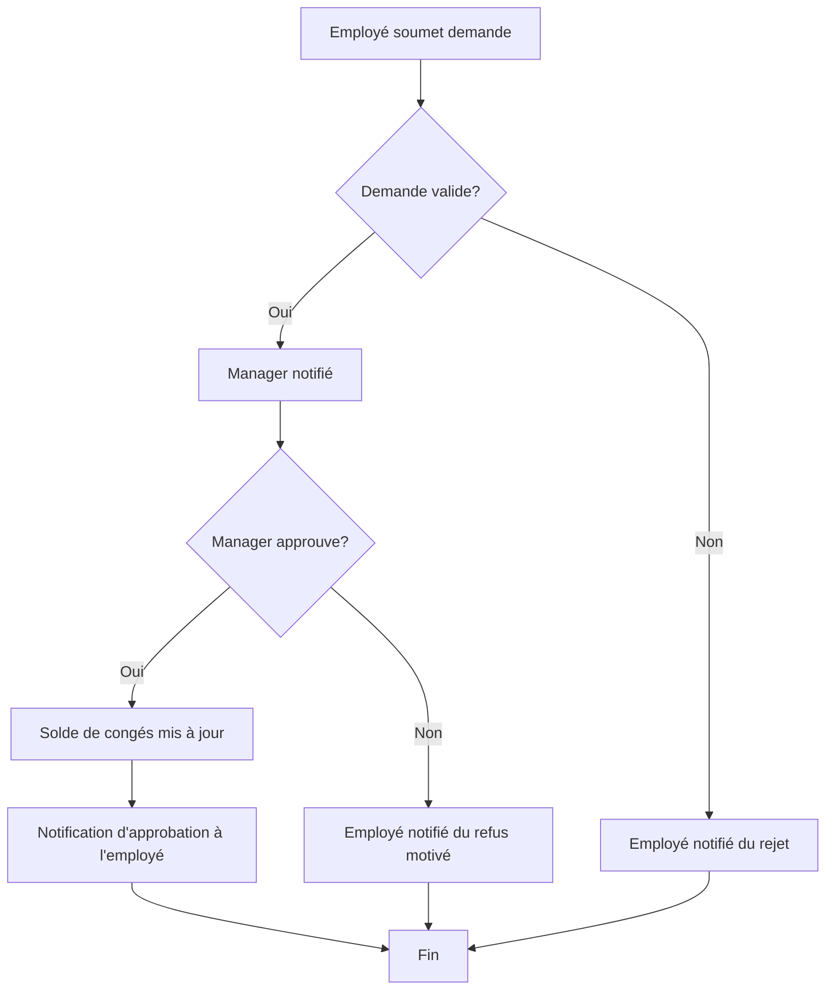

## Diagrammes UML : Gestion des Ressources Humaines (RH)

### 1. Diagramme de Cas d’Usage

```mermaid
        +------------------+      +----------------------+
        | Employe          |----->| Consulter ses donnees|
        +------------------+      +----------------------+
               |                               ^
               | Demande                       | (etend)
               v                               |
        +------------------+      +----------------------+
        | Gestionnaire RH  |----->| Gerer dossier employe|
        +------------------+      +----------------------+
               |                               |
               | Valide                        | (inclut)
               v                               v
        +------------------+      +----------------------+
        | Admin RH         |----->| Traiter demande conge|
        +------------------+      +----------------------+
               |                               |
               | Lance                         | (inclut)
               v                               v
        +------------------+      +----------------------+
        | SystemPaie       |<-----| Calculer Paie        |
        +------------------+      +----------------------+

```
Diagramme généré par : Team Primex Software
Pour : Primex Software (https://primex-software.com)
Date : 2024-07-26

### 2. Diagramme de Classes Simplifié

```mermaid
        +-----------------+       +-----------------+
        | Employe         |       | Contrat         |
        +-----------------+       +-----------------+
        | - idEmploye     |1----1 | - idContrat     |
        | - nom           |       | - type          |
        | - prenom        |       | - dateDebut     |
        | - poste         |       | - dateFin       |
        | + Consulter()   |       | - salaire       |
        +-----------------+       +-----------------+
               | *                             | 1
               |                               |
               | Gere                          | Possede
               v 1                             v 1..*
        +-----------------+       +-----------------+
        | DossierRH       |------>| DemandeConge    |
        +-----------------+       +-----------------+
        | - idDossier     |       | - idDemande     |
        | - dateCreation  |       | - dateDebut     |
        | + Archiver()    |       | - dateFin       |
        +-----------------+       | - statut        |
                                  | + Soumettre()   |
                                  | + Valider()     |
                                  +-----------------+
```
Diagramme généré par : Team Primex Software
Pour : Primex Software (https://primex-software.com)
Date : 2024-07-26

### 3. Diagramme d'Activités : Traitement d'une demande de congé


Diagramme généré par : Team Primex Software
Pour : Primex Software (https://primex-software.com)
Date : 2024-07-26
