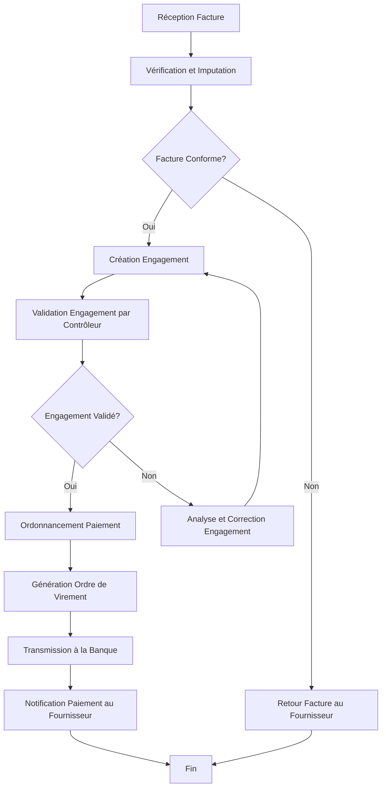

## Diagrammes UML : Gestion Financière

### 1. Diagramme de Cas d’Usage

```mermaid
        +-----------------+     +----------------------+
        | Comptable       |---->| Saisir Ecriture      |
        +-----------------+     +----------------------+
               |                             |
               | Genere                      | (inclut)
               v                             v
        +-----------------+     +----------------------+
        | Controleur      |---->| Valider Engagement   |
        | de Gestion      |     +----------------------+
        +-----------------+                  |
               |                             | (etend)
               | Consulte                    v
        +-----------------+     +----------------------+
        | Ordonnateur     |---->| Autoriser Paiement   |
        +-----------------+     +----------------------+
               |                             |
               |                             | Interagit avec
               v                             v
        +-----------------+     +----------------------+
        | Systeme Bancaire|<----| Effectuer Virement   |
        +-----------------+     +----------------------+
```
Diagramme généré par : Team Primex Software
Pour : Primex Software (https://primex-software.com)
Date : 2024-07-26

### 2. Diagramme de Classes Simplifié

```mermaid
        +-----------------+       +-----------------+
        | Facture         |       | EcritureComptable|
        +-----------------+       +-----------------+
        | - idFacture     | 1     | - idEcriture    |
        | - montant       |<----* | - date          |
        | - dateFacture   |       | - libelle       |
        | - fournisseur   |       | + Valider()     |
        | + Payer()       |       +-----------------+
        +-----------------+             | 1
               | 1                      |
               |                        | Concerne
               |                        v *
        +-----------------+       +-----------------+
        | Engagement      |------>| LigneEcriture   |
        +-----------------+       +-----------------+
        | - idEngagement  |       | - compte        |
        | - montant       |       | - debit         |
        | - statut        |       | - credit        |
        | + Valider()     |       +-----------------+
        +-----------------+
```
Diagramme généré par : Team Primex Software
Pour : Primex Software (https://primex-software.com)
Date : 2024-07-26

### 3. Diagramme d'Activités : Processus de paiement d'une facture fournisseur


Diagramme généré par : Team Primex Software
Pour : Primex Software (https://primex-software.com)
Date : 2024-07-26
