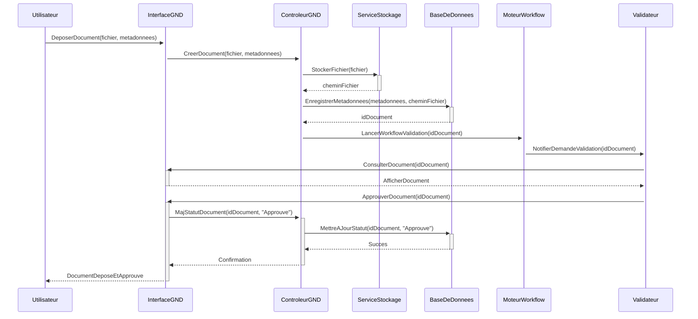

## Diagrammes UML : Gestion Numérique des Documents (GND)

### 1. Diagramme de Cas d’Usage

```mermaid
        +-----------------+     +----------------------+
        | Utilisateur     |---->| Rechercher Document  |
        +-----------------+     +----------------------+
               |                             |
               | Contribue                   | (inclut)
               v                             v
        +-----------------+     +----------------------+
        | Agent Cour      |---->| Deposer Document     |
        +-----------------+     +----------------------+
               |                             |
               |                             | (etend par <<Signature>>)
               |                             v
        +-----------------+     +----------------------+
        | Validateur      |---->| Approuver Document   |
        +-----------------+     +----------------------+
               |                             |
               |                             | (inclut <<Archivage>>)
               v                             v
        +-----------------+     +----------------------+
        | Archiviste      |---->| Gerer Cycle de Vie   |
        +-----------------+     +----------------------+
```
Diagramme généré par : Team Primex Software
Pour : Primex Software (https://primex-software.com)
Date : 2024-07-26

### 2. Diagramme de Classes Simplifié

```mermaid
        +-----------------+       +-----------------+
        | Document        |       | Version         |
        +-----------------+       +-----------------+
        | - idDocument    | 1    *| - idVersion     |
        | - titre         |<----->| - numero        |
        | - dateCreation  |       | - dateVersion   |
        | - typeMIME      |       | - cheminFichier |
        | + Rechercher()  |       | + Restaurer()   |
        | + Partager()    |       +-----------------+
        +-----------------+
               | 1..*
               | Est classé dans
               v 1
        +-----------------+       +-----------------+
        | Dossier         |       | Metadonnee      |
        +-----------------+       +-----------------+
        | - idDossier     | 1    *| - nomChamp      |
        | - nom           |<------| - valeurChamp   |
        | + Creer()       |       +-----------------+
        +-----------------+
```
Diagramme généré par : Team Primex Software
Pour : Primex Software (https://primex-software.com)
Date : 2024-07-26

### 3. Diagramme de Séquence : Dépôt et validation simple d'un document


Diagramme généré par : Team Primex Software
Pour : Primex Software (https://primex-software.com)
Date : 2024-07-26
