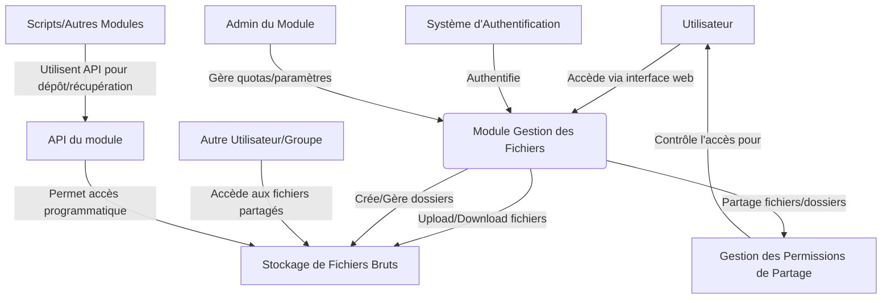

# Documentation Fonctionnelle & Technique : Gestion des Fichiers

## Objectif du module

Le module de Gestion des Fichiers a pour but de fournir un espace de stockage, d'organisation et de partage de fichiers bruts ou de travail qui ne relèvent pas nécessairement de la Gestion Numérique des Documents (GND) formelle. Il s'agit souvent de fichiers volumineux, de formats spécifiques, ou de données temporaires utilisées dans le cadre des activités de la Cour des Comptes. Ce module peut aussi servir de "zone de transit" ou de "bac à sable" pour des fichiers avant leur formalisation dans la GND.

## Acteurs concernés

*   Analystes de données
*   Auditeurs (pour les fichiers de travail, preuves numériques brutes)
*   Services techniques et informatiques
*   Tout employé ayant besoin de stocker ou partager des fichiers volumineux ou spécifiques.

## Cas d’usage

*   **Stockage de fichiers volumineux :** Enregistrements audio/vidéo d'auditions, images satellites, sauvegardes de bases de données d'audit.
*   **Partage de fichiers de travail :** Échange de jeux de données brutes entre analystes, fichiers de configuration.
*   **Organisation de dossiers de projets spécifiques :** Création d'arborescences pour des investigations ou des études particulières.
*   **Gestion de formats de fichiers non standards :** Fichiers techniques, logs, exports de logiciels spécialisés.
*   **Zone de transit pour la numérisation :** Stockage temporaire de lots de fichiers numérisés avant traitement et import dans la GND.
*   **Collaboration sur des fichiers techniques** ne nécessitant pas le versioning formel de la GND.

## Fonctionnalités clés

*   **Stockage de fichiers de grande taille et de tout type.**
*   **Organisation en dossiers et sous-dossiers avec gestion des droits d'accès.**
*   **Interface de type explorateur de fichiers web.**
*   **Fonctionnalités de téléversement (upload) et téléchargement (download) simples et par lots.**
*   **Partage de fichiers/dossiers avec d'autres utilisateurs ou groupes, avec contrôle des permissions (lecture seule, lecture/écriture).**
*   **Liens de partage temporaires et sécurisés (optionnel).**
*   **Corbeille pour les fichiers supprimés avec possibilité de restauration.**
*   **Recherche simple par nom de fichier et éventuellement par type ou taille.**
*   **Affichage des propriétés de base des fichiers (taille, type, date de modification).**
*   **Pas de versioning complexe ou de workflows formels (distinction avec la GND).**
*   **Quotas de stockage par utilisateur ou par groupe (optionnel).**
*   **Journal d'activité de base (qui a accédé/modifié quoi).**

## Interfaces attendues

*   **Interface utilisateur web principale** pour la navigation, le téléversement et le téléchargement.
*   **Accès via des protocoles standards (optionnel) :** WebDAV, SFTP pour des usages plus techniques ou des transferts de gros volumes.
*   **API** pour permettre à d'autres modules ou scripts d'interagir avec l'espace de stockage (ex: dépôt automatisé de logs).

## Diagramme fonctionnel simplifié (UML si possible)

## Contraintes techniques ou juridiques

*   **Sécurité des accès :** S'assurer que seuls les utilisateurs autorisés peuvent accéder aux fichiers.
*   **Protection contre les malwares :** Analyse des fichiers téléversés.
*   **Scalabilité du stockage :** Capacité à gérer de gros volumes de données.
*   **Performance des transferts,** surtout pour les fichiers volumineux.
*   **Politiques de rétention/nettoyage** pour les fichiers temporaires ou obsolètes (à définir).
*   **Pas de vocation à l'archivage légal :** Les documents nécessitant une valeur probante ou un archivage long terme doivent aller dans la GND. Ce module est pour du stockage plus "opérationnel" ou "temporaire".
*   **Sauvegarde régulière des données stockées.**

## Dépendances avec d’autres modules

*   **Plateforme d’Authentification et Gestion des Entités :** Pour l'authentification des utilisateurs et la gestion des groupes/rôles qui serviront à définir les permissions sur les fichiers/dossiers.
*   **Gestion Numérique des Documents (GND) :** Distinction claire des usages. Possibilité de "promouvoir" un fichier de ce module vers la GND après traitement ou formalisation.
*   **Business Intelligence (BI) :** Peut utiliser des fichiers de données stockés temporairement dans ce module comme source pour des analyses.
*   **Interopérabilité :** Si des exports de systèmes externes (ex: SIDONIA) sont temporairement stockés ici avant traitement.

## Spécifications API (si applicables)

*   **API RESTful** pour :
    *   Lister les fichiers et dossiers.
    *   Téléverser des fichiers (potentiellement avec support du "chunking" pour les gros fichiers).
    *   Télécharger des fichiers.
    *   Créer, renommer, supprimer des fichiers et dossiers.
    *   Gérer les permissions de partage.
*   **Endpoints pour :**
    *   `/files` : Opérations sur les fichiers.
    *   `/folders` : Opérations sur les dossiers.
    *   `/shares` : Gestion des partages.
*   **Authentification via OAuth2.**
*   **Transfert de données sécurisé (HTTPS).**
*   **Utilisation de Content-Type appropriés pour les transferts de fichiers.**

---
Document préparé par : Primex Software
Rédigé par : Team Primex Software
URL : https://primex-software.com
Date : 2024-07-26
