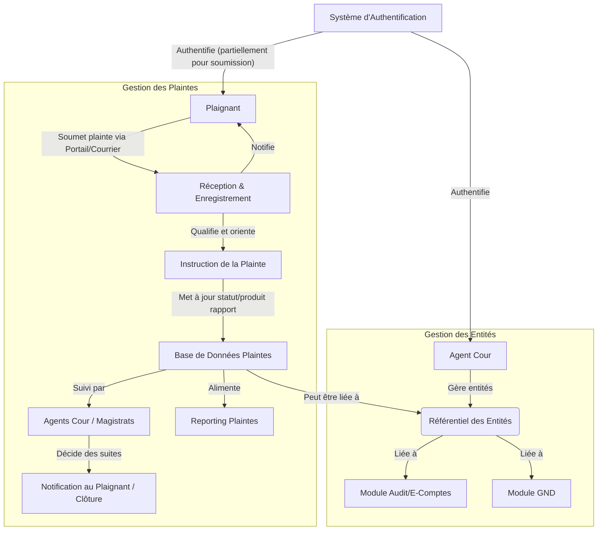

# Documentation Fonctionnelle & Technique : Gestion des Entités et Plaintes

## Objectif du module

Le module de Gestion des Entités et Plaintes a pour double objectif de :
1.  Gérer un référentiel des entités auditées ou contrôlées par la Cour des Comptes (administrations publiques, entreprises publiques, projets, etc.).
2.  Gérer le processus de réception, d'enregistrement, de qualification, d'orientation et de suivi des plaintes, dénonciations ou signalements reçus par la Cour des Comptes.

## Acteurs concernés

*   **Pour la gestion des entités :**
    *   Auditeurs / Contrôleurs (qui interagissent avec les entités)
    *   Planificateurs des audits
    *   Greffe (pour l'enregistrement officiel des entités)
*   **Pour la gestion des plaintes :**
    *   Citoyens / Plaignants (source des plaintes)
    *   Service de réception/Greffe (enregistrement des plaintes)
    *   Analystes / Instructeurs des plaintes
    *   Magistrats de la Cour
    *   Responsables de l'orientation des plaintes

## Cas d’usage

**Gestion des Entités :**
*   Création et mise à jour des fiches d'entités (informations générales, contacts, historique des contrôles, documents liés).
*   Classification des entités (par type, secteur, etc.).
*   Liaison des entités avec les audits, les rapports, les plaintes.
*   Recherche et consultation du référentiel des entités.

**Gestion des Plaintes :**
*   Réception multicanal des plaintes (portail web, courrier, email, guichet).
*   Enregistrement et qualification des plaintes (recevabilité, nature, domaine concerné).
*   Accusé de réception au plaignant.
*   Analyse préliminaire et orientation de la plainte (vers un service d'instruction, classement sans suite, transmission à une autre institution).
*   Instruction de la plainte (collecte d'informations, auditions, investigations).
*   Suivi de l'état d'avancement de la plainte.
*   Notification au plaignant des suites données.
*   Reporting et statistiques sur les plaintes.

## Fonctionnalités clés

**Gestion des Entités :**
*   Référentiel des entités avec fiches descriptives détaillées.
*   Historique des interactions (audits, contrôles, communications).
*   Cartographie des liens entre entités (ex: filiales, tutelles).
*   Recherche avancée et filtres.

**Gestion des Plaintes :**
*   Formulaire de soumission de plainte en ligne (sécurisé et anonymisable si requis).
*   Enregistrement centralisé avec attribution d'un numéro unique de suivi.
*   Workflow de traitement des plaintes configurable (étapes, acteurs, délais).
*   Gestion des pièces jointes aux plaintes.
*   Système de notification automatique (accusé de réception, mises à jour de statut).
*   Tableau de bord de suivi des plaintes (par statut, par instructeur, par délai).
*   Confidentialité et anonymisation des plaignants si nécessaire.
*   Archivage des plaintes traitées.
*   Module de reporting et statistiques.

## Interfaces attendues

*   **Interface utilisateur web** pour les agents de la Cour (gestion des entités et traitement des plaintes).
*   **Portail public (ou section du site web de la Cour)** pour la soumission de plaintes en ligne et potentiellement le suivi par le plaignant (avec code de suivi).
*   **API** pour l'intégration avec d'autres modules (ex: lier une plainte à un audit en cours, lier une entité à un document dans la GND).

## Diagramme fonctionnel simplifié (UML si possible)

## Contraintes techniques ou juridiques

*   **Sécurité et confidentialité des données des plaignants et des informations sensibles** contenues dans les plaintes.
*   **Respect de l'anonymat si le plaignant le demande.**
*   **Traçabilité complète du traitement des plaintes.**
*   **Respect des délais légaux ou réglementaires** pour le traitement des plaintes.
*   **Intégrité des données du référentiel des entités.**
*   **Archivage sécurisé des dossiers de plaintes.**
*   **Conformité aux lois sur la protection des données personnelles.**

## Dépendances avec d’autres modules

*   **Plateforme d’Authentification et Gestion des Entités :** Pour l'authentification des utilisateurs internes. Le référentiel d'entités de ce module est central.
*   **Gestion Numérique des Documents (GND) :** Pour stocker les pièces jointes aux plaintes, les rapports d'instruction, et les documents relatifs aux entités.
*   **E-Comptes / Traitement procédural :** Une plainte peut déclencher une procédure ou un audit. Les informations sur les entités sont cruciales pour le traitement procédural.
*   **Business Intelligence (BI) :** Pour l'analyse des tendances des plaintes, l'identification des entités les plus concernées, etc.
*   **Portail Intranet / Application Mobile :** Pour l'accès des agents de la Cour aux fonctionnalités de gestion.
*   **Interopérabilité :** Potentiellement avec des systèmes externes pour vérifier des informations sur les entités ou transmettre des plaintes à d'autres organismes compétents.

## Spécifications API (si applicables)

*   **API RESTful** pour :
    *   **Entités :** CRUD sur les fiches d'entités, recherche.
    *   **Plaintes :** Création de plaintes (par le portail ou en interne), mise à jour de statut, ajout de notes/documents, consultation.
*   **Endpoints pour :**
    *   `/entities` : Gestion des entités.
    *   `/complaints` : Gestion des plaintes.
    *   `/complaints/{id}/status` : Mise à jour du statut d'une plainte.
    *   `/complaints/{id}/documents` : Liaison avec la GND pour les documents d'une plainte.
*   **Authentification via OAuth2** pour les accès internes. Mécanisme d'authentification léger ou pas d'authentification (avec captcha) pour la soumission publique de plainte.
*   **Formats de données :** JSON.
*   **Sécurisation particulière des endpoints liés à la consultation/modification des plaintes.**

---
Document préparé par : Primex Software
Rédigé par : Team Primex Software
URL : https://primex-software.com
Date : 2024-07-26
