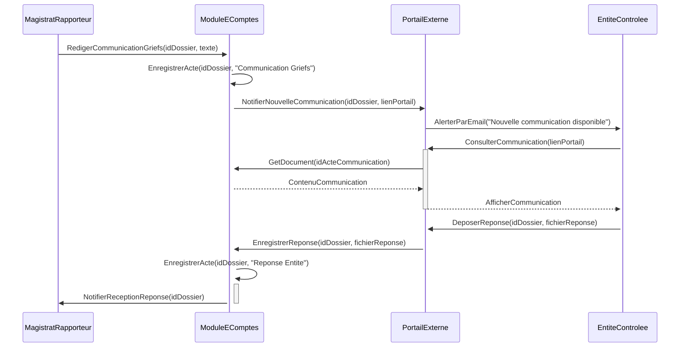

## Diagrammes UML : E-Comptes / Traitement procédural

### 1. Diagramme de Cas d’Usage

```mermaid
        +-----------------+     +----------------------+
        | Greffier        |---->| Enregistrer Affaire  |
        +-----------------+     +----------------------+
               |                             |
               | Gere pieces                 | (inclut <<Deposer Piece via GND>>)
               v                             v
        +-----------------+     +----------------------+
        | Magistrat       |---->| Instruire Dossier    |
        | (Rapporteur)    |     +----------------------+
        +-----------------+              |
               |                         | (etend par <<Communication Griefs>>)
               | Redige                  v
        +-----------------+     +----------------------+
        | Entite Controlee|---->| Repondre a Comm.     |
        | / Justiciable   |     | (via Portail Externe)|
        +-----------------+     +----------------------+
               ^                         |
               | Notifie                 | (inclut <<Signer Acte>>)
               |                         v
        +-----------------+     +----------------------+
        | President       |---->| Valider Arret/Rapport|
        | de Chambre      |     +----------------------+
        +-----------------+
```
Diagramme généré par : Team Primex Software
Pour : Primex Software (https://primex-software.com)
Date : 2024-07-26

### 2. Diagramme de Classes Simplifié

```mermaid
        +-----------------+       +-----------------+
        | DossierProcedure|       | ActeProcedure   |
        +-----------------+       +-----------------+
        | - idDossier     | 1    *| - idActe        |
        | - numAffaire    |<------| - typeActe      |
        | - dateOuverture |       | - dateActe      |
        | - statut        |       | - contenu (lien GND)|
        | + Cloturer()    |       | + Signer()      |
        +-----------------+       +-----------------+
               | 1
               | Concerne
               v 1..*
        +-----------------+       +-----------------+
        | PartiePrenante  |       | Echeance        |
        +-----------------+       +-----------------+
        | - idPartie      | 1    *| - idEcheance    |
        | - nom           |<------| - dateLimite    |
        | - role (Entite, |       | - typeEcheance  |
        |   Justiciable)  |       | + Verifier()    |
        +-----------------+       +-----------------+
```
Diagramme généré par : Team Primex Software
Pour : Primex Software (https://primex-software.com)
Date : 2024-07-26

### 3. Diagramme de Séquence : Échange contradictoire simple


Diagramme généré par : Team Primex Software
Pour : Primex Software (https://primex-software.com)
Date : 2024-07-26
