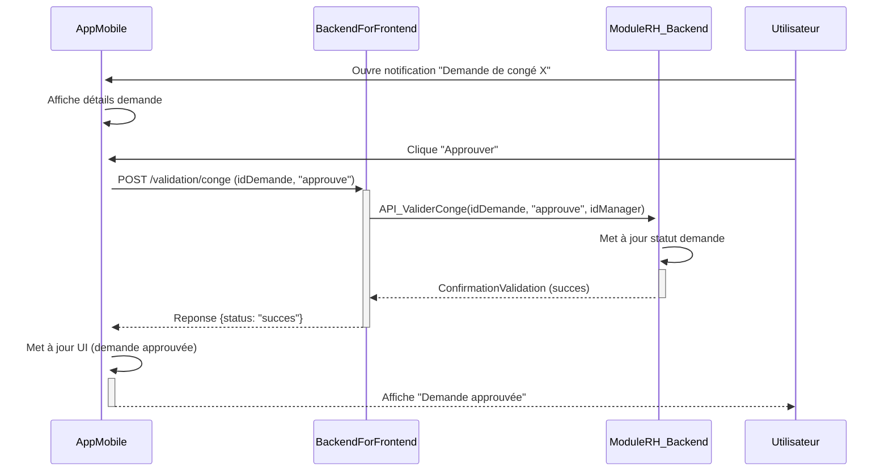

## Diagrammes UML : Application Mobile

### 1. Diagramme de Cas d’Usage

```mermaid
        +-----------------+     +----------------------+
        | Agent Cour      |---->| Se Connecter (Mobile)|
        | (en déplacement)|     +----------------------+
        +-----------------+              |
               |                         | (inclut <<Synchro Donnees>>)
               | Consulte                v
        +-----------------+     +----------------------+
        | Utilisateur     |---->| Recevoir Notification|
        | Mobile          |     +----------------------+
        +-----------------+              |
               |                         | (etend par <<Consulter Detail Tache>>)
               | Valide                  v
        +-----------------+     +----------------------+
        | Module RH/Finance|<----| Valider Demande      |
        | (Backend)       |     | (Conge/Depense)      |
        +-----------------+     +----------------------+
               ^                         |
               |                         |
        +-----------------+     +----------------------+
        | Module E-Comptes|<----| Consulter Etat Doss. |
        | (Backend)       |     +----------------------+
        +-----------------+
```
Diagramme généré par : Team Primex Software
Pour : Primex Software (https://primex-software.com)
Date : 2024-07-26

### 2. Diagramme de Classes Simplifié (Focus sur données locales)

```mermaid
        +-----------------+       +-----------------+
        | Notification    |       | TacheMobile     |
        +-----------------+       +-----------------+
        | - idNotif       |       | - idTache       |
        | - titre         |       | - description   |
        | - message       |       | - type (Validat°)|
        | - date          |       | - statut        |
        | - lu (boolean)  |       | - lienModuleSrc |
        | + MarquerCommeLu()|       | + Valider()     |
        +-----------------+       +-----------------+
               | *                          | *
               |                            |
        +----------------------+  +----------------------+
        | DonneesSynchronisees |  | ConfigurationApp     |
        +----------------------+  +----------------------+
        | - dernierSync        |  | - urlServeur         |
        | - agendaItems (list) |  | - frequenceSync (int)|
        | - documentsHorsLigne |  | - notifActive(bool)  |
        |   (list de refs)     |  | + EnregistrerPrefs() |
        | + Synchroniser()     |  +----------------------+
        +----------------------+
```
Diagramme généré par : Team Primex Software
Pour : Primex Software (https://primex-software.com)
Date : 2024-07-26

### 3. Diagramme de Séquence : Validation d'une demande de congé


Diagramme généré par : Team Primex Software
Pour : Primex Software (https://primex-software.com)
Date : 2024-07-26
