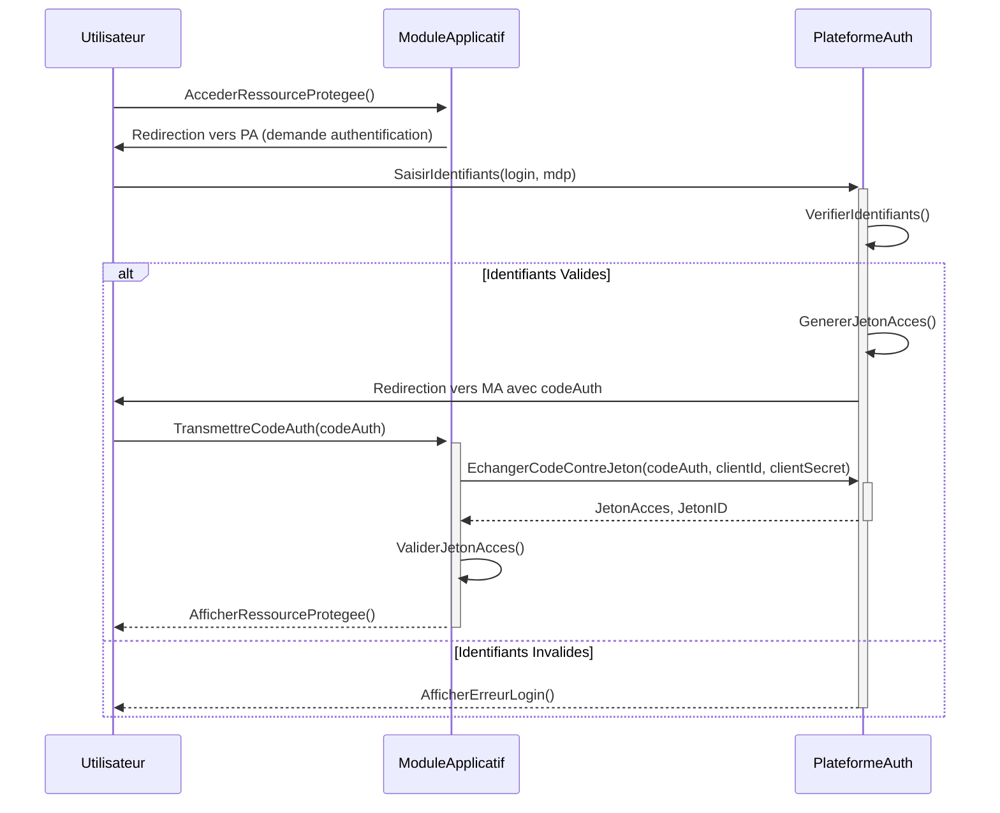

## Diagrammes UML : Plateforme d’Authentification et Gestion des Entités (Utilisateurs)

### 1. Diagramme de Cas d’Usage

```mermaid
        +-----------------+     +----------------------+
        | Utilisateur     |---->| S'authentifier (SSO) |
        | (Agent/Externe) |     +----------------------+
        +-----------------+              |
               |                         | (inclut <<Verifier Identifiants>>)
               |                         | (etend par <<MFA>>)
               v                         v
        +-----------------+     +----------------------+
        | Module Applicatif|---->| Valider Jeton Acces  |
        | (SIGEF-TC)      |     +----------------------+
        +-----------------+              |
               |                         |
               | Verifie                 v
        +-----------------+     +----------------------+
        | Admin Securite  |---->| Gerer Utilisateur    |
        +-----------------+     +----------------------+
               |                             |
               | Definit                     | (inclut <<Assigner Role>>)
               v                             v
        +-----------------+     +----------------------+
        |                 |     | Gerer Role           |
        | (Systeme)       |     +----------------------+
        +-----------------+     +----------------------+
                                | Definit Permissions  |
                                +----------------------+
```
Diagramme généré par : Team Primex Software
Pour : Primex Software (https://primex-software.com)
Date : 2024-07-26

### 2. Diagramme de Classes Simplifié

```mermaid
        +-----------------+       +-----------------+
        | Utilisateur     |       | Role            |
        +-----------------+       +-----------------+
        | - idUtilisateur | 1..*  | - idRole        |
        | - login         |------>| - nomRole       |
        | - motDePasseHash|       +-----------------+
        | - email         |         | 1..*
        | - estActif      |         |
        | + Creer()       |         | Definit
        | + VerifierMdp() |         v 1..*
        +-----------------+       +-----------------+
                                  | Permission      |
        +-----------------+       +-----------------+
        | Session         |       | - idPermission  |
        +-----------------+       | - nomPermission |
        | - idSession     |       | (ex: "facture:creer")|
        | - jetonAcces    |       +-----------------+
        | - dateExpiration|
        | + ValiderJeton()|
        +-----------------+
```
Diagramme généré par : Team Primex Software
Pour : Primex Software (https://primex-software.com)
Date : 2024-07-26

### 3. Diagramme de Séquence : Authentification SSO (simplifié OIDC)


Diagramme généré par : Team Primex Software
Pour : Primex Software (https://primex-software.com)
Date : 2024-07-26
