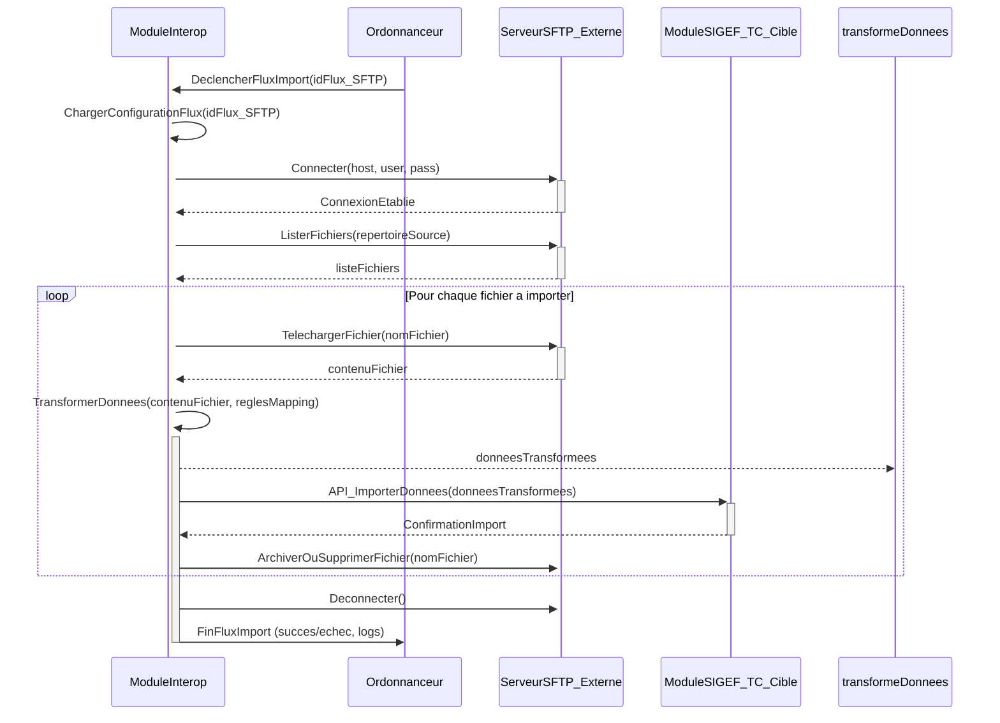

## Diagrammes UML : Interopérabilité

### 1. Diagramme de Cas d’Usage

```mermaid
        +-----------------+     +----------------------+
        | Admin Interop   |---->| Configurer Flux      |
        +-----------------+     +----------------------+
               |                             |
               | Supervise                   | (inclut <<Definir Mapping Donnees>>)
               v                             v
        +-----------------+     +----------------------+
        | Module SIGEF-TC |---->| Envoyer Donnees      |
        | (ex: Suivi Budg)|     | (vers Sys Externe)   |
        +-----------------+     +----------------------+
               |                             |
               | Demande                     | (utilise <<Connecteur Specifique>>)
               v                             v
        +-----------------+     +----------------------+
        | Module SIGEF-TC |---->| Recevoir Donnees     |
        | (ex: RH)        |     | (de Sys Externe)     |
        +-----------------+     +----------------------+
               ^                             |
               |                             |
        +-----------------+     +----------------------+
        | Systeme Externe |<----| Echanger Donnees     |
        | (MinFin, SIGRH) |     +----------------------+
        +-----------------+
```
Diagramme généré par : Team Primex Software
Pour : Primex Software (https://primex-software.com)
Date : 2024-07-26

### 2. Diagramme de Classes Simplifié (Focus sur la configuration d'un flux)

```mermaid
        +-----------------+       +-----------------+
        | FluxInterop     |       | Connecteur      |
        +-----------------+       +-----------------+
        | - idFlux        | 1    1| - idConnecteur  |
        | - nomFlux       |------>| - type (API, SFTP)|
        | - direction     |       | - config        |
        |   (In/Out)      |       | (url, creds)    |
        | - actif (bool)  |       | + Connecter()   |
        | + Executer()    |       | + Transferer()  |
        +-----------------+       +-----------------+
               | 1
               | Utilise
               v 1
        +-----------------+       +-----------------+
        | Transformation  |       | JournalEchange  |
        +-----------------+       +-----------------+
        | - idTransfo     | 1    *| - idJournal     |
        | - type (XSLT,   |<------| - idFlux        |
        |   Script)       |       | - timestamp     |
        | - reglesMapping |       | - statut        |
        | + Transformer() |       | - messageErreur |
        +-----------------+       +-----------------+
```
Diagramme généré par : Team Primex Software
Pour : Primex Software (https://primex-software.com)
Date : 2024-07-26

### 3. Diagramme de Séquence : Import de données depuis un système externe via SFTP


Diagramme généré par : Team Primex Software
Pour : Primex Software (https://primex-software.com)
Date : 2024-07-26
